# OSI ?

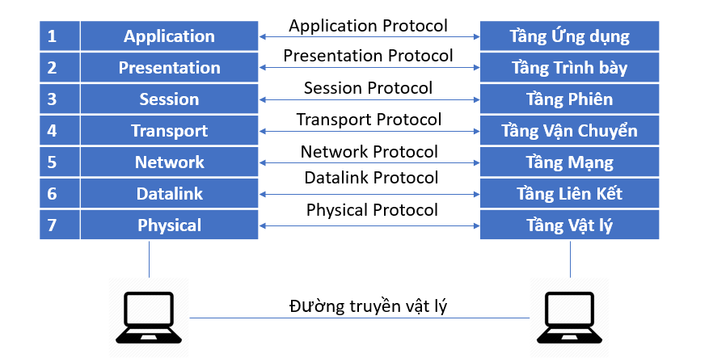
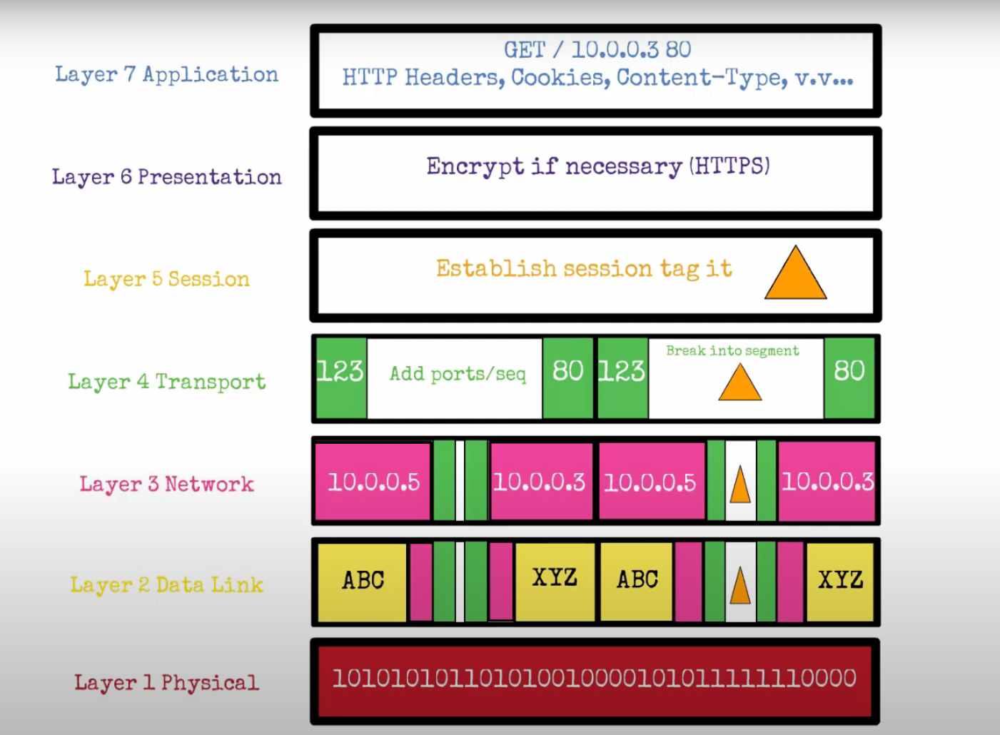

- Mô hình OSI (Open Systems Interconnection)
- Mô hình OSI (Open Systems Interconnection) là một mô hình tham chiếu để mô tả cách mà các hệ thống mạng hoạt động (máy tính sử dụng để giao tiếp qua mạng)
# Nắm được vai trò từng layer trong các mô hình.

## Tầng 7 – Application Layer ( Tầng ứng dụng)
- Tầng ứng dụng là lớp trên cùng, xác định giao diện giữa người sử dụng và môi trường OSI. Tầng ứng dụng được sử dụng bởi phần mềm người dùng cuối như trình duyệt web và ứng dụng email. Nó cung cấp các giao thức cho phép phần mềm gửi, nhận thông tin và trình bày dữ liệu có ý nghĩa cho người dùng.

====
- Đây là tầng duy nhất tương tác trực tiếp với dữ liệu từ người dùng. Các phần mềm ứng dụng như web browser và email client dựa vào Application layer để khởi tạo giao tiếp. Tuy nhiên, cần làm rõ rằng client software applications không phải là một phần của Application layer; thay vào đó, Application layer chịu trách nhiệm về các protocol và xử lý dữ liệu mà phần mềm sử dụng để hiển thị thông tin có ý nghĩa cho người dùng.

- Các Application layer protocols bao gồm HTTP cũng như SMTP (Simple Mail Transfer Protocol - một trong những protocols cho phép email communications).

====
- Đây là tầng trên cùng của mô hình OSI, đảm bảo kết nối giữa người dùng và hệ thống. Tầng này được sử dụng bởi các phần mềm như trình duyệt web hay ứng dụng email, cung cấp các giao thức hỗ trợ gửi, nhận và trình bày dữ liệu một cách có ý nghĩa cho người dùng cuối.

## Tầng 6 – Presentation Layer (Tầng Trình Bày)
- Tầng này chủ yếu chịu trách nhiệm chuẩn bị dữ liệu để có thể được sử dụng bởi Application layer; nói cách khác, Layer 6 giúp dữ liệu có thể được các ứng dụng tiếp nhận. Presentation layer chịu trách nhiệm về translation, encryption và compression của dữ liệu.

===
- Tầng trình bày xác định cách hai thiết bị sẽ mã hóa và nén dữ liệu để nó được nhận một cách chính xác ở đầu bên kia. Tầng trình bày lấy bất kỳ dữ liệu nào được truyền bởi tầng ứng dụng và chuẩn bị cho việc truyền qua tầng phiên.

- Tầng này chịu trách nhiệm chính trong việc chuẩn bị dữ liệu để nó có thể được sử dụng bởi tầng ứng dụng. Nói cách khác, tầng 6 làm cho dữ liệu hiển thị cho các ứng dụng sử dụng. Tầng trình bày chịu trách nhiệm dịch, mã hóa và nén dữ liệu.

- Hai thiết bị đang giao tiếp có thể sử dụng các phương pháp mã hóa khác nhau, do đó tầng 6 chịu trách nhiệm dịch dữ liệu đến thành một cú pháp mà lớp ứng dụng của thiết bị nhận có thể hiểu được. Nếu các thiết bị đang giao tiếp qua kết nối được mã hóa, tầng 6 chịu trách nhiệm thêm mã hóa ở đầu người gửi cũng như giải mã mã hóa ở đầu người nhận để nó có thể hiển thị tầng ứng dụng với dữ liệu có thể đọc được, không được mã hóa.

- Cuối cùng, lớp trình bày cũng chịu trách nhiệm nén dữ liệu mà nó nhận được từ lớp ứng dụng trước khi phân phối đến tầng 5. Điều này giúp cải thiện tốc độ và hiệu quả của giao tiếp bằng cách giảm thiểu lượng dữ liệu sẽ được truyền.

## Tầng 5 – Session Layer (Tầng phiên)
- Đây là lớp chịu trách nhiệm đóng mở giao tiếp giữa hai thiết bị. Khoảng thời gian từ khi giao tiếp được mở và đóng được gọi là phiên. Tầng phiên đảm bảo rằng phiên vẫn mở đủ lâu để chuyển tất cả dữ liệu đang được trao đổi, và sau đó nhanh chóng đóng phiên để tránh lãng phí tài nguyên.
- Lớp phiên cũng đồng bộ hóa việc truyền dữ liệu với các điểm kiểm tra.

- Ví dụ: Nếu một tệp 100 megabyte đang được chuyển, tầng phiên có thể đặt một điểm kiểm tra cứ sau 5 megabyte. Trong trường hợp ngắt kết nối hoặc gặp sự cố sau khi 52 megabyte đã được chuyển, phiên có thể được tiếp tục từ điểm kiểm tra cuối cùng, có nghĩa là chỉ cần chuyển thêm 50 megabyte dữ liệu. Nếu không có các trạm kiểm soát, toàn bộ quá trình chuyển sẽ phải bắt đầu lại từ đầu.

===

- Session layer cũng đồng bộ hóa quá trình truyền dữ liệu bằng các checkpoint. Ví dụ, nếu một tệp 100 megabyte đang được truyền, Session layer có thể đặt một checkpoint sau mỗi 5 megabyte. Trong trường hợp mất kết nối hoặc sự cố xảy ra sau khi đã truyền được 52 megabyte, phiên truyền dữ liệu có thể được tiếp tục từ checkpoint cuối cùng, nghĩa là chỉ cần truyền thêm 50 megabyte nữa. Nếu không có checkpoint, toàn bộ quá trình truyền sẽ phải bắt đầu lại từ đầu.

## Tầng 4 – Transport Layer (Tầng Vận Chuyển)

- Tầng 4 chịu trách nhiệm giao tiếp đầu cuối giữa hai thiết bị. Điều này bao gồm việc lấy dữ liệu từ lớp phiên và chia nó thành các phần được gọi là phân đoạn trước khi gửi đến tầng 3. Tầng truyền tải trên thiết bị nhận có trách nhiệm tập hợp lại các phân đoạn thành dữ liệu mà tầng phiên có thể sử dụng.

- Tầng vận chuyển cũng chịu trách nhiệm kiểm soát luồng và kiểm soát lỗi. Kiểm soát luồng xác định tốc độ truyền tối ưu để đảm bảo rằng người gửi có kết nối nhanh không làm người nhận có kết nối chậm bị choáng ngợp. Tầng truyền tải thực hiện kiểm soát lỗi ở đầu nhận bằng cách đảm bảo rằng dữ liệu nhận được là hoàn chỉnh và yêu cầu truyền lại nếu chưa.


====

- Layer 4 chịu trách nhiệm về giao tiếp end-to-end giữa hai thiết bị. Điều này bao gồm việc lấy dữ liệu từ Session layer và chia nhỏ thành các phần gọi là segment trước khi gửi xuống Layer 3. Transport layer trên thiết bị nhận sẽ chịu trách nhiệm tập hợp lại các segment thành dữ liệu mà Session layer có thể sử dụng.

- Transport layer cũng đảm nhiệm flow control và error control. Flow control xác định tốc độ truyền tối ưu để đảm bảo rằng một sender có kết nối nhanh không làm quá tải một receiver có kết nối chậm. Transport layer thực hiện error control ở phía nhận bằng cách đảm bảo dữ liệu nhận được là đầy đủ và yêu cầu truyền lại nếu dữ liệu bị thiếu.

- Các Transport layer protocols bao gồm Transmission Control Protocol (TCP) và User Datagram Protocol (UDP).

## Tầng 3 – Network Layer (Tầng Mạng)

- Tầng mạng có nhiệm vụ tạo điều kiện thuận lợi cho việc truyền dữ liệu giữa hai mạng khác nhau. Nếu hai thiết bị giao tiếp trên cùng một mạng, thì tầng mạng là không cần thiết. Tầng mạng chia nhỏ các phân đoạn từ lớp truyền tải thành các đơn vị nhỏ hơn, được gọi là gói, trên thiết bị của người gửi và tập hợp lại các gói này trên thiết bị nhận. Tầng mạng cũng tìm ra con đường vật lý tốt nhất để dữ liệu đến đích của nó; điều này được gọi là định tuyến.

====
- Network layer chịu trách nhiệm hỗ trợ việc truyền dữ liệu giữa hai mạng khác nhau. Nếu hai thiết bị giao tiếp nằm trong cùng một mạng, thì Network layer không cần thiết. Network layer chia nhỏ các segment từ Transport layer thành các đơn vị nhỏ hơn, gọi là packet, trên thiết bị gửi và tập hợp lại các packet này trên thiết bị nhận.

Network layer cũng tìm đường đi vật lý tối ưu nhất để dữ liệu đến đích, quá trình này được gọi là routing.

Các Network layer protocols bao gồm IP, Internet Control Message Protocol (ICMP), Internet Group Message Protocol (IGMP) và bộ giao thức IPsec.

## Tầng 2 – Data Link Layer (Tầng liên kết)

- Tầng liên kết dữ liệu rất giống với tầng mạng, ngoại trừ tầng liên kết dữ liệu tạo điều kiện thuận lợi cho việc truyền dữ liệu giữa hai thiết bị trên cùng một mạng . Tầng liên kết dữ liệu lấy các gói từ tầng mạng và chia chúng thành các phần nhỏ hơn gọi là frame. Giống như tầng mạng, tầng liên kết dữ liệu cũng chịu trách nhiệm điều khiển luồng và điều khiển lỗi trong giao tiếp nội mạng (Tầng vận chuyển chỉ làm nhiệm vụ điều khiển luồng và điều khiển lỗi cho truyền thông giữa các mạng).


===

- Data link layer rất giống với Network layer, nhưng điểm khác biệt là Data link layer hỗ trợ truyền dữ liệu giữa hai thiết bị trong cùng một mạng. Data link layer nhận các packet từ Network layer và chia nhỏ chúng thành các phần nhỏ hơn gọi là frame.

- Giống như Network layer, Data link layer cũng chịu trách nhiệm về flow control và error control trong giao tiếp nội mạng (intra-network). Trong khi đó, Transport layer chỉ thực hiện flow control và error control cho giao tiếp liên mạng (inter-network).


===
Nội mạng (Intra-network): Là mạng nội bộ, tức là các thiết bị giao tiếp với nhau trong cùng một mạng, không cần đi qua bộ định tuyến (router). Ví dụ, các máy tính trong cùng một mạng LAN (Local Area Network) có thể truyền dữ liệu trực tiếp với nhau thông qua switch hoặc hub mà không cần kết nối ra bên ngoài.

Liên mạng (Inter-network): Là giao tiếp giữa các thiết bị thuộc các mạng khác nhau, cần sử dụng router để định tuyến dữ liệu. Ví dụ, khi một máy tính trong mạng nội bộ gửi dữ liệu đến một máy chủ trên Internet, dữ liệu phải đi qua nhiều mạng trung gian, bao gồm cả mạng của nhà cung cấp dịch vụ Internet (ISP).

Tóm lại:

Nội mạng: Giao tiếp trong cùng một mạng cục bộ (LAN).
Liên mạng: Giao tiếp giữa các mạng khác nhau (WAN, Internet).

## Tầng 1 – Physical Layer (Tầng Vật Lý)

- Lớp này bao gồm các thiết bị vật lý liên quan đến việc truyền dữ liệu, chẳng hạn như cáp và thiết bị chuyển mạch. Đây cũng là lớp nơi dữ liệu được chuyển đổi thành một luồng bit, là một chuỗi gồm các số 1 và 0. Lớp vật lý của cả hai thiết bị cũng phải đồng ý về một quy ước tín hiệu để các số 1 có thể được phân biệt với các số 0 trên cả hai thiết bị.

## Cách dữ liệu di chuyển qua mô hình OSI
Để thông tin có thể đọc được bởi con người được truyền qua mạng từ một thiết bị này đến một thiết bị khác, dữ liệu phải đi xuống qua bảy tầng của mô hình OSI trên thiết bị gửi và sau đó đi lên qua bảy tầng trên thiết bị nhận.

Ví dụ: Ông Cooper muốn gửi email cho bà Palmer. Ông Cooper soạn tin nhắn trong ứng dụng email trên laptop của mình, sau đó nhấn "gửi". Ứng dụng email sẽ chuyển email của ông đến Application layer, tầng này sẽ chọn một giao thức (SMTP) và chuyển dữ liệu xuống Presentation layer. Presentation layer sẽ nén dữ liệu, sau đó dữ liệu sẽ được chuyển đến Session layer, nơi khởi tạo phiên giao tiếp.

Tiếp theo, dữ liệu sẽ đến Transport layer, nơi nó sẽ được chia thành các segment. Những segment này sẽ được chia nhỏ hơn thành packet tại Network layer, sau đó được chia thành frame tại Data Link layer. Data Link layer sẽ chuyển frame đến Physical layer, nơi dữ liệu được chuyển đổi thành một dòng bit gồm các số 1 và 0 và gửi đi qua một phương tiện truyền dẫn vật lý, chẳng hạn như cáp mạng.

Khi máy tính của bà Palmer nhận được bit stream thông qua một phương tiện vật lý (chẳng hạn như Wi-Fi), dữ liệu sẽ chảy qua các tầng của mô hình OSI theo thứ tự ngược lại. Đầu tiên, Physical layer sẽ chuyển đổi bit stream từ các số 1 và 0 thành frame và gửi chúng đến Data Link layer. Data Link layer sẽ tập hợp lại các frame thành packet để gửi đến Network layer. Network layer sẽ tạo ra các segment từ packet cho Transport layer, nơi các segment sẽ được tập hợp lại thành một khối dữ liệu hoàn chỉnh.

Sau đó, dữ liệu sẽ tiếp tục đến Session layer, nơi nó được chuyển đến Presentation layer và phiên giao tiếp sẽ kết thúc. Presentation layer sẽ giải nén dữ liệu và chuyển dữ liệu thô lên Application layer. Application layer sau đó sẽ cung cấp dữ liệu ở dạng con người có thể đọc được cho phần mềm email của bà Palmer, giúp bà có thể đọc email của ông Cooper trên màn hình laptop của mình.

## Mô hình TCP/IP là gì?    
Mô hình TCP/IP, hay còn gọi là mô hình DoD, là bộ giao thức được sử dụng phổ biến trên Internet. Mô hình này chia thành 4 tầng chính:

Tầng 1 – Giao diện mạng (Network Interface Layer): Kết hợp chức năng của tầng vật lý và tầng liên kết dữ liệu trong OSI, đảm bảo truyền dữ liệu trên một liên kết cụ thể.
Tầng 2 – Internet (Internet Layer): Định nghĩa địa chỉ IP và định tuyến các gói tin qua các mạng khác nhau (tương đương với tầng Mạng của OSI).
Tầng 3 – Giao vận (Transport Layer): Chịu trách nhiệm đảm bảo truyền tải dữ liệu giữa các đầu cuối. Các giao thức chính ở tầng này là TCP và UDP.
Tầng 4 – Ứng dụng (Application Layer): Gồm các giao thức ứng dụng như HTTP, FTP, SMTP, DNS, … tương tự như tầng Ứng dụng của OSI; tuy nhiên, ở mô hình TCP/IP các chức năng của tầng Phiên và Trình diễn của OSI được tích hợp vào tầng ứng dụng này 


## Phân biệt được ý nghĩa của 02 môi hình & mối tương quan của chúng.

- Điểm tương đồng giữa mô hình OSI và TCP/IP
    + Chia sẻ kiến trúc chung
Cả 2 mô hình đều là mô hình logic và có kiến trúc tương tự vì cả 2 mô hình đều được xây dựng dựa trên các lớp
    + Xác định tiêu chuẩn 
Cả 2 lớp đều có các tiêu chuẩn xác định và chúng cũng cung cấp khuôn khổ được sử dụng để thực hiện các tiêu chuẩn và thiết bị
    + Quy trình khắc phục sự cố được đơn giản hóa
Cả 2 mô hình đã đơn giản hóa quá trình khắc phục sự cố bằng cách chia nhỏ chức năng phức tạp thành các thành phần đơn giản hơn
    + Các tiêu chuẩn được xác định trước
Các tiêu chuẩn và giao thức đã được xác định trước, những mô hình này không xác định lại chúng, chỉ tham khảo hoặc sử dụng lại chúng. Ví dụ, các tiêu chuẩn Ethernet đã được IEEE xác định trước khi phát triển các mô hình 
    + Cả 2 đều có chức năng tương tự của các lớp Transport và Network

- Sự khác biệt giữa mô hình OSI và TCP/IP

```
         Mô hình OSI           |           Mô hình TCP/IP
Độ tin cậy và phổ biến:
    + Nhiều người cho rằng đây là mô hình cũ, chỉ để tham khảo, số người sử dụng hạn chế hơn so với TCP/IP
    + Được chuẩn hóa, nhiều người tin cậy và sử dụng phổ biến trên toàn cầu
Phương pháp tiếp cận:
    + Tiếp cận theo chiều dọc
    + Tiếp cận theo chiều ngang
Sự kết hợp giữa các tầng:
    + Mỗi tầng khác nhau sẽ thực hiện một nhiệm vụ khác nhau, không có sự kết hợp giữa bất cứ tầng nào
    + Trong tầng ứng dụng có tầng trình diễn và tầng phiên được kết hợp với nhau
Thiết kế:
    + Phát triển mô hình trước sau đó sẽ phát triển giao thức
    + Các giao thức được thiết kế trước sau đó phát triển mô hình
Số lớp (Tầng)
    + 7
    + 4
```

- Điểm giống nhau:
    + Cả hai đều là mô hình logic, phân chia quá trình truyền dữ liệu thành các lớp có chức năng riêng biệt.
    + Mỗi tầng của mô hình đều đảm nhiệm một phần công việc (ví dụ: tầng giao vận quản lý việc chuyển dữ liệu giữa các đầu cuối).
    + Cung cấp tiêu chuẩn để các nhà sản xuất phát triển thiết bị và phần mềm giao tiếp được với nhau 
- Điểm khác nhau:
    + Số tầng: OSI có 7 tầng trong khi TCP/IP có 4 tầng. Ở TCP/IP, các chức năng của tầng Phiên và Trình diễn của OSI được gộp chung vào tầng Ứng dụng.
    + Cách tiếp cận: OSI được xây dựng theo cách “trái xuống” (từ mô hình lý thuyết đến giao thức thực tế) trong khi TCP/IP được phát triển dựa trên giao thức đã được triển khai thực tế trên ARPANET.
    + Ứng dụng thực tế: Mô hình TCP/IP được sử dụng rộng rãi trên Internet vì tính hiệu quả và đơn giản, trong khi mô hình OSI chủ yếu là frame tham khảo giúp học và nghiên cứu các khái niệm mạng


## Phân biệt UDP/TCP.

## TCP
- TCP (Transmission Control Protocol) là một giao thức mạng dùng trong truyền dữ liệu qua một mạng khác, được nhận xét là khá quan trọng. Một giao thức trong phạm vi mạng bao gồm những quy tắc và thứ tự quản lý quá trình truyền dữ liệu sao cho người dùng trên toàn cầu dù ở đâu, trên nền tảng gì, phần mềm nào đều được phép thao tác theo cùng một phương thức tương tự nhau thì được gọi là TCP.
- Thông thường, TCP thường liên kết với giao thức Internet (IP) tạo thành một đôi được gọi là TCP/IP. Thuật ngữ này hay xuất hiện ở mục network setting trên máy tính hay các thiết bị di động cá nhân. IP có nhiệm vụ gán địa chỉ thực hiện đưa những gói tin từ nguồn đến đích, còn TCP xác thực tính tin cậy của truyền dẫn.

### Cách hoạt động của TCP

- Các gói tin được TCP dán nhãn theo hình thức đánh số. TCP cũng sẽ chịu trách nhiệm việc dữ liệu đến đích trong một thời gian cụ thể và nó cũng phải tuân theo những quy định về mặt kỹ thuật. Ở những gói tin nhận được, thiết bị gửi được nhận thông báo bằng hình thức là một gói được định nghĩa là xác nhận.

- Nếu thời gian chờ (tương đương vài trăm mili giây) kết thúc mà không nhận được thông báo, nguồn gửi tiến hành gửi đi một gói bảo sao của tin bị mất hoặc tạm dừng. Những gọi tin nào không tuân theo trình tự cũng sẽ không được xác nhận. Chính vì thế, hầu hết những gói dữ liệu sẽ luôn được sắp xếp theo thứ tự cố định, không có sơ hở, ở một thời gian chấp nhận được và đã xác định trước đó.


# Switching

## Tìm hiểu về VLAN, cách ứng dụng VLAN

## Phân biệt router, switch, hub
### Hub – Bộ tập trung (Thiết bị đơn giản nhất)
- Hub là thiết bị mạng cơ bản, dùng để kết nối nhiều thiết bị vào cùng một mạng và truyền dữ liệu đến tất cả các cổng mà nó có.
- Cách hoạt động:
    + Khi một máy tính gửi dữ liệu đến Hub, Hub sẽ phát (broadcast) dữ liệu này đến tất cả các thiết bị khác trong mạng.
    + Điều này gây lãng phí băng thông và dễ bị tắc nghẽn khi có nhiều thiết bị kết nố
- Ví dụ: Một phòng game cũ sử dụng Hub để kết nối tất cả máy tính. Khi một máy gửi dữ liệu, tất cả máy khác đều nhận được, dù có cần hay không.
### Switch – Bộ chuyển mạch (Thông minh hơn Hub)
- Switch cũng kết nối nhiều thiết bị trong một mạng LAN, nhưng thông minh hơn Hub vì nó có thể xác định chính xác thiết bị nào cần nhận dữ liệu.
- Cách hoạt động:
    + Switch sử dụng địa chỉ MAC của thiết bị để gửi dữ liệu đến đúng đích, thay vì phát toàn bộ như Hub.
    +  giảm tải cho mạng, tối ưu hiệu suất và bảo mật hơn.
- Ví dụ: Trong văn phòng công ty, Switch giúp các máy tính chỉ gửi dữ liệu đến đúng thiết bị nhận, tránh lãng phí băng thông.
### Router – Bộ định tuyến (Thông minh nhất)
- Router là thiết bị giúp kết nối các mạng khác nhau với nhau, chẳng hạn như mạng nội bộ (LAN) với Internet (WAN).
    + Router có thể cấp địa chỉ IP cho các thiết bị trong mạng.
    + Hướng dẫn các gói tin đi qua mạng nội bộ hoặc ra Internet.
    + Có thể thiết lập tường lửa, NAT, DHCP để quản lý mạng tốt hơn.

```
4. So sánh tổng quan
Tiêu chí	Hub	Switch	Router
Chức năng chính	Kết nối các thiết bị trong LAN	Chuyển tiếp dữ liệu thông minh trong LAN	Kết nối các mạng khác nhau (LAN ↔ Internet)
Cách truyền dữ liệu	Gửi đến tất cả thiết bị	Gửi chính xác đến thiết bị đích	Định tuyến dữ liệu giữa các mạng
Định danh thiết bị	Không có	Dựa trên địa chỉ MAC	Dựa trên địa chỉ IP
Bảo mật	Kém, dễ bị nghe lén	Tốt hơn Hub	Rất tốt, có thể thiết lập tường lửa
Hiệu suất mạng	Kém, dễ nghẽn	Tốt, giảm tắc nghẽn	Cao nhất
Giá thành	Rẻ nhất	Trung bình	Đắt nhất
Dùng khi nào?	Mạng nhỏ, ít thiết bị	Mạng nội bộ cần hiệu suất tốt	Cần kết nối Internet hoặc nhiều mạng

```

## LAN

- LAN là một mạng máy tính nội bộ, kết nối các thiết bị trong một phạm vi nhỏ như văn phòng, tòa nhà, hoặc trường học. Các thiết bị trong LAN có thể chia sẻ tài nguyên (máy in, internet, dữ liệu) mà không cần kết nối internet.
- Ví dụ về LAN: Công ty A có một văn phòng với 20 máy tính, một máy in, và một server. Tất cả đều kết nối vào cùng một switch. Khi một nhân viên in tài liệu, dữ liệu truyền từ máy tính của họ đến máy in thông qua mạng LAN mà không cần đi qua internet.
- Đặc điểm của LAN:
    + Tất cả thiết bị kết nối trực tiếp với nhau.
    + Sử dụng switch hoặc hub để truyền dữ liệu.
    + Dễ bị tắc nghẽn mạng khi có nhiều thiết bị gửi dữ liệu cùng lúc.
    + Không có cơ chế tách biệt giữa các nhóm thiết bị trong mạng.


## VLAN

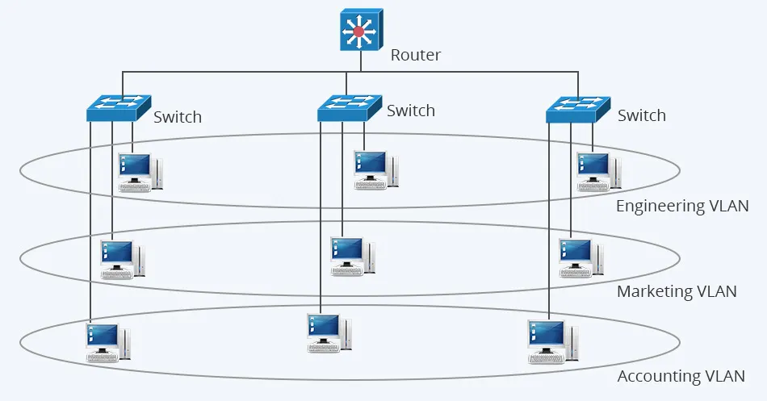

- VLAN là viết tắt của Virtual Local Area Network, hay còn gọi là mạng LAN ảo. VLAN là một kỹ thuật phân chia mạng LAN vật lý thành các mạng logic riêng biệt, được gọi là các VLAN.
- Mỗi VLAN hoạt động như một mạng LAN riêng biệt, với lưu lượng truy cập riêng biệt và được cách ly với các VLAN khác.
- Nếu không có mạng Virtual LAN, một broadcast được gửi từ host có thể dễ dàng đi đến mọi thiết bị mạng. Khi đó, tất cả thiết bị đều sẽ xử lý những frame đã nhận broadcast đó. Việc này sẽ làm tăng đáng kể chi phí cho CPU trên mỗi thiết bị, đồng thời làm giảm khả năng bảo mật của hệ thống.

- Nếu ta đặt các interface trên các switch ở những VLAN riêng biệt, một broadcast từ host A chỉ có thể đi đến các thiết bị khả dụng ở trong cùng một Virtual LAN. Các host của Virtual LAN sẽ không hề biết về cách thức giao tiếp.

- Mỗi VLAN hoạt động như một mạng LAN độc lập, mặc dù tất cả các thiết bị trong các VLAN khác nhau có thể kết nối đến cùng một thiết bị chuyển mạch (switch) vật lý. Điều này giúp tăng cường bảo mật, giảm lưu lượng không cần thiết (như broadcast) và tạo điều kiện quản lý mạng hiệu quả hơn.

- Giả sử bạn là quản trị viên mạng của một công ty có 30 máy tính được kết nối qua một switch. Công ty có 3 phòng ban:
    + Phòng IT
    + Phòng Kinh doanh
    + Phòng Nhân sự
- Cấu hình trên switch:
    + Tạo VLAN 10 cho Phòng IT.
    + Tạo VLAN 20 cho Phòng Kinh doanh.
    + Tạo VLAN 30 cho Phòng Nhân sự.
- Phân bổ cổng (port):
    + Gán các cổng của switch mà các máy tính phòng IT kết nối vào VLAN 10.
    + Gán các cổng mà các máy tính phòng Kinh doanh kết nối vào VLAN 20.
    + Gán các cổng mà các máy tính phòng Nhân sự kết nối vào VLAN 30.

- Gán cổng vào VLAN:
    + Khi ta gán một cổng vào một VLAN cụ thể, bạn đang “định danh” rằng tất cả dữ liệu gửi và nhận qua cổng đó sẽ được xem là thuộc về VLAN đó. Điều này có nghĩa là các thiết bị kết nối vào cổng đó sẽ thuộc nhóm mạng ảo (VLAN) đã được chỉ định và chỉ có thể giao tiếp trực tiếp với các thiết bị khác trong cùng VLAN (trừ khi có thiết bị định tuyến giữa các VLAN).

```plaintext
Tiêu chí	LAN	VLAN
Định nghĩa	Mạng nội bộ cục bộ	Mạng LAN ảo, chia nhỏ LAN thành nhiều mạng con
Phân chia	Dựa vào phần cứng (switch, router)	Dựa vào cấu hình logic trên switch
Bảo mật	Thấp, dễ bị đánh cắp dữ liệu giữa các thiết bị	Cao, cách ly dữ liệu giữa các VLAN
Hiệu suất	Dễ bị nghẽn mạng khi có nhiều broadcast	Giảm bớt broadcast, tăng hiệu suất
Chi phí	Rẻ hơn, chỉ cần switch cơ bản	Có thể cần switch hỗ trợ VLAN (switch Layer 2 trở lên)
```

## VLAN hoạt động như thế nào?
- VLAN hoạt động bằng cách đánh dấu các khung Ethernet với một mã VLAN (VLAN ID). Mã VLAN này xác định VLAN mà khung Ethernet thuộc về. Khi một thiết bị gửi khung Ethernet, chúng sẽ thêm mã VLAN vào khung. Khi khung Ethernet đến bộ chuyển mạch, bộ chuyển mạch sẽ đọc mã VLAN và chuyển khung đến cổng tương ứng với VLAN đó.

- Dưới đây là các bước chi tiết về cách VLAN hoạt động:
    1️⃣ Gửi Frame Ethernet: Khi một thiết bị gửi Frame Ethernet, nó sẽ thêm mã VLAN vào Frame. mã VLAN này xác định VLAN mà Frame Ethernet thuộc về.
    2️⃣ Chuyển Frame đến Switch: Frame Ethernet được truyền qua cáp đến Switch.
    3️⃣ Switch đọc mã VLAN: Switch đọc mã VLAN trong Frame Ethernet để xác định nó thuộc VLAN nào.
    4️⃣ Chuyển Frame đến cổng tương ứng: Switch chuyển Frame Ethernet đến cổng tương ứng với VLAN được xác định bởi mã VLAN.
    5️⃣ Thiết bị nhận Frame: Thiết bị trên cổng nhận được Frame Ethernet và xử lý nó.

- VÍ DỤ: 
    + Giả sử bạn có một mạng LAN với ba VLAN: VLAN 10 cho bộ phận kế toán, VLAN 20 cho bộ phận bán hàng và VLAN 30 cho bộ phận marketing. Máy tính trong bộ phận kế toán được kết nối với các cổng truy cập được gán vào VLAN 10, máy tính trong bộ phận bán hàng được kết nối với các cổng truy cập được gán vào VLAN 20 và máy tính trong bộ phận marketing được kết nối với các cổng truy cập được gán vào VLAN 30.
    + Khi một máy tính trong bộ phận kế toán gửi email cho một máy tính trong bộ phận bán hàng, khung Ethernet sẽ được đánh dấu với mã VLAN 10. Khi khung Ethernet đến bộ chuyển mạch, bộ chuyển mạch sẽ đọc mã VLAN và chuyển khung đến cổng được gán vào VLAN 20. Máy tính trong bộ phận bán hàng sau đó sẽ nhận được khung Ethernet và xử lý email.

- VLAN được phân loại như thế nào?
VLAN được phân loại theo nhiều phương thức khác nhau, dựa trên tiêu chí và mục đích sử dụng. Dưới đây là một số phân loại VLAN phổ biến:
1. VLAN dựa trên cổng (Port-based VLAN):
 + Đây là phương thức phổ biến nhất, trong đó các thiết bị được gán vào VLAN dựa trên cổng switch mà chúng kết nối. Ưu điểm của phương thức này là đơn giản và dễ dàng cấu hình. Tuy nhiên, nó không linh hoạt vì việc di chuyển thiết bị sang cổng khác có thể thay đổi VLAN của chúng.

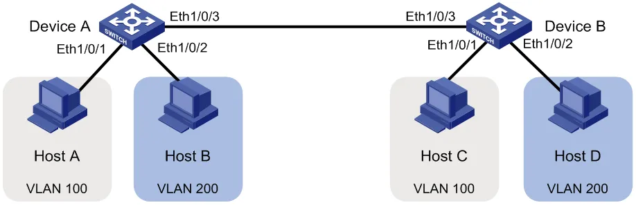

2. VLAN dựa trên địa chỉ MAC (MAC address-based VLAN)
- Phương thức này gán thiết bị vào VLAN dựa trên địa chỉ MAC duy nhất của nó. Ưu điểm của phương thức này là linh hoạt hơn so với VLAN dựa trên cổng, vì việc di chuyển thiết bị không ảnh hưởng đến VLAN của nó. Tuy nhiên, chúng có thể phức tạp hơn để cấu hình và quản lý.
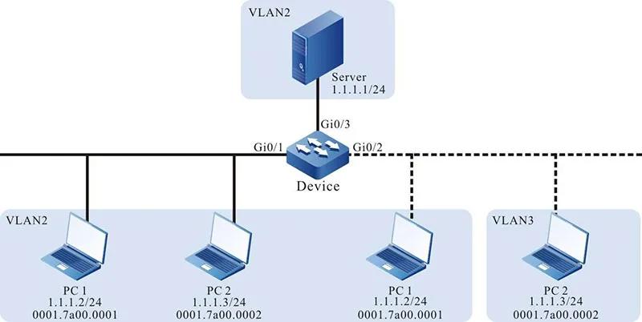

3. VLAN dựa trên giao thức (Protocol-based VLAN)
- Phương thức này gán thiết bị vào VLAN dựa trên giao thức mạng mà nó sử dụng (ví dụ: IP, IPX). Ưu điểm của phương thức này là nó có thể hữu ích cho việc phân chia lưu lượng truy cập mạng theo loại ứng dụng.

### Ưu và nhược điểm của VLAN là gì?
- Tăng cường bảo mật: VLAN giúp cô lập lưu lượng truy cập của các nhóm người dùng khác nhau, giúp bảo vệ dữ liệu nhạy cảm khỏi những truy cập trái phép.
    - Ví dụ: Bạn có thể tạo một VLAN riêng cho bộ phận tài chính và một VLAN riêng cho bộ phận nhân sự, giúp ngăn chặn nhân viên bộ phận nhân sự truy cập vào dữ liệu tài chính nhạy cảm.
- Cải thiện hiệu suất: VLAN giúp giảm tắc nghẽn mạng bằng cách phân chia lưu lượng truy cập thành các nhóm nhỏ hơn. Điều này đặc biệt hữu ích trong các mạng lớn có nhiều người dùng và thiết bị.
- Dễ dàng quản lý: VLAN giúp đơn giản hóa việc quản lý mạng bằng cách cho phép quản trị viên mạng quản lý từng VLAN riêng biệt.
    - Ví dụ:  Bạn có thể dễ dàng thay đổi cài đặt bảo mật cho một VLAN cụ thể mà không ảnh hưởng đến các VLAN khác
- Tăng tính linh hoạt: VLAN giúp dễ dàng di chuyển và thêm người dùng vào mạng.
    - Ví dụ: Nếu bạn cần di chuyển một nhân viên từ bộ phận nhân sự sang bộ phận tài chính, bạn chỉ cần thay đổi VLAN của máy tính của họ.
- Giảm chi phí: VLAN có thể giúp giảm chi phí bằng cách cho phép bạn sử dụng hiệu quả hơn các tài nguyên mạng hiện có.
    - Ví dụ: Bạn có thể sử dụng một switch để hỗ trợ nhiều VLAN, thay vì cần nhiều switch cho mỗi mạng con.

## Ứng dụng và lợi ích của mạng VLAN
- 1. Chia tách mạng logic
- Đây là ứng dụng cơ bản và quan trọng nhất của mạng VLAN. VLAN giúp chia tách mạng vật lý thành các mạng logic riêng biệt, mỗi mạng logic có thể đại diện cho một bộ phận, phòng ban hoặc nhóm người dùng khác nhau trong tổ chức. Việc chia tách mạng logic mang lại nhiều lợi ích như:
    + Tăng cường tính bảo mật: Mỗi VLAN hoạt động như một mạng riêng biệt, giúp hạn chế truy cập trái phép giữa các bộ phận, phòng ban, ngăn chặn sự lây lan của virus và phần mềm độc hại.
    + Cải thiện hiệu suất mạng: Việc chia tách lưu lượng truy cập theo VLAN giúp giảm thiểu tình trạng tắc nghẽn mạng, đảm bảo hiệu suất mạng tốt hơn cho các ứng dụng quan trọng.
    + Dễ dàng quản lý: Quản trị viên mạng có thể dễ dàng quản lý và điều khiển lưu lượng truy cập trong từng VLAN, giúp đơn giản hóa việc quản lý mạng và khắc phục sự cố.
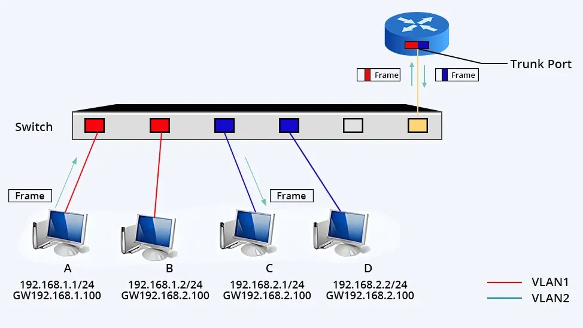

2. Phân đoạn mạng
- VLAN giúp phân đoạn mạng thành các vùng riêng biệt, mỗi vùng có thể có các chính sách bảo mật và chất lượng dịch vụ (QoS) riêng. Việc phân đoạn mạng đặc biệt hữu ích trong các môi trường mạng có nhiều loại lưu lượng truy cập khác nhau, chẳng hạn như mạng văn phòng, mạng VoIP, mạng IoT, v.v.

3. Tạo mạng ảo cho các dịch vụ đặc biệt
- Mạng VLAN có thể được sử dụng để tạo ra các mạng ảo cho các dịch vụ đặc biệt như mạng khách, mạng DMZ, v.v. Việc tạo ra các mạng ảo riêng biệt giúp tăng cường bảo mật và khả năng kiểm soát cho các dịch vụ này.

### So sánh sự khác nhau giữa mạng LAN và VLAN
- Mạng LAN (Mạng cục bộ) là một mạng máy tính kết nối các thiết bị trong một khu vực giới hạn, như nhà ở, văn phòng hoặc tòa nhà. Mạng LAN cho phép các thiết bị chia sẻ tài nguyên, chẳng hạn như máy in, tệp và kết nối internet.

- Mạng VLAN (Mạng cục bộ ảo) là một mạng logic được tạo ra trên mạng LAN vật lý. VLAN chia nhỏ mạng LAN thành các nhóm logic, cho phép quản lý và bảo mật tốt hơn. Các thiết bị trong cùng một VLAN có thể giao tiếp với nhau như thể chúng được kết nối trực tiếp, ngay cả khi chúng được kết nối với các bộ chuyển mạch khác nhau trong mạng LAN vật lý.

# Trunking
- Giả sử trong 1 tòa nhà nhiều tầng mỗi tầng có nhiều phòng ban, mỗi phòng ban con đều chia thành các phòng nhỏ như HR,IT,SALE,…. Như vậy mỗi phòng ban sẽ cần 1 con switch, vậy sẽ cần rất nhiều switch cho hạ tầng này. Nhưng mỗi con switch có khoảng 24-48 port mà mỗi phòng ban chỉ có tối đa 10 nhân viên, điều đó dẫn đến dư thừa port. VLAN ra đời để giải quyết vấn đề đó.
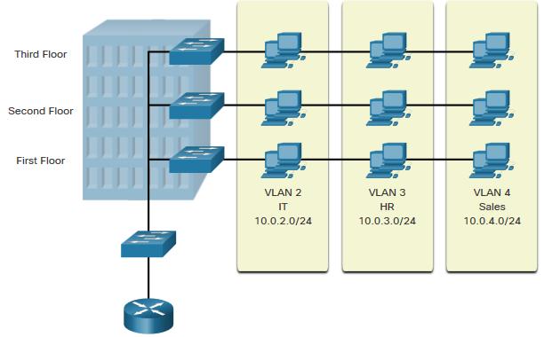
- Hiểu 1 cách đơn giản VLAN là việc chia 1 con 1 switch vật lý thành nhiều con switch logic

## 2. CÁCH HOẠT ĐỘNG CỦA VLAN
- TH1. Khi chưa chia VLAN   
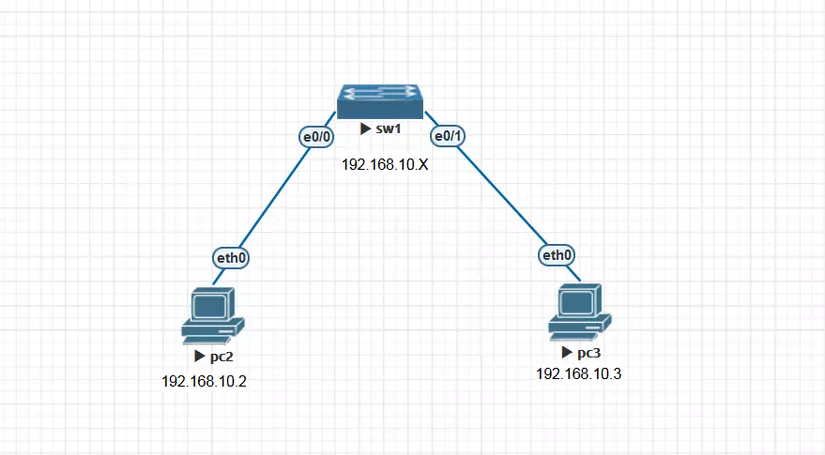
+ Ping từ PC2 => PC3 (thành công)
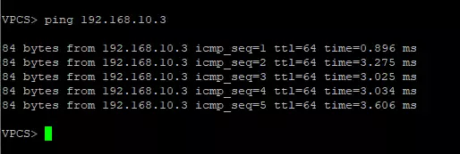
- TH2. Khi đã chia VLAN
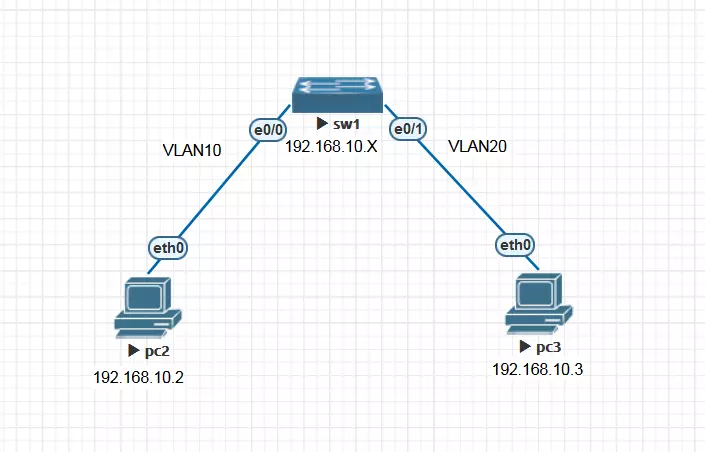
+ Thực hiện ping lại từ PC2 => PC3 ( không thành công)
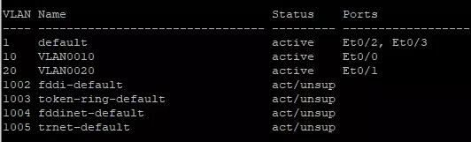
==> Từ hai TH trên, tại sao trong cùng 1 dải mạng nhưng sau khi chia Vlan xong thì không thể ping từ PC2 => PC3? Bản chất của vấn đề là khi chia Vlan, từ con switch vật lý đã được chia thành hai con switch logic. Lúc này PC2 và PC3 ở hai dải mạng LAN khác nhau, do đó không thể liên lạc với nhau.

## LÀM THẾ NÀO CÁC THIẾT BỊ TRÊN CÁC VLAN KHÁC NHAU CÓ THỂ LIÊN LẠC ĐƯỢC VỚI NHAU.
- Chúng ta có 2 cách để giải quyết vấn đề này.
### 3.1. Dùng mỗi kết nối cho từng VLan
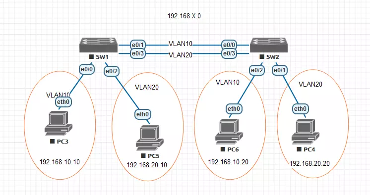
- Có nghĩa là mỗi VLan trên các Switch sẽ được kết nối bằng các đường dây riêng biệt. Giả sử PC3 trong VLAN 10 trong SW1 muốn ping được đến PC6 trong VLAN 10 trong SW2 thì phải có kết nối vật lý giữa SW1 và SW2 và hai cổng kết nối này đều thuộc VLAN10.
- Vấn đề bắt đầu nảy sinh, giả sử chúng ta có nhiều hơn 2 VLAN muốn liên lạc với nhau thì cũng sẽ cần nhiều đường kết nối vật lý hơn. Điều này sẽ sử dụng 1 số lượng port đáng kể trên switch và việc đấu nối nhiều dây giữa các Switch như vậy sẽ gây lãng phí lớn. Từ đó dây trunk ra đời để giải quyết vấn đề trên.
### 3.2. Kết nối Trunk( dây Trunk)
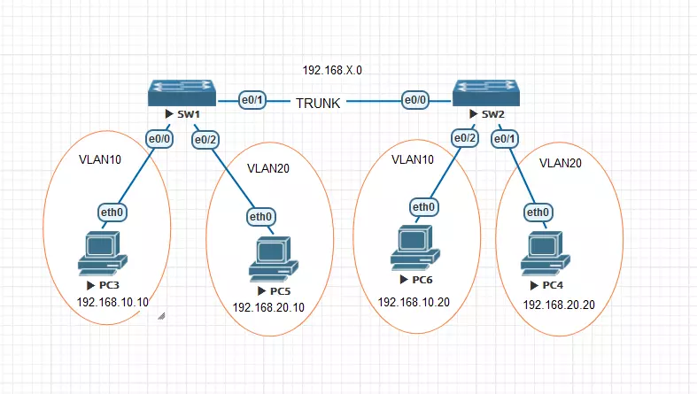
- Ở trên đã gộp 2 dây kết nối vật lý từ VLAN10 ở SW1 đến VLAN10 ở SW2 và VLAN20 ở SW1 đến VLAN20 ở SW2 thành 1 dây trunk duy nhất. Trên đường trunk sẽ cho phép dữ liệu từ VLA10, VLAN20 ở SW1 cùng chạy trên đường này.
- Vì kỹ thuật Trunk cho phép nhiều VLan truyền dữ liệu trên 1 kết nối vật lý. Vậy giả sử PC3 trong VLAN10 ở SW1 muốn liên hệ với PC6 trong VLAN10 ở SW2, thì làm sao SW2 biết được gói tin được gửi đến thuộc VLAN nào để chuyển đi, do vậy trước khi chuyển gói tin đi người ta sẽ gán nhãn cho nó hay còn gọi là “tagging”. Hiểu đơn giản trên đường Trunk chúng ta sẽ sử dụng một chuẩn đóng gói một cách riêng biệt đó là 802.1Q.
- Giao thức 802.1Q
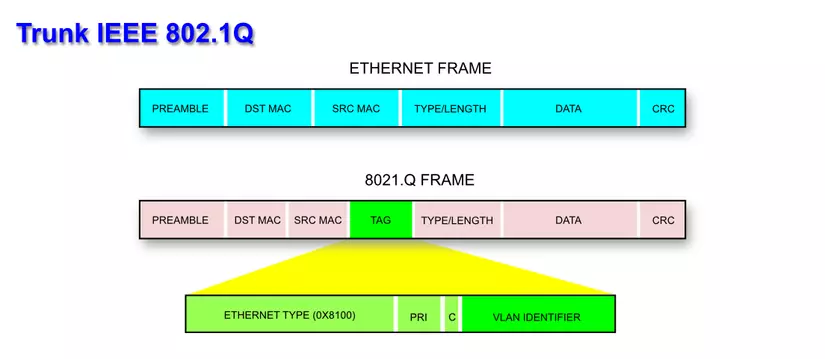
- Đây là giao thức tiêu chuẩn của IEEE dùng để nhận dạng các VLan khi đi qua đường Trunk. Là giao thức gán nhãn frame khi frame đi qua dây trunk kết nối giữa 2 con switch hoặc giữa switch và router. Cách hoạt động của nó là khi SW1 chuẩn bị đẩy gói tin đi thì nó sẽ thêm 1 trường frame tagging để đánh dấu xem gói tin đó thuộc VLAN nào.
- Khi gói tin đến được SW2, SW2 sẽ mở gói tin ra đọc thông tin đích đến và xem frame này thuộc về VLan nào. Sau đó sẽ xóa đi Tagging trở về đúng frame ban đầu. Thực chất quá trình 802.1Q Tagging chỉ xảy ra trên đường Trunk để phân biệt frame đó thuộc VLAN nào. Các PC không hiểu và cũng không quan tâm.

# Routing giữa các VLAN
- Mặc định, các thiết bị trong cùng một VLAN có thể giao tiếp với nhau, nhưng giữa các VLAN thì không thể. Routing giữa VLAN giúp các thiết bị thuộc các VLAN khác nhau có thể trao đổi dữ liệu thông qua một thiết bị định tuyến (router hoặc switch Layer 3).

- Giả sử công ty bạn có hai phòng ban:
+ Phòng Kế Toán (VLAN 10)
    + Địa chỉ mạng: 192.168.10.0/24
+ Phòng IT (VLAN 20)
    + Địa chỉ mạng: 192.168.20.0/24
Mỗi phòng ban sử dụng một VLAN riêng biệt để bảo mật và quản lý tốt hơn. Nhưng nếu một nhân viên IT muốn gửi file cho nhân viên Kế Toán, họ sẽ không thể giao tiếp vì VLAN mặc định không thể giao tiếp với nhau.
===> Cần một thiết bị có thể định tuyến (routing) để truyền dữ liệu giữa các VLAN

## Giải pháp: Routing giữa VLAN
### Router-on-a-stick (Dùng router để routing giữa VLAN)
- Theo cách này, ta sẽ sử dụng một Router và kết nối với Switch qua nhiều cổng. Mỗi cổng cấu hình cho một VLAN cụ thể. Các cổng trên Router sẽ được thiết lập là các cổng mặc định cho các VLAN tương ứng được cấu hình trên Switch.
- Khi một thiết bị từ VLAN này kết nối với VLAN khác, gói tin chuyển từ thiết bị đến cổng truy cập kết nối với Router tương ứng VLAN mà thiết bị kết nối. Router nhận được gói tin, nó kiểm tra địa chỉ IP đích của gói tin và chuyển tiếp đến mạng đích bằng cổng truy cập tương ứng của VLAN đích.
- Switch nhận được gói tin sẽ chuyến tiếp khung tới thiết bị đích vì Router đã đổi thông tin VLAN từ VLAN nguồn sang VLAN đích.
- Cách này rất đơn giản nhưng yêu cầu Router phải có số cổng bằng với số lượng VLAN cấu hình trên Switch. Do đó, nếu Switch có 10 VLAN thì Router cũng cần 10 cổng để thực hiện kết nối định tuyến dữ liệu. Do đó, cách này thường không được sử dụng.

# EtherChannel

## Đặt vấn đề:
- Thiết bị Switch có thể sử dụng các cổng Ethernet, Fast-Ethernet(FE), GigaEthernet(GE), 10 GigaEthernet(10GE) để tăng tốc độ các link. Mỗi lần link bị quá tải ta có thể nâng cấp các đường lên 10 lần, nhưng như vậy sẽ rất tốn kém trong việc mua module gắn vào và dây dẫn, bên cạnh đó, không phải switch nào cũng có module để bạn gắn cũng như tốn chi phí về mua dây dẫn.

- Ví dụ: Ta có hai Switch đang kết nối với nhau bằng cổng Fast Ethernet 100 Mbit trong khi các PC Host kết nối Switch thì dùng cổng Fast với băng thông 1000 Mbit. Hiển nhiên khi mà PC muốn truyền tải một lượng lớn dữ liệu hơn 100 Mbit đi thì tại Switch sẽ xảy ra hiện tượng nghẽn Traffic, các gói tin trong hàng đợi khi quá ngưỡng Cache thi sẽ bị Drop bỏ.

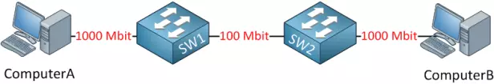

- Khi mà dữ liệu truyền tải quá lớn đến nỗi đường truyền không đáp ứng được thì thay vì ta phải nâng cấp hay mua thiết bị mới thì ta sẽ nghĩ tới việc mở thêm nhiều kết nối dây giữa các Switch để cân bằng tải dữ liệu.

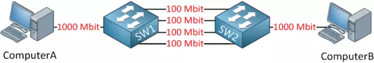

- Ta có thể kết nối thêm 3 đường dây nữa giúp tăng băng thông cân bằng tải lên 400 Mbit.
- Tuy nhiên, nếu chỉ kết nối thêm các dây mà không cấu hình đúng, giao thức Spanning Tree Protocol (STP) sẽ nhận diện sự lặp lại (loop) và chặn hầu hết các đường phụ nhằm ngăn chặn loop, dẫn đến chỉ có một link được hoạt động và các link còn lại không được sử dụng để tăng băng thông.

## EtherChannel

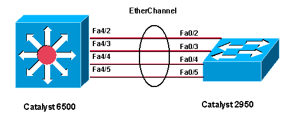

- EtherChannel là một kỹ thuật nhóm hai hay nhiều đường kết nối truyền tải dữ liệu vật lý (Link Aggregation) thành một đường ảo duy nhất (Logic) có Port ảo thậm chí cả MAC ảo nhằm mục đích tăng tốc độ truyền dữ liệu và tăng khả năng dự phòng (Redundancy) cho hệ thống.
- Công nghệ EtherChannel có thể bó từ 2 đến 8 link FE, GE, 10GE thành 1 link logical. Khi đó, switch đối xử các port thuộc EtherChannel như 1 port duy nhất.
- Switch hoặc thiết bị ở 2 đầu EtherChannel phải hiểu và sử dụng công nghệ EtherChannel để đảm bảo hoạt động đúng và chống loop. Nếu chỉ có 1 đầu sử dụng EtherChannel, còn đầu bên kia không sử dụng thì có thể gây ra loop.
- Traffic không phải lúc nào cũng được phân bố đồng đều qua các đường link thuộc EtherChannel, mà nó phụ thuộc vào phương pháp load balancing mà switch sử dụng và mẫu traffic trong mạng.
- Nếu một trong các link thuộc EtherChannel bị down thì traffic sẽ tự động được chuyển sang link khác trong channel chỉ trong vòng vài miliseconds. Khi link up trở lại thì traffic được phân bố lại như cũ.

### Mục đích của EtherChannel
- Tăng tốc độ truyền tải dữ liệu: Bằng cách kết hợp nhiều đường vật lý, tổng băng thông của liên kết được tăng lên. Ví dụ, việc bó 4 link Fast-Ethernet (mỗi link 100 Mbit/s) có thể cung cấp một tổng băng thông lên tới 400 Mbit/s.

- Tăng khả năng dự phòng (Redundancy): Nếu một trong các đường vật lý gặp sự cố (bị down), các đường còn lại vẫn đảm bảo việc truyền dữ 
liệu, giúp duy trì tính liên tục của kết nối. Thông thường, việc chuyển đổi sẽ diễn ra chỉ trong vài mili giây.    

### Các đặc điểm kỹ thuật
- Số lượng link: EtherChannel có thể "bó" từ 2 đến 8 đường kết nối vật lý (FE, GE, 10GE) thành một liên kết logic.
- Quá trình tích hợp: Sau khi các cổng được cấu hình thành EtherChannel, thiết bị (ví dụ: switch) sẽ xử lý toàn bộ các cổng đó như thể nó là một cổng đơn lẻ. Điều này giúp việc quản lý và thiết lập kết nối trở nên đơn giản hơn và tránh các xung đột liên quan đến giao thức định tuyến hoặc chuyển mạch.
- Yêu cầu tương thích: Cả hai đầu của EtherChannel (ví dụ: switch nối với switch hoặc switch nối với router) đều phải hỗ trợ và được cấu hình sử dụng công nghệ EtherChannel. Nếu chỉ có một đầu sử dụng EtherChannel mà đầu kia không hỗ trợ, có thể gây ra các hiện tượng không mong muốn như loop (vòng lặp không kiểm soát).
- Phân bổ traffic (Load Balancing): Traffic không nhất thiết phải được chia đều hoàn hảo trên tất cả các đường link trong EtherChannel. Phân bổ lưu lượng phụ thuộc vào:
    + Thuật toán cân bằng tải mà switch sử dụng (ví dụ: dựa trên địa chỉ MAC, địa chỉ IP, cổng TCP/UDP, …).
    + Mẫu lưu lượng cụ thể trong mạng.
- Điều này có nghĩa là trong một số trường hợp, một số đường link có thể phải gánh vác nhiều traffic hơn so với các link khác.
- Tính năng tự động chuyển đổi: Khi một trong các link thuộc EtherChannel bị hỏng hoặc down, hệ thống sẽ tự động chuyển traffic sang các đường còn lại. Quá trình này diễn ra rất nhanh (chỉ vài mili giây) để đảm bảo tính liên tục của kết nối. Khi đường link gặp sự cố được khôi phục, quá trình cân bằng lại được thực hiện để đưa traffic về trạng thái phân bố ban đầu.

### Tại sao cần phải cấu hình EtherChannel trên cả hai switch và cách loop có thể xảy ra nếu cấu hình không đồng bộ
- Giả sử có 2 switch kết nối với nhau:
    + Bạn có Switch A và Switch B.
    + Hai switch này được kết nối với nhau bằng 2 dây cáp qua cổng GE0/1 và GE0/2.
- Khi CẢ HAI switch được cấu hình EtherChannel:
    + Trên Switch A, ta gom GE0/1 và GE0/2 thành một nhóm EtherChannel (Port-channel1).
    + Trên Switch B, ta cũng gom GE0/1 và GE0/2 vào một nhóm EtherChannel (Port-channel1).
    🔹 Khi đó, cả hai switch sẽ coi 2 đường cáp là một đường duy nhất (Link Aggregation).
    🔹 Spanning Tree Protocol (STP) chỉ xem đây là một kết nối duy nhất, do đó không có loop.
    🔹 EtherChannel sẽ quản lý load balancing và dự phòng nếu một đường cáp bị lỗi.
    ✅ Kết quả: Hoạt động ổn định, không có loop.
#### Khi CHỈ MỘT bên cấu hình EtherChannel (Gây ra loop)
- Trường hợp: Switch A cấu hình EtherChannel, nhưng Switch B không cấu hình EtherChannel
    + Switch A: Gom GE0/1 và GE0/2 thành một đường duy nhất (Port-channel1).
    + Switch B: Vẫn coi GE0/1 và GE0/2 là hai cổng độc lập.
    
🔸 Điều gì xảy ra?
+ Switch A gửi gói tin qua Port-channel1, hệ thống load balance và có thể gửi gói tin qua GE0/1 hoặc GE0/2.
+ Switch B lại nhận 2 đường độc lập, nên gói tin có thể được lặp lại khi truyền ngược lại Switch A.
+ Switch A tiếp tục gửi gói tin đi qua EtherChannel của nó, khiến gói tin bị quay vòng liên tục.
+ Vì STP trên Switch B vẫn coi đây là hai cổng độc lập, nó không nhận diện loop và không chặn bớt một cổng nào.
🔥 Kết quả: Loop xảy ra!

- Giải thích loop theo từng bước đơn giản
    + Switch A gửi một gói tin broadcast (ví dụ: ARP Request) vào Port-channel1.
    + Vì EtherChannel load balancing, gói tin có thể đi qua GE0/1 hoặc GE0/2.
    + Switch B nhận được gói tin trên cả GE0/1 và GE0/2 vì nó không gom 2 port này lại.
    + Switch B không nhận ra rằng đây là 2 đường của cùng một nhóm, nên nó sẽ phát lại gói tin ra cả hai cổng.
    + Switch A lại nhận gói tin này và tiếp tục load balance, gửi lại gói tin qua Port-channel1.
    + Chu kỳ này tiếp tục lặp lại vô hạn, gây ra loop trong mạng.

# Bonding
- Bonding (còn gọi là NIC teaming trên một số hệ thống) là kỹ thuật gộp nhiều card mạng (Network Interface Cards – NIC) thành một liên kết logic duy nhất trên hệ điều hành Linux (và một số hệ điều hành khác).
- Nó tương tự như EtherChannel trên switch, nhưng Bonding thường được sử dụng trên máy chủ (server) hoặc Linux host thay vì trên thiết bị switch.
- Mục tiêu của bonding:
    + Tăng băng thông: Sử dụng nhiều card để tổng hợp băng thông.
    + Dự phòng: Nếu một card mạng gặp lỗi, các card khác sẽ tiếp tục truyền nhận dữ liệu.
- Ví dụ:
    + Nếu có 2 cổng 1 Gbps, bonding giúp tạo thành một link ảo có tốc độ 2 Gbps.
    + Nếu 1 trong 2 đường bị hỏng, đường còn lại vẫn hoạt động bình thường.


## Ví dụ thực tế về Bonding
- Giả sử bạn có một máy chủ Linux với 2 card mạng:
    + eth0 (1 Gbps)
    + eth1 (1 Gbps)
Bạn muốn:
    + Tăng băng thông lên 2 Gbps bằng cách gộp hai card mạng này.
    + Nếu eth0 bị lỗi, toàn bộ lưu lượng sẽ tự động chuyển sang eth1 để đảm bảo mạng không bị gián đoạn.
📌 Giải pháp: Dùng Bonding để gộp eth0 + eth1 thành một cổng ảo bond0.
- Sau khi cấu hình, hệ thống sẽ coi bond0 là một cổng mạng duy nhất thay vì hai cổng riêng lẻ.

# Routing
## Tìm hiểu về giao thức định tuyến, tập trung vào định tuyến tĩnh.
- Định tuyến (Routing) là quá trình xác định đường đi của gói tin từ mạng nguồn đến mạng đích. Trong hệ thống mạng, có hai loại định tuyến chính:
    + Định tuyến tĩnh (Static Routing) – Cấu hình thủ công, chỉ định đường đi cố định.
    + Định tuyến động (Dynamic Routing) – Dùng các giao thức định tuyến để tự động cập nhật đường đi.
## Định tuyến tĩnh (Static Routing)
+ Định tuyến tĩnh là khi người quản trị mạng tự cấu hình thủ công các đường đi cho gói tin.
+ Không thay đổi tự động khi có sự cố mạng, cần cấu hình lại nếu có thay đổi.
+ Phù hợp cho mạng nhỏ hoặc định tuyến đơn giản.

- Giả sử bạn có hai mạng:
    + Mạng 1: 192.168.1.0/24 (PC-1: 192.168.1.10)
    + Mạng 2: 192.168.2.0/24 (PC-2: 192.168.2.20)
- Router trung gian có:
    + eth0: 192.168.1.1
    + eth1: 192.168.2.1
📌 Mục tiêu:
    + PC-1 (192.168.1.10) muốn giao tiếp với PC-2 (192.168.2.20).
    + Vì hai máy thuộc hai mạng khác nhau, gói tin phải đi qua router.

## Tìm hiểu routing table, cấu hình định tuyến trên Linux
### Routing Table là gì?
- Routing Table là bảng định tuyến chứa các quy tắc giúp hệ thống quyết định gửi gói tin đi đâu dựa trên địa chỉ đích (destination IP).

```bash
root@ubuntu-22-04:~# ip route show
default via 192.168.254.2 dev ens33 proto static 
192.168.254.0/24 dev ens33 proto kernel scope link src 192.168.254.10 

# default via 192.168.254.2 dev ens33 proto static
# Đây là default route (cổng mặc định) của hệ thống.
# default → Tất cả các gói tin không có route cụ thể sẽ được gửi theo route này.
# via 192.168.254.2 → Gói tin sẽ đi qua gateway 192.168.254.2.
# dev ens33 → Gói tin sẽ đi qua card mạng ens33.
# proto static → Đây là route tĩnh (static route), được cấu hình thủ công.
# ==> Mọi gói tin đi ra ngoài (không thuộc mạng nội bộ) sẽ được chuyển đến 192.168.254.2 (gateway).

# 192.168.254.0/24 dev ens33 proto kernel scope link src 192.168.254.10
# 👉 Đây là route nội bộ của mạng 192.168.254.0/24.
# 192.168.254.0/24 → Đây là mạng nội bộ (Subnet Mask: 255.255.255.0).
# dev ens33 → Giao diện mạng ens33 kết nối trực tiếp với mạng này.
# proto kernel → Route này được tạo tự động bởi kernel khi thiết lập IP.
# scope link → Route chỉ có hiệu lực trong mạng nội bộ (không cần gateway).
# src 192.168.254.10 → Khi gửi gói tin từ mạng này, hệ thống sẽ sử dụng 192.168.254.10 làm địa chỉ nguồn. 
# ==>  Mọi gói tin gửi đến mạng 192.168.254.0/24 sẽ đi trực tiếp qua ens33, mà không cần qua gateway.

# 📌 Kết luận
# Nếu gói tin có đích là 192.168.254.X, nó sẽ đi thẳng qua interface ens33.
# Nếu gói tin có đích là mạng khác (ví dụ: 8.8.8.8), nó sẽ đi qua gateway 192.168.254.2.

default via 192.168.1.1 dev ens33 proto static 
192.168.1.0/24 dev ens33 proto kernel scope link src 192.168.1.10
192.168.2.0/24 via 192.168.1.1 dev ens33

# default via 192.168.1.1 dev ens33 → Tất cả gói tin không biết đi đâu sẽ đi qua 192.168.1.1 (default gateway).
# 192.168.1.0/24 dev ens33 → Mạng 192.168.1.0/24 kết nối trực tiếp qua card mạng ens33.
# 192.168.2.0/24 via 192.168.1.1 dev ens33 → Nếu gửi gói tin đến 192.168.2.0/24, nó sẽ đi qua 192.168.1.1.


root@ubuntu-22-04:~# route -n
Kernel IP routing table
Destination     Gateway         Genmask         Flags Metric Ref    Use Iface
0.0.0.0         192.168.254.2   0.0.0.0         UG    0      0        0 ens33
192.168.254.0   0.0.0.0         255.255.255.0   U     0      0        0 ens33

```

```bash
# Cấu hình định tuyến trên Linux
# Thêm route tĩnh (Static Route)
# Ví dụ: Bạn có 2 mạng:
# - Mạng 1: 192.168.1.0/24 (Server1)
# - Mạng 2: 192.168.2.0/24 (Server2)
# - Router (Linux) có IP: 192.168.1.1 và 192.168.2.1

# Trên Server1 (192.168.1.10), thêm route đến mạng 192.168.2.0/24:
ip route add 192.168.2.0/24 via 192.168.1.1 dev ens33
# Trên Server2 (192.168.2.10), thêm route đến mạng 192.168.1.0/24:
ip route add 192.168.1.0/24 via 192.168.2.1 dev ens33
# Giải thích:
# Khi Server1 muốn gửi gói tin đến 192.168.2.0/24, nó sẽ gửi đến 192.168.1.1 (Router).
# Khi Server2 muốn gửi gói tin đến 192.168.1.0/24, nó sẽ gửi đến 192.168.2.1 (Router).

# Kiểm tra bằng lệnh
ip route show
# Xóa route tĩnh
ip route del 192.168.2.0/24 via 192.168.1.1 dev ens33


```
- Lưu Route Vĩnh Viễn

```/etc/netplan/01-netcfg.yaml
network:
  ethernets:
    ens33:
      dhcp4: no
      addresses:
        - 192.168.1.10/24
      routes:
        - to: 192.168.2.0/24
          via: 192.168.1.1
```

```bash
sudo netplan apply
```

- Các lệnh này là lệnh định tuyến tĩnh (static route) trong Linux, giúp thiết lập đường đi cho các gói tin khi máy tính hoặc router không biết sẵn đường đến mạng đích.


# Nắm chắc giao thức chính: HTTP, DNS, FTP, SSH, DHCP, ARP, SNMP, SMTP

## HTTP
📌 Chức năng:
    + Dùng để truyền tải dữ liệu giữa trình duyệt web và máy chủ web.
    + Hoạt động theo mô hình Client-Server (máy khách - máy chủ).
    + Phiên bản bảo mật: HTTPS (HTTP + SSL/TLS).
📌 Ví dụ:
    + Khi bạn truy cập https://example.com, trình duyệt sẽ gửi yêu cầu HTTP đến máy chủ và nhận về nội dung trang web

## DNS (Domain Name System) - Hệ thống phân giải tên miền
📌 Chức năng:
    + Chuyển đổi tên miền (vd: google.com) thành địa chỉ IP (vd: 142.250.183.206).
    + Giúp con người dễ nhớ tên trang web thay vì phải nhớ địa chỉ IP.
📌 Ví dụ:
    + Khi bạn nhập google.com, máy tính sẽ gửi yêu cầu DNS để lấy địa chỉ IP của máy chủ Google.

## FTP (File Transfer Protocol) - Giao thức truyền tải tập tin
📌 Chức năng:
    + Dùng để tải lên/tải xuống file giữa máy khách (Client) và máy chủ (Server).
    + Cần có username/password để xác thực.
📌 Ví dụ:
    + Dùng FileZilla hoặc lệnh ftp để kết nối và tải file từ một máy chủ FTP.
## SSH (Secure Shell) - Giao thức kết nối từ xa an toàn
📌 Chức năng:
    + Dùng để điều khiển máy chủ từ xa một cách bảo mật qua đường truyền mã hóa.
    + Thay thế cho Telnet (không có mã hóa).
📌 Ví dụ:
    + Kết nối SSH vào máy chủ bằng lệnh: ssh user@192.168.1.10

## DHCP (Dynamic Host Configuration Protocol) - Giao thức cấp phát địa chỉ IP tự động
📌 Chức năng:
    + Cấp phát địa chỉ IP tự động cho các thiết bị trong mạng.
    + Giúp tránh xung đột IP khi nhiều thiết bị kết nối vào mạng.
📌 Ví dụ: Khi bạn kết nối Wi-Fi, Router sẽ cấp phát một địa chỉ IP động cho bạn qua DHCP.

## ARP (Address Resolution Protocol) - Giao thức phân giải địa chỉ
📌 Chức năng:
    + Chuyển đổi địa chỉ IP thành địa chỉ MAC để các thiết bị trong mạng LAN có thể giao tiếp với nhau.
📌 Ví dụ:
    + Khi máy tính muốn gửi dữ liệu đến 192.168.1.2, nó dùng ARP để tìm địa chỉ MAC của thiết bị đó.

## SNMP (Simple Network Management Protocol) - Giao thức quản lý mạng đơn giản
📌 Chức năng:
    + Dùng để giám sát và quản lý các thiết bị mạng như Router, Switch, Server,...
    + Thu thập thông tin như tốc độ mạng, trạng thái CPU, dung lượng RAM,...
📌 Ví dụ: Phần mềm giám sát Zabbix, Nagios dùng SNMP để thu thập dữ liệu từ các thiết bị mạng.

## SMTP (Simple Mail Transfer Protocol) - Giao thức gửi email
📌 Chức năng: Dùng để gửi email từ máy khách lên máy chủ email.
Không dùng để nhận email (POP3, IMAP mới là giao thức nhận email).
📌 Ví dụ: Khi bạn gửi email qua Gmail, máy chủ Gmail dùng SMTP để gửi email đến máy chủ đích.

# Tìm hiểu cơ chế NAT, các loại NAT

## 1. NAT là gì?
- Nat là viết tắt của từ gì? NAT (viết tắt của cụm từ tiếng Anh Network Address Translation) là một kỹ thuật trong mạng máy tính cho phép chuyển đổi địa chỉ IP giữa các thiết bị trong mạng nội bộ và mạng bên ngoài. Nó được sử dụng để ánh xạ địa chỉ IP riêng (private IP) của các thiết bị trong mạng nội bộ sang một địa chỉ IP công cộng (public IP) khi chúng truy cập internet.
- Điều này giúp tiết kiệm địa chỉ IP và tăng cường bảo mật cho mạng nội bộ vì các thiết bị bên ngoài không thể trực tiếp truy cập vào các thiết bị trong mạng nội bộ.
- NAT thường được sử dụng trong các router hoặc gateway để cho phép nhiều thiết bị trong mạng nội bộ chia sẻ một địa chỉ IP công khai duy nhất.

## 2. Nguyên lý hoạt động của NAT như thế nào?
- NAT hoạt động dựa trên việc thay đổi địa chỉ IP và cổng của các gói tin khi chúng đi qua router. Nó giúp che giấu các địa chỉ IP nội bộ với bên ngoài, đồng thời tiết kiệm địa chỉ IP công cộng bằng cách cho phép nhiều thiết bị sử dụng chung một địa chỉ IP công cộng.
- Quá trình này thường diễn ra tại router hoặc firewall để quản lý kết nối giữa mạng nội bộ và internet, cụ thể như sau:
- Gửi gói tin từ mạng nội bộ ra ngoài:
    + Khi một thiết bị trong mạng nội bộ muốn truy cập internet, nó sẽ gửi một gói tin đến router NAT.
    + Gói tin này chứa địa chỉ IP nguồn là địa chỉ IP riêng của thiết bị, và địa chỉ IP đích là địa chỉ IP công cộng của máy chủ mà thiết bị muốn kết nối.
- Thay đổi địa chỉ IP nguồn:
    + Router NAT nhận gói tin và thay đổi địa chỉ IP nguồn từ địa chỉ IP riêng thành địa chỉ IP công cộng của router (hoặc một địa chỉ IP công cộng được ánh xạ).
    + Đôi khi, NAT cũng thay đổi cả cổng nguồn của gói tin để đảm bảo sự phân biệt giữa các kết nối khác nhau sử dụng chung một địa chỉ IP public. Đây là quá trình Port Address Translation (PAT).
    + Sau đó, router gửi gói tin ra ngoài internet với địa chỉ IP công cộng mới.
- Lưu bảng NAT:
    + Router NAT sẽ lưu thông tin ánh xạ giữa địa chỉ IP và cổng nguồn ban đầu với địa chỉ IP và cổng nguồn mới trong bảng NAT.
    + Bảng này giúp router biết cách chuyển tiếp gói tin phản hồi từ internet về đúng thiết bị trong mạng nội bộ.
- Nhận gói tin phản hồi:
    + Khi máy chủ bên ngoài phản hồi, gói tin sẽ được gửi về địa chỉ IP công cộng của router NAT.
    + Router NAT kiểm tra bảng NAT để tìm ánh xạ phù hợp giữa địa chỉ IP công cộng và địa chỉ IP riêng ban đầu.
- Chuyển đổi lại địa chỉ IP:
    + Router Network Address Translation thay đổi địa chỉ IP đích từ địa chỉ IP công cộng trở lại địa chỉ IP riêng của thiết bị trong mạng nội bộ.
    + Gói tin sau đó được gửi đến thiết bị ban đầu trong mạng nội bộ.
- Kết thúc phiên: Khi phiên kết nối kết thúc, ánh xạ trong bảng NAT sẽ được xóa hoặc thời gian sử dụng ánh xạ sẽ hết hạn.

Ví dụ: Giả sử bạn có một mạng gia đình với nhiều thiết bị (điện thoại, máy tính,…) và chỉ có một địa chỉ IP công cộng. Khi bạn truy cập vào Google, router sẽ:
    + Thay thế địa chỉ IP của máy tính bạn bằng địa chỉ IP công cộng của router.
    + Gửi gói tin đến máy chủ của Google.
    + Khi Google trả về kết quả, router sẽ nhận gói tin và gửi lại cho máy tính bạn.

## Phân loại NAT
- NAT được phân thành ba loại chính dựa trên cách thức ánh xạ địa chỉ IP giữa mạng nội bộ và mạng bên ngoài: NAT tĩnh, NAT động, và NAT Overload (PAT). VinaHost sẽ giới thiệu đến bạn chi tiết từng loại nhé!

### 3.1. NAT tĩnh (Static NAT)
- NAT tĩnh ánh xạ một địa chỉ IP riêng (private IP) cố định từ mạng nội bộ sang một địa chỉ IP công cộng (public IP) cố định. Đây là một ánh xạ 1:1, có nghĩa là mỗi địa chỉ IP riêng luôn tương ứng với một địa chỉ IP công cộng cụ thể.
- Ưu điểm: Thích hợp cho các thiết bị trong mạng nội bộ cần truy cập từ bên ngoài với địa chỉ IP công cộng cố định, chẳng hạn như các máy chủ web hoặc máy chủ email.
- Nhược điểm: Không tiết kiệm địa chỉ IP công cộng vì mỗi thiết bị yêu cầu một địa chỉ IP công cộng riêng biệt.

### 3.2. NAT động (Dynamic NAT)
- NAT động ánh xạ các địa chỉ IP riêng trong mạng nội bộ thành một địa chỉ IP công cộng ngẫu nhiên từ một nhóm (pool) các địa chỉ IP công cộng có sẵn. Không phải lúc nào một địa chỉ IP riêng cũng tương ứng với một địa chỉ IP công cộng cố định, mà phụ thuộc vào địa chỉ IP nào còn trống trong nhóm IP công cộng.
- Ưu điểm: Tiết kiệm địa chỉ IP công cộng hơn NAT tĩnh vì không cần ánh xạ cố định.
- Nhược điểm:
    + Địa chỉ IP công cộng thay đổi thường xuyên, gây khó khăn cho việc thiết lập các kết nối từ ngoài vào mạng nội bộ.
    + Hạn chế bởi số lượng địa chỉ IP công cộng trong pool.

### 3.3. NAT Overload (PAT)
- NAT Overload, hay còn gọi là PAT, cho phép nhiều thiết bị trong mạng nội bộ chia sẻ một địa chỉ IP công cộng duy nhất. Thay vì ánh xạ 1:1, PAT sử dụng các cổng (port) để phân biệt giữa các kết nối từ các thiết bị khác nhau trong mạng nội bộ.
- Ưu điểm:
    + Tiết kiệm tối đa địa chỉ IP công cộng vì nhiều thiết bị có thể sử dụng chung một địa chỉ IP công cộng.
    + Là phương pháp phổ biến nhất hiện nay cho các mạng gia đình và văn phòng nhỏ.
- Nhược điểm: Có thể dẫn đến việc tắc nghẽn hoặc quá tải khi có quá nhiều kết nối từ một địa chỉ IP công cộng.
- NAT Overload là một phiên bản mở rộng của NAT động, trong đó ánh xạ không chỉ dựa trên địa chỉ IP mà còn dựa trên các cổng để phân biệt nhiều kết nối.

## Ưu điểm và nhược điểm của NAT
### 4.1. Ưu điểm của NAT
- Tiết kiệm địa chỉ IP công cộng: Network Address Translation cho phép nhiều thiết bị trong mạng nội bộ sử dụng chung một hoặc một số địa chỉ IP công cộng, giúp giảm nhu cầu tiêu tốn địa chỉ IP công cộng, đặc biệt khi số lượng IPv4 bị giới hạn.
- Tăng cường bảo mật mạng nội bộ: Network Address Translation che giấu địa chỉ IP nội bộ khỏi internet, làm cho các thiết bị bên ngoài không thể xác định hoặc truy cập trực tiếp vào các thiết bị bên trong mạng nội bộ. Điều này giúp bảo vệ mạng nội bộ khỏi các cuộc tấn công từ bên ngoài.
- Linh hoạt trong việc đổi địa chỉ IP: NAT cho phép thay đổi cấu trúc địa chỉ IP bên trong mạng nội bộ mà không cần thông báo hoặc thay đổi cấu hình của các thiết bị bên ngoài.
- Hỗ trợ nhiều thiết bị cùng truy cập internet: Với NAT Overload (PAT), nhiều thiết bị trong mạng nội bộ có thể chia sẻ một địa chỉ IP công cộng duy nhất, tạo điều kiện cho việc truy cập internet mà không cần nhiều địa chỉ IP công cộng.
- Giảm chi phí ISP: Việc chỉ cần một vài địa chỉ IP công cộng thay vì phải mua nhiều địa chỉ từ nhà cung cấp dịch vụ (ISP) giúp tiết kiệm chi phí.
### 4.2. Nhược điểm của NAT
- Giảm hiệu suất kết nối: Quá trình chuyển đổi địa chỉ IP và cổng qua NAT có thể tạo thêm độ trễ (latency) và làm giảm hiệu suất kết nối mạng, đặc biệt là khi có quá nhiều thiết bị chia sẻ một địa chỉ IP công cộng.
Khó khăn trong việc thiết lập kết nối từ ngoài vào mạng nội bộ: Các dịch vụ yêu cầu kết nối từ internet vào thiết bị bên trong mạng nội bộ (ví dụ: máy chủ web hoặc máy chủ trò chơi) có thể gặp khó khăn trong việc cấu hình và hoạt động do NAT không cho phép truy cập trực tiếp.
- Vấn đề với một số giao thức: Một số giao thức mạng, như SIP (Session Initiation Protocol) và IPSec, có thể gặp khó khăn trong việc hoạt động qua Network Address Translation vì các vấn đề liên quan đến việc thay đổi địa chỉ và cổng.
- Tăng độ phức tạp trong cấu hình: Để các dịch vụ yêu cầu truy cập từ bên ngoài hoạt động chính xác, cần cấu hình cẩn thận NAT tĩnh, NAT động hoặc Port Forwarding, điều này có thể phức tạp đối với người dùng không quen thuộc.
- Không tương thích với IPv6: Network Address Translation chủ yếu được sử dụng cho địa chỉ IPv4, trong khi IPv6 có thể không cần đến Network Address Translation do có số lượng địa chỉ IP lớn hơn. Điều này có thể làm cho NAT trở nên kém cần thiết trong các mạng sử dụng IPv6.

### 4.2. Nhược điểm của NAT
- Giảm hiệu suất kết nối: Quá trình chuyển đổi địa chỉ IP và cổng qua NAT có thể tạo thêm độ trễ (latency) và làm giảm hiệu suất kết nối mạng, đặc biệt là khi có quá nhiều thiết bị chia sẻ một địa chỉ IP công cộng.
Khó khăn trong việc thiết lập kết nối từ ngoài vào mạng nội bộ: Các dịch vụ yêu cầu kết nối từ internet vào thiết bị bên trong mạng nội bộ (ví dụ: máy chủ web hoặc máy chủ trò chơi) có thể gặp khó khăn trong việc cấu hình và hoạt động do NAT không cho phép truy cập trực tiếp.
- Vấn đề với một số giao thức: Một số giao thức mạng, như SIP (Session Initiation Protocol) và IPSec, có thể gặp khó khăn trong việc hoạt động qua Network Address Translation vì các vấn đề liên quan đến việc thay đổi địa chỉ và cổng.
- Tăng độ phức tạp trong cấu hình: Để các dịch vụ yêu cầu truy cập từ bên ngoài hoạt động chính xác, cần cấu hình cẩn thận NAT tĩnh, NAT động hoặc Port Forwarding, điều này có thể phức tạp đối với người dùng không quen thuộc.
- Không tương thích với IPv6: Network Address Translation chủ yếu được sử dụng cho địa chỉ IPv4, trong khi IPv6 có thể không cần đến Network Address Translation do có số lượng địa chỉ IP lớn hơn. Điều này có thể làm cho NAT trở nên kém cần thiết trong các mạng sử dụng IPv6.

### 5. Tìm hiểu về địa chỉ IP Public và IP Private
- NAT cho phép hàng trăm hoặc thậm chí hàng nghìn thiết bị nội bộ chia sẻ một hoặc vài địa chỉ IP công khai, giúp tiết kiệm tài nguyên địa chỉ IP.
###  IP Public là gì?
- IP Public (địa chỉ IP công cộng) là một địa chỉ IP được sử dụng để định danh một thiết bị trên mạng internet. Đây là địa chỉ duy nhất mà các thiết bị, máy chủ, hoặc hệ thống mạng có thể sử dụng để giao tiếp với các thiết bị khác trên internet.
- Các nhà cung cấp dịch vụ internet (ISP) cung cấp địa chỉ IP công cộng cho các thiết bị hoặc mạng nội bộ để có thể truy cập internet.
 - Đặc điểm của IP Public:
    + Duy nhất trên toàn cầu: Mỗi địa chỉ IP công cộng là duy nhất trên toàn cầu và không thể trùng lặp. Nó cho phép các thiết bị truy cập và liên lạc trực tiếp với các thiết bị khác trên mạng internet.
    + Giao tiếp trực tiếp với internet: Các thiết bị có địa chỉ IP công cộng có thể gửi và nhận dữ liệu trực tiếp từ internet mà không cần thông qua quá trình chuyển đổi địa chỉ IP (như NAT).
    + Phân bổ bởi ISP: IP công cộng thường được nhà cung cấp dịch vụ internet (ISP) cấp cho các mạng gia đình hoặc doanh nghiệp. Địa chỉ này có thể là tĩnh (Static IP) hoặc động (Dynamic IP) tùy vào cách thiết lập của ISP.
    + Tầm nhìn công khai: Vì địa chỉ IP công cộng có thể được nhìn thấy từ bất kỳ thiết bị nào trên internet, nó có thể bị các tác nhân độc hại hoặc tấn công mạng nhắm đến. Điều này đòi hỏi phải có biện pháp bảo mật như tường lửa hoặc VPN.

### IP Private là gì?
- IP Private (địa chỉ IP riêng) là địa chỉ IP được sử dụng trong các mạng nội bộ (LAN) như nhà riêng, doanh nghiệp, hoặc các tổ chức, và không thể truy cập trực tiếp từ internet. Địa chỉ IP Private chỉ được sử dụng để giao tiếp giữa các thiết bị trong cùng một mạng nội bộ.
- Đặc điểm của IP Private:
    + Không định danh trên internet: Địa chỉ IP Private chỉ có hiệu lực trong phạm vi mạng nội bộ và không được định danh hoặc truy cập từ bên ngoài mạng nội bộ (tức là không kết nối trực tiếp với internet).
    + Dùng trong các mạng nội bộ: Các thiết bị như máy tính, máy in, hoặc điện thoại thông minh trong một mạng LAN sử dụng IP Private để giao tiếp với nhau. Để các thiết bị này kết nối với internet, thường phải thông qua một thiết bị có IP Public, như router hoặc modem có cài đặt NAT.
    + Phân bổ cố định: IP Private không được các nhà cung cấp dịch vụ internet (ISP) cấp phát mà thường được gán tự động hoặc thủ công bởi router hoặc quản trị mạng nội bộ.
    + Tiết kiệm địa chỉ IP Public: Vì IP Private không cần phải là duy nhất trên toàn cầu, nên nhiều mạng khác nhau có thể sử dụng cùng một dải IP Private mà không gây xung đột.

### Chức năng chính của NAT
- Chức năng chính của Network Address Translation là chuyển đổi địa chỉ IP giữa mạng nội bộ và mạng bên ngoài (internet), cụ thể là ánh xạ các địa chỉ IP Private trong mạng nội bộ thành địa chỉ IP Public khi truy cập internet, và ngược lại. Điều này cho phép các thiết bị trong mạng nội bộ có thể truy cập internet thông qua một hoặc một số địa chỉ IP Public.
- Sau đây là các chức năng quan trọng nhất của Network Address Translation:
    + Chia sẻ địa chỉ IP Public: NAT cho phép nhiều thiết bị trong mạng nội bộ (sử dụng địa chỉ IP Private) chia sẻ một hoặc một số địa chỉ IP Public để truy cập internet. Điều này rất quan trọng khi số lượng địa chỉ IP Public có hạn trong IPv4.
- Tăng cường bảo mật: NAT che giấu địa chỉ IP Private của các thiết bị trong mạng nội bộ khỏi internet, giúp bảo vệ mạng khỏi các cuộc tấn công bên ngoài. Thiết bị từ ngoài internet không thể kết nối trực tiếp với các thiết bị có IP Private mà không qua Network Address Translation.
- Giảm bớt nhu cầu sử dụng địa chỉ IP Public: Bằng cách sử dụng một hoặc một vài địa chỉ IP Public cho hàng trăm hoặc hàng nghìn thiết bị có IP Private, NAT giúp tiết kiệm đáng kể tài nguyên địa chỉ IP Public.
- Dễ dàng cấu hình mạng nội bộ: Network Address Translation cho phép thay đổi, cấu trúc lại địa chỉ IP Private trong mạng nội bộ mà không ảnh hưởng đến địa chỉ IP Public. Điều này tạo ra sự linh hoạt trong việc quản lý và tổ chức mạng nội bộ.
- Hỗ trợ kết nối từ mạng nội bộ ra ngoài internet: Khi một thiết bị trong mạng nội bộ muốn truy cập internet, Network Address Translation sẽ ánh xạ địa chỉ IP Private thành địa chỉ IP Public. Điều này cho phép các thiết bị trong mạng nội bộ có thể duy trì kết nối với các dịch vụ và hệ thống trên internet.

### Vì sao nên sử dụng NAT?
- Nguồn địa chỉ IPv4 bị giới hạn: Số lượng địa chỉ IPv4 Public là hữu hạn, nhưng số lượng thiết bị kết nối internet ngày càng tăng. NAT giúp nhiều thiết bị trong mạng nội bộ chia sẻ cùng một địa chỉ IP Public, giảm nhu cầu sử dụng địa chỉ IP Public.
- Giải pháp tạm thời cho vấn đề cạn kiệt IPv4: Dù IPv6 đã ra đời với số lượng địa chỉ IP rất lớn, nhưng việc triển khai còn hạn chế. NAT cung cấp một giải pháp tạm thời hiệu quả để tối ưu hóa việc sử dụng địa chỉ IPv4 Public.
- Che giấu địa chỉ IP Private: NAT ngăn không cho các thiết bị bên ngoài trực tiếp truy cập vào các thiết bị trong mạng nội bộ, giúp bảo vệ mạng khỏi các cuộc tấn công từ bên ngoài. Điều này tạo ra một lớp bảo mật cho mạng nội bộ.
- Tường lửa tích hợp với NAT: Nhiều router hiện nay có chức năng NAT kết hợp với tường lửa, cung cấp thêm một lớp bảo vệ bằng cách lọc và quản lý lưu lượng truy cập.
- Linh hoạt trong cấu hình địa chỉ IP: Sử dụng NAT cho phép bạn thay đổi địa chỉ IP Private bên trong mạng mà không cần phải điều chỉnh hệ thống địa chỉ IP Public hoặc ảnh hưởng đến kết nối internet. Điều này giúp quản lý mạng trở nên dễ dàng hơn, đặc biệt trong các tổ chức lớn.
- Dễ dàng mở rộng mạng: Khi cần thêm thiết bị mới vào mạng nội bộ, bạn không cần mua thêm địa chỉ IP Public, chỉ cần sử dụng NAT để tiếp tục chia sẻ địa chỉ IP Public hiện có.
- Chia sẻ kết nối internet dễ dàng: Với NAT, nhiều thiết bị có thể cùng lúc truy cập internet thông qua một kết nối duy nhất, giúp tiết kiệm chi phí và đơn giản hóa việc triển khai network.
- Hỗ trợ kết nối từ xa: Có thể cấu hình NAT để cho phép truy cập từ xa vào các thiết bị nội bộ một cách an toàn, bằng cách sử dụng các kỹ thuật như Port Forwarding.
- Hỗ trợ tốt cho các thiết bị chỉ hỗ trợ IPv4: Mặc dù IPv6 đang dần được triển khai, nhiều thiết bị vẫn chỉ hỗ trợ IPv4. NAT giúp những thiết bị này tiếp tục hoạt động và kết nối với internet mà không cần nâng cấp ngay lập tức.

# Tìm hiểu cơ chế hoạt động, cách cấu hình iptables
- IPtables là một chương trình Firewall – Tường lửa miễn phí. Chương trình này được phát triển chủ yếu dành cho hệ điều hành Linux, cho phép hệ điều hành thiết lập các quy tắc riêng để kiểm soát truy cập và tăng cường tính bảo mật cho các hệ thống như VPS, Hosting hay Server.

- Khi tiến hành sử dụng máy chủ, công cụ này thực hiện tốt nhiệm vụ ngăn chặn các truy cập không hợp lệ thông qua việc sử dụng Netfilter. IPtables/Netfilter bao gồm hai thành phần chính: phần Netfilter được tích hợp trong nhân Linux và phần còn lại là IPtables ở bên ngoài. Vì thế, chương trình này đóng vai trò là hệ thống giao tiếp với người dùng, đồng thời đưa các quy tắc của người dùng vào Netfilter để xử lý.  
- Netfilter đảm nhận nhiệm vụ lọc các gói dữ liệu ở mức IP, và hoạt động trực tiếp trong nhân Linux, giúp tăng hiệu suất và giảm tải cho hệ thống. IPtables đóng vai trò là giao diện cho Netfilter, và cả hai thành phần này có nhiệm vụ tương tự nhau. Tường lửa quyết định xem các gói tin nào được phép đi vào hoặc ra khỏi hệ thống, và việc quyết định cổng nào có thể kết nối từ bên ngoài là một phần chức năng của tường lửa. 


# ip link – Quản lý trạng thái của interface mạng

```bash
ip link show            # Hiển thị tất cả interface
ip link set eth0 up     # Bật interface eth0
ip link set eth0 down   # Tắt interface eth0
```

# ip route – Kiểm tra bảng định tuyến

```bash
ip route show           # Hiển thị bảng định tuyến hiện tại
ip route add default via 192.168.1.1 dev eth0  # Thêm default gateway
ip route del default                          # Xóa default gateway
```

# ip address – Quản lý địa chỉ IP

```bash
ip addr show           # Xem địa chỉ IP của tất cả interface
ip addr add 192.168.1.100/24 dev eth0  # Gán IP cho interface eth0
ip addr del 192.168.1.100/24 dev eth0  # Xóa IP khỏi interface eth0
```

# traceroute – Kiểm tra đường đi của gói tin

```bash
traceroute google.com  # Xem các bước trung gian khi gửi gói tin tới Google
```

