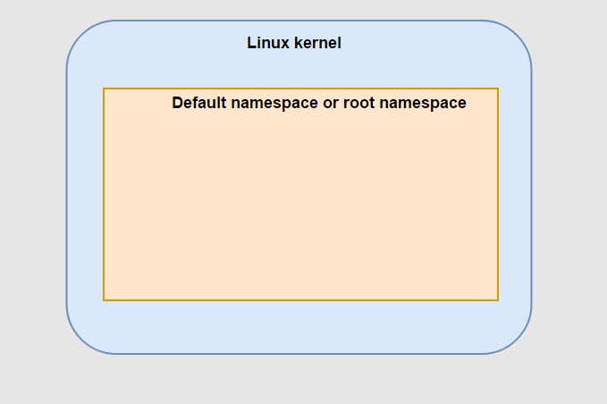
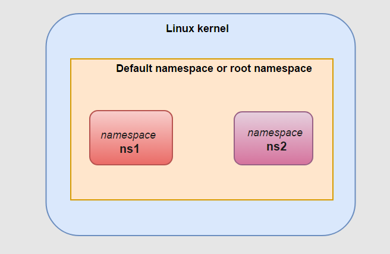
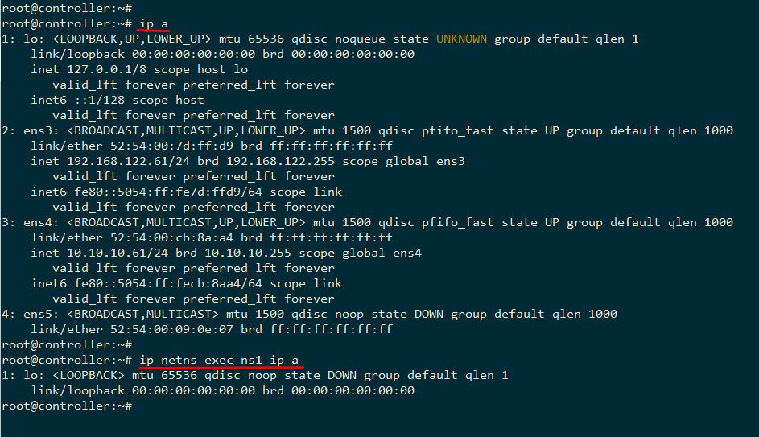
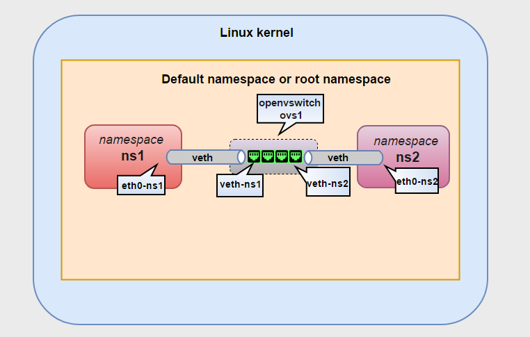

# 1. Network namespace
- Network namspace là khái niệm cho phép bạn cô lập môi trường mạng network trong một host. Namespace phân chia việc sử dụng các khác niệm liên quan tới network như devices, địa chỉ addresses, ports, định tuyến và các quy tắc tường lửa vào trong một hộp (box) riêng biệt, chủ yếu là ảo hóa mạng trong một máy chạy một kernel duy nhất.

- Mỗi network namespaces có bản định tuyến riêng, các thiết lập iptables riêng cung cấp cơ chế NAT và lọc đối với các máy ảo thuộc namespace đó. Linux network namespaces cũng cung cấp thêm khả năng để chạy các tiến trình riêng biệt trong nội bộ mỗi namespace.

===> khi bạn chỉ tạo một network namespace (ip netns add), nó chỉ cô lập về mạng, không ảnh hưởng đến tiến trình.

# 2. Một số thao tác quản lý làm việc với linux network namespace
- Ban đầu, khi khởi động hệ thống Linux, bạn sẽ có một namespace mặc định đã chạy trên hệ thống và mọi tiến trình mới tạo sẽ thừa kế namespace này, gọi là root namespace. Tất cả các quy trình kế thừa network namespace được init sử dụng (PID 1).



## 2.1 List namespace
- Cách để làm việc với network namespace là sử dụng câu lệnh ip netns (tìm hiểu thêm tại man ip netns)
- Để liệt kê tất cả các network namespace trên hệ thống sử dụng câu lệnh:
```bash
ip netns
# or
ip netns list
```

==> Nếu chưa thêm bất kì network namespace nào thì đầu ra màn hình sẽ để trống. root namespace sẽ không được liệt kê khi sử dụng câu lệnh ip netns list.

## 2.2 Add namespaces
- Để thêm một network namespace sử dụng lệnh ip netns add <namespace_name>
- Ví dụ: tạo thêm 2 namespace là ns1 và ns2 như sau:

```bash
 ip netns add ns1
 ip netns add ns2
```



- Sử dụng câu lệnh ip netns hoặc ip netns list để hiển thị các namespace hiện tại:

```bash
root@k8s-master-1:~#  ip netns add ns1
 ip netns add ns2
root@k8s-master-1:~# ip netns
ns2
ns1
root@k8s-master-1:~# ip netns list
ns2
ns1
```

- Mỗi khi thêm vào một namespace, một file mới được tạo trong thư mục /var/run/netns với tên giống như tên namespace. (không bao gồm file của root namespace).

```bash
root@k8s-master-1:~# ls -l /var/run/netns
total 0
-r--r--r-- 1 root root 0 Feb 24 14:44 ns1
-r--r--r-- 1 root root 0 Feb 24 14:44 ns2
```

## 2.3 Executing commands trong namespaces
- Để xử lý các lệnh trong một namespace (không phải root namespace) sử dụng ip netns exec <namespace> <command>
- Ví dụ: chạy lệnh ip a liệt kê địa chỉ các interface trong namespace ns1.



```bash
root@k8s-master-1:~# ip netns exec ns1 ip a
1: lo: <LOOPBACK> mtu 65536 qdisc noop state DOWN group default qlen 1000
    link/loopback 00:00:00:00:00:00 brd 00:00:00:00:00:00
```

- Kết quả đầu ra sẽ khác so với khi chạy câu lệnh ip a ở chế độ mặc định (trong root namespace). Mỗi namespace sẽ có một môi trường mạng cô lập và có các interface và bảng định tuyến riêng.


- Để liệt kê tất các các địa chỉ interface của các namespace sử dụng tùy chọn –a hoặc –all như sau:

```bash
root@k8s-master-1:~# ip -a netns  exec ip a

netns: ns2
1: lo: <LOOPBACK> mtu 65536 qdisc noop state DOWN group default qlen 1000
    link/loopback 00:00:00:00:00:00 brd 00:00:00:00:00:00

netns: ns1
1: lo: <LOOPBACK> mtu 65536 qdisc noop state DOWN group default qlen 1000
    link/loopback 00:00:00:00:00:00 brd 00:00:00:00:00:00

# or
root@k8s-master-1:~# ip --all netns  exec ip a

netns: ns2
1: lo: <LOOPBACK> mtu 65536 qdisc noop state DOWN group default qlen 1000
    link/loopback 00:00:00:00:00:00 brd 00:00:00:00:00:00

netns: ns1
1: lo: <LOOPBACK> mtu 65536 qdisc noop state DOWN group default qlen 1000
    link/loopback 00:00:00:00:00:00 brd 00:00:00:00:00:00
```
- Để sử dụng các câu lệnh với namespace ta sử dụng command bash để xử lý các câu lệnh trong riêng namespace đã chọn:

```bash
 ip netns exec <namespace_name> bash
 ip a #se chi hien thi thong tin trong namespace <namespace_name> 
```

## 2.4 Gán interface vào một network namespace

```bash
# - Sử dụng câu lệnh sau để gán interface vào namespace:
ip link set <interface_name> netns <namespace_name>
# Gán một interface if1 vào namespace ns1 sử dụng lệnh sau:
ip link set <interface_name> netns <namespace_name>
```
- Các thao tác khác tương tự như các câu lệnh bình thường, thêm ip netns exec <namespace_name> <command>


1.2.5. Xóa namespace

## 2.5 Xóa namespace
```bash
ip netns delete <namespace_name>
```
# 3. Một số bài lab thử nghiệm tính năng của linux network namespace

- Xét một ví dụ đơn giản, kết nối 2 namespace sử dụng một virtual switch và gửi bản tin ping từ một namespace tới namespace khác.
- 2 virtual switch thông dụng nhất trong hệ thống ảo hóa trên linux là linux `bridge` và `Openvswitch`. 

## 3.1. Kết nối 2 namespace sử dụng Openvswitch

### 3.1.1 Kết nối thông qua virtual ethernet (veth)



```bash
ovs-vsctl add-br ovs1
```

- Thêm cặp veth
    + Để kết nối các namespace tới swtich, sử dụng veth pairs.
    + `Virtual Ethernet interfaces` (hay veth) là một kiến trúc thú vị, chúng luôn có 1 cặp, và được sử dụng để kết nối như một đường ống: các lưu lượng tới từ một đầu veth và được đưa ra, peer tới giao diện veth còn lại. Như vậy, có thể dùng veth để kết nối mạng trong namespace từ trong ra ngoài root namespace trên các interface vật lý của root namespace.
    + Thêm một veth pairs sử dụng lệnh:
    + `ip link add veth0 type veth peer name veth1`
    + Khi đó, một veth được tạo ra với 2 đầu là 2 interface veth0 và veth1.
    + Như mô hình trong bài, thêm veth nối giữa namespace ns1 và switch ovs1 :
    + `ip link add veth-ns1 type veth peer name eth0-ns1`
    + Thêm veth dùng để nối giữa ns2 và ovs1:
    + `ip link add veth-ns2 type veth peer name eth0-ns2`

- Gán các interface vào namespace tương ứng
    + Chuyển interface eth0-ns1 và namespace ns1 và eth1-ns2 vào namespace ns2 và bật lên:

```bash
 ip link set eth0-ns1 netns ns1
 ip netns exec ns1 ip link set eth0-ns1 up

 ip link set eth0-ns2 netns ns2
 ip netns exec ns2 ip link set eth0-ns2 up
```

- Các interface còn lại gán vào openvswitch port:

```bash
 ip link set veth-ns1 up
 ip link set veth-ns2 up
 ovs-vsctl add-port ovs1 veth-ns1
 ovs-vsctl add-port ovs1 veth-ns2
```

- Lưu ý: khi thêm 2 đầu interface của các veth vào namespace hoặc openvswitch thì phải bật các device lên (device hiểu đơn giản trong trường hợp này là 2 đầu interface của veth). Sử dụng câu lệnh: ip link set <device_name> up

- Kiểm tra lại sử dụng câu lệnh: ovs-vsctl show được kết quả như sau:

```bash
root@k8s-master-1:~# ovs-vsctl show
6ed360e7-11b2-4fd1-bd67-d019d7259462
    Bridge ovs1
        Port veth-ns2
            Interface veth-ns2
        Port veth-ns1
            Interface veth-ns1
        Port ovs1
            Interface ovs1
                type: internal
    ovs_version: "2.17.9"
```

- Gán địa chỉ IP và ping thử giữa 2 namespace

```bash
ip netns exec ns1 bash
ifconfig eth0-ns1 10.0.0.1

# root@k8s-master-1:~# ip a
# 1: lo: <LOOPBACK> mtu 65536 qdisc noop state DOWN group default qlen 1000
#     link/loopback 00:00:00:00:00:00 brd 00:00:00:00:00:00
# 2: tunl0@NONE: <NOARP> mtu 1480 qdisc noop state DOWN group default qlen 1000
#     link/ipip 0.0.0.0 brd 0.0.0.0
# 23: eth0-ns1@if24: <BROADCAST,MULTICAST,UP,LOWER_UP> mtu 1500 qdisc noqueue state UP group default qlen 1000
#     link/ether 9e:5e:a6:77:2d:ab brd ff:ff:ff:ff:ff:ff link-netnsid 0
#     inet 10.0.0.1/8 brd 10.255.255.255 scope global eth0-ns1
#        valid_lft forever preferred_lft forever
#     inet6 fe80::9c5e:a6ff:fe77:2dab/64 scope link
#        valid_lft forever preferred_lft forever

ip netns exec ns2 bash
ifconfig eth0-ns2 10.0.0.2

# root@k8s-master-1:~# ip a
# 1: lo: <LOOPBACK> mtu 65536 qdisc noop state DOWN group default qlen 1000
#     link/loopback 00:00:00:00:00:00 brd 00:00:00:00:00:00
# 2: tunl0@NONE: <NOARP> mtu 1480 qdisc noop state DOWN group default qlen 1000
#     link/ipip 0.0.0.0 brd 0.0.0.0
# 25: eth0-ns2@if26: <BROADCAST,MULTICAST,UP,LOWER_UP> mtu 1500 qdisc noqueue state UP group default qlen 1000
#     link/ether 46:6a:a3:65:bd:30 brd ff:ff:ff:ff:ff:ff link-netnsid 0
#     inet 10.0.0.2/8 brd 10.255.255.255 scope global eth0-ns2
#        valid_lft forever preferred_lft forever
#     inet6 fe80::446a:a3ff:fe65:bd30/64 scope link 
#        valid_lft forever preferred_lft forever
```

- Tiến hành ping thử giữa 2 namespace:

```bash
ip netns exec ns1 ping 10.0.0.2

# root@k8s-master-1:~# ip netns exec ns1 ping 10.0.0.2
# PING 10.0.0.2 (10.0.0.2) 56(84) bytes of data.
# 64 bytes from 10.0.0.2: icmp_seq=1 ttl=64 time=0.813 ms
# 64 bytes from 10.0.0.2: icmp_seq=2 ttl=64 time=0.063 ms
# 64 bytes from 10.0.0.2: icmp_seq=3 ttl=64 time=0.057 ms
```

================================

# Containerd khởi tạo container

```bash
sudo apt update && sudo apt install -y containerd
sudo systemctl start containerd
sudo systemctl enable containerd
```

## 2. Tạo network namespace và bridge

```bash
sudo ip netns add ns1
sudo ip netns add ns2
```

```bash
sudo ip link add br0 type bridge
sudo ip link set br0 up

# Tạo veth pair để kết nối namespace với bridge
sudo ip link add veth1 type veth peer name veth1-br
sudo ip link add veth2 type veth peer name veth2-br

# Gán veth vào các namespace
sudo ip link set veth1 netns ns1
sudo ip link set veth2 netns ns2

# Gán veth bridge-side vào bridge
sudo ip link set veth1-br master br0
sudo ip link set veth2-br master br0

# Cấu hình địa chỉ IP
sudo ip netns exec ns1 ip addr add 192.168.1.2/24 dev veth1
sudo ip netns exec ns2 ip addr add 192.168.1.3/24 dev veth2
sudo ip addr add 192.168.1.1/24 dev br0

# Bật interface lên
sudo ip netns exec ns1 ip link set veth1 up
sudo ip netns exec ns2 ip link set veth2 up
sudo ip link set veth1-br up
sudo ip link set veth2-br up
```

## 3. Chạy container với ctr

- Chạy hai container trong hai network namespace.

```bash
# install busybox
sudo ctr image pull docker.io/library/busybox:latest

# - Chạy container trong ns1
sudo ip netns exec ns1 ctr run --rm -t --net-host docker.io/library/busybox:latest container1 sh

# Chạy container trong ns2 
sudo ip netns exec ns2 ctr run --rm -t --net-host docker.io/library/busybox:latest container2 sh

```

## 4. Kiểm tra kết nối

```bash
# Trong terminal của container1 (đang trong ns1), chạy:
ping 192.168.1.3

# Trong terminal của container2 (đang trong ns2), chạy:
ping 192.168.1.2
```

# Sử dụng cni

📌 Bước 1: Tải plugin CNI

```bash
# Containerd không cung cấp sẵn quản lý mạng, ta cần tải CNI plugin:
sudo mkdir -p /opt/cni/bin
sudo curl -L -o /opt/cni/bin/cni-plugins.tgz https://github.com/containernetworking/plugins/releases/download/v1.3.0/cni-plugins-linux-amd64-v1.3.0.tgz
sudo tar -xzvf /opt/cni/bin/cni-plugins.tgz -C /opt/cni/bin
```

📌 Bước 2: Tạo cấu hình mạng bridge

```bash
sudo mkdir -p /etc/cni/net.d
cat <<EOF | sudo tee /etc/cni/net.d/10-bridge.conf
{
  "cniVersion": "0.4.0",
  "name": "mynet",
  "type": "bridge",
  "bridge": "cni0",
  "isGateway": true,
  "ipMasq": true,
  "ipam": {
    "type": "host-local",
    "subnet": "192.168.1.0/24",
    "routes": [
      { "dst": "0.0.0.0/0" }
    ]
  }
}
EOF
```

```bash
sudo ctr image pull docker.io/library/busybox:latest

#  Tạo container 1
sudo ctr run --net-host=false --cni --rm -t docker.io/library/busybox:latest container1 sh

#  Tạo container 2
sudo ctr run --net-host=false --cni --rm -t docker.io/library/busybox:latest container2 sh
```

```bash
# Container 1
root@k8s-master-1:~# sudo ctr run --net-host=false --cni --rm -t docker.io/library/busybox:latest container1 sh
/ # ip a
1: lo: <LOOPBACK,UP,LOWER_UP> mtu 65536 qdisc noqueue qlen 1000
    link/loopback 00:00:00:00:00:00 brd 00:00:00:00:00:00
    inet 127.0.0.1/8 scope host lo
       valid_lft forever preferred_lft forever
    inet6 ::1/128 scope host 
       valid_lft forever preferred_lft forever
2: eth0@if21: <BROADCAST,MULTICAST,UP,LOWER_UP,M-DOWN> mtu 1500 qdisc noqueue 
    link/ether 26:a9:4a:ce:8a:1e brd ff:ff:ff:ff:ff:ff
    inet 192.168.1.2/24 brd 192.168.1.255 scope global eth0
       valid_lft forever preferred_lft forever
    inet6 fe80::24a9:4aff:fece:8a1e/64 scope link 
       valid_lft forever preferred_lft forever

# Container 2
root@k8s-master-1:~# sudo ctr run --net-host=false --cni --rm -t docker.io/library/busybox:latest container2 sh
/ # ip a
1: lo: <LOOPBACK,UP,LOWER_UP> mtu 65536 qdisc noqueue qlen 1000
    link/loopback 00:00:00:00:00:00 brd 00:00:00:00:00:00
    inet 127.0.0.1/8 scope host lo
       valid_lft forever preferred_lft forever
    inet6 ::1/128 scope host 
       valid_lft forever preferred_lft forever
2: eth0@if22: <BROADCAST,MULTICAST,UP,LOWER_UP,M-DOWN> mtu 1500 qdisc noqueue 
    link/ether 2a:ef:96:94:5d:68 brd ff:ff:ff:ff:ff:ff
    inet 192.168.1.3/24 brd 192.168.1.255 scope global eth0
       valid_lft forever preferred_lft forever
    inet6 fe80::28ef:96ff:fe94:5d68/64 scope link 
       valid_lft forever preferred_lft forever
```

5️⃣ Kiểm tra kết nối giữa các container

```bash
# Trong terminal của container1, chạy:
ping 192.168.1.3

# Trong terminal của container2, chạy:
ping 192.168.1.2
```
=============== Nháp =================
📌 CNI là gì?
- CNI (Container Network Interface) là một tiêu chuẩn cho việc quản lý mạng trong các container. Nó giúp container có thể giao tiếp với nhau và với bên ngoài bằng cách cung cấp các plugin mạng như:
    + Bridge: Tạo một mạng cầu nối để các container có thể liên lạc.
    + MACVLAN: Gán địa chỉ MAC trực tiếp từ host.
    + Flannel, Calico: Dùng trong Kubernetes để kết nối cluster.
📌 Khi nào cần --cni?
- Khi bạn muốn container tự động kết nối vào mạng do CNI quản lý.
- Khi bạn đã cấu hình CNI `(/etc/cni/net.d/)` và muốn container dùng nó.

====> Containerd sử dụng CNI bằng cách đọc cấu hình trong thư mục /etc/cni/net.d/. Bạn có thể đặt các tệp JSON trong đó để chỉ định plugin bạn muốn.

```bash
root@k8s-master-1:~# ls /opt/cni/bin/
bandwidth  bridge  cni-plugins.tgz  dhcp  dummy  firewall  host-device  host-local  ipvlan  loopback  macvlan  portmap  ptp  sbr  static  tap  tuning  vlan  vrf

# Các plugin phổ biến:

# bridge: Tạo mạng cầu nối để các container giao tiếp.
# macvlan: Cấp địa chỉ MAC thực từ host.
# ipvlan: Tạo subnet riêng.
```

2️⃣ Chỉ định plugin CNI bằng cách tạo cấu hình mạng
- Bạn có thể chỉ định một plugin cụ thể bằng cách tạo một tệp JSON trong /etc/cni/net.d/. Ví dụ:
============== End Nháp ===============
