# Linux Namespaces và Cgroups: Container được xây dựng từ gì?

1. Các loại namespace trong Linux
Linux namespace có nhiều loại khác nhau, mỗi loại cô lập một phần của hệ thống:

Network Namespace (netns) → Cô lập mạng (giao diện mạng, IP, routing, firewall, v.v.)
PID Namespace (pidns) → Cô lập tiến trình (các PID riêng biệt)
Mount Namespace (mntns) → Cô lập filesystem
User Namespace (userns) → Cô lập user & quyền
UTS Namespace (utsns) → Cô lập hostname
IPC Namespace (ipcns) → Cô lập Inter-Process Communication (shm, message queue)

## Container

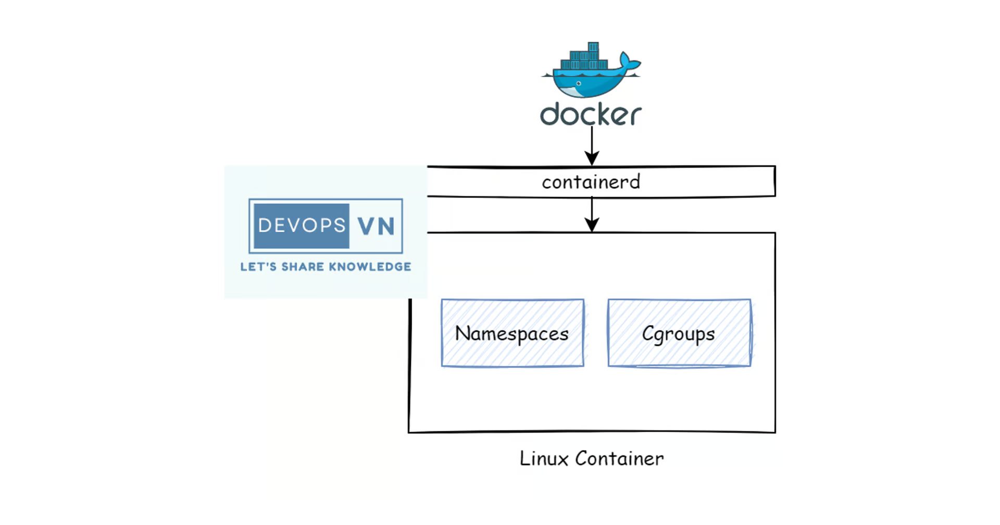

- Container là một công nghệ mà cho phép chúng ta chạy một chương trình trong một môi trường độc lập hoàn toàn với các chương trình còn lại trên cùng một máy tính. Vậy container làm được việc đó bằng cách nào?

- Và thật ra để làm được việc đó thì container nó được xây dựng từ một vài tính năng mới của Linux kernel, trong đó hai tính năng chính là “namespaces” and “cgroups”. Đây là hai tính năng của Linux giúp ta tách biệt một process hoàn toàn độc lập với các process còn lại.

## Linux Namespaces
- Đây là một tính năng của Linux cho phép ta tạo ra một virtualize system, khá giống với chức năng của các công cụ virtual machine. Đây là tính năng chính giúp process của ta tách biệt hoàn toàn với các process còn lại.
- Linux namespaces sẽ bao gồm các thành phần nhỏ hơn như:
    + PID namespace cho phép ta tạo các process tách biệt.
    + Networking namespace cho phép ta chạy chương trình trên bất kì port nào mà không bị xung độ với các process khác chạy trên server.
    + Mount namespace cho phép ta mount và unmount filesystem mà không ảnh hưởng gì tới host filesystem.

- Để tạo linux namespace khá đơn giản, ta dùng một package tên là unshare để tạo một namespace riêng với process tách biệt với các process còn lại. Ví dụ ta chạy câu lệnh sau để tạo namespace và thực thi câu lệnh bash trên nó.

(Thuật ngữ "virtualize system" có thể được hiểu theo nhiều cách, nhưng trong ngữ cảnh của Linux Namespace, nó có nghĩa là một môi trường hệ thống được cô lập nhưng vẫn chạy trên cùng một kernel.)

```bash
sudo unshare --fork --pid --mount-proc bash

# unshare là một lệnh trong Linux dùng để tạo namespace mới, giúp tiến trình chạy trong một không gian cô lập.
# --fork yêu cầu unshare tạo một tiến trình con (fork) và chạy trong namespace mới, giúp tránh trường hợp tiến trình cha vẫn nằm trong namespace cũ.
# Tạo một PID namespace mới, trong đó các tiến trình có thể có PID riêng không bị lẫn với các tiến trình bên ngoài.
# Tiến trình đầu tiên trong namespace mới luôn có PID = 1, tương tự như tiến trình init trong một hệ điều hành Linux.
# Mount lại /proc trong namespace mới, để danh sách PID trong /proc chỉ hiển thị các tiến trình thuộc namespace này.
# Nếu không dùng --mount-proc, tiến trình trong namespace mới vẫn thấy danh sách tiến trình của hệ thống chính.
```

- Nó sẽ tạo ra một virtualize system và gán bash shell vào nó.

```bash
root@ubuntu-22:~# ps aux
USER         PID %CPU %MEM    VSZ   RSS TTY      STAT START   TIME COMMAND
root           1  0.0  0.1   7636  4296 pts/2    S    06:54   0:00 bash
root          10  0.0  0.0  10072  1568 pts/2    R+   06:54   0:00 ps aux
root@ubuntu-22:~# 
```

- Ta sẽ thấy namespace được tạo ra là một môi trường hoàn toàn tách biệt với bên ngoài, nó chỉ có duy nhất hai process đang chạy là bash với câu lệnh ps aux ta vừa gõ.

- Bạn bật một terminal khác ở trên server và gõ câu lệnh ps aux.

```bash
root@ubuntu-22:~#  ps aux
root       32597  0.0  0.1  11500  5728 pts/1    S+   06:54   0:00 sudo unshare --fork --pid --mount-proc bash
```

- Bạn sẽ thấy một process của `unshare` đang chạy,` ta có thể so sánh nó với các container được liệt kê ra khi ta chạy câu lệnh docker ps`.

- Để thoát khỏi namespace thì bạn gõ `exit`.

===> Lúc này khi bạn chạy lại câu lệnh ps aux ở trên server ta sẽ thấy process của `unshare` hồi nãy đã mất đi.

## Cgroups
- Ta đã có thể tạo một process riêng biệt với namespace, nhưng nếu ta tạo nhiều namespace thì làm sao ta giới hạn được resource của từng namespace để nó không chiếm mất resource của namespace khác?

- May thay là Linux cũng đã đoán được điều đó và tạo ra Cgroups, đây là tính năng để giới hạn resource của một process. Cgroups sẽ định ra giới hạn của CPU và Memory mà một process có thể dùng. Để tạo cgroup thì ta sẽ dùng `cgcreate`. Ta cần cài `cgroup-tools` trước khi sử dụng.

```bash
sudo apt-get install cgroup-tools
```

- Sau đó, để tạo cgroup ta chạy câu lệnh sau.

```bash
sudo cgcreate -g memory:my-process
```

- Nó sẽ tạo ra cho ta một folder ở dường dẫn `/sys/fs/cgroup/`, các bạn liệt kê nó ra.

```bash
root@ubuntu-22:~# ls /sys/fs/cgroup/my-process/
cgroup.controllers      cgroup.subtree_control  cpuset.cpus.effective  cpu.weight.nice           hugetlb.2MB.events        io.stat              memory.min           memory.swap.max
cgroup.events           cgroup.threads          cpuset.cpus.partition  hugetlb.1GB.current       hugetlb.2MB.events.local  io.weight            memory.numa_stat     misc.current
cgroup.freeze           cgroup.type             cpuset.mems            hugetlb.1GB.events        hugetlb.2MB.max           memory.current       memory.oom.group     misc.max
cgroup.kill             cpu.idle                cpuset.mems.effective  hugetlb.1GB.events.local  hugetlb.2MB.rsvd.current  memory.events        memory.pressure      pids.current
cgroup.max.depth        cpu.max                 cpu.stat               hugetlb.1GB.max           hugetlb.2MB.rsvd.max      memory.events.local  memory.stat          pids.events
cgroup.max.descendants  cpu.max.burst           cpu.uclamp.max         hugetlb.1GB.rsvd.current  io.max                    memory.high          memory.swap.current  pids.max
cgroup.procs            cpu.pressure            cpu.uclamp.min         hugetlb.1GB.rsvd.max      io.pressure               memory.low           memory.swap.events   rdma.current
cgroup.stat             cpuset.cpus             cpu.weight             hugetlb.2MB.current       io.prio.class             memory.max           memory.swap.high     rdma.max
root@ubuntu-22:~# 
```

- Ta sẽ thấy khá nhiều file, đây là những file định nghĩa limit của process, file mà ta quan tâm bây giờ là `memory.kmem.limit_in_bytes`, nó sẽ định nghĩa memory limit của một process, giá trị sử dụng theo bytes nhé. Ví dụ ta giới hạn memory là 50Mi.

```bash
sudo echo 50000000 >  /sys/fs/cgroup/memory/my-process/memory.limit_in_bytes
```

- Ok, sau đó để sử dụng cgroup ta chạy câu lệnh sau.


```bash
sudo cgexec -g memory:my-process bash
```

===> Lúc này process được tạo bởi cgroup sẽ có memory limit là 50Mi.


## Cgroups with namespace

- Và ta có thể sử dụng `cgroups` kết hợp với namespace để tạo một process độc lập và có giới hạn resource nó có thể sử dụng. Ví dụ ta chạy câu sau.


```bash
mkdir -p /mktemp/bin/sh
rm -rf /mktemp/bin/sh
cp /bin/sh /mktemp/bin/
cp /bin/bash /mktemp/bin/

chmod +x /mktemp/bin/sh
mkdir -p /mktemp/lib/x86_64-linux-gnu /mktemp/lib64
cp -v /lib/x86_64-linux-gnu/libc.so.6 /mktemp/lib/x86_64-linux-gnu/
cp -v /lib64/ld-linux-x86-64.so.2 /mktemp/lib64/
```

```bash
sudo cgexec -g cpu,memory:my-process unshare -uinpUrf --mount-proc sh -c "/bin/hostname my-process && chroot /mktemp /bin/bash"

root@ubuntu-22:/mktemp/bin# sudo cgexec -g cpu,memory:my-process unshare -uinpUrf --mount-proc sh -c "/bin/hostname my-process && chroot /mktemp /bin/bash"
bash-5.1# echo "hello world"
hello world
bash-5.1#
```

=====> Vậy thật ra container là một sự kết hợp của hai tính năng cgroups và namespace, tuy thực tế thì có thể nó còn một số thứ khác nữa, nhưng cơ bản cgroups và namespace là hai cái chính.

- Vậy docker là gì? Docker nó chỉ là một công cụ giúp ta tương tác với công nghệ container ở bên dưới, chứ nó không phải là container. Nói chính xác hơn docker là một tool giúp ta tương tác với container một cách dễ dàng thay vì ta phải làm nhiều thứ. Và docker sẽ tương tác với container bên dưới thông qua container runtime. Mình sẽ nói về nó ở bài sau.

# Tìm hiểu sâu hơn về Container - Container Runtime là gì?

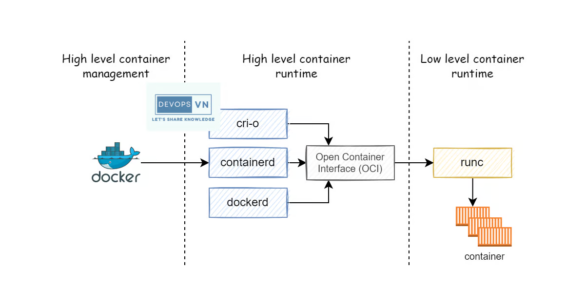

- Container được tạo ra để giúp ta chạy một chương trình trong một môi trường hoàn toàn độc lập với các chương trình khác trên cùng một máy tính. Nhưng ta sẽ gặp một vài vấn đề sau nếu ta chỉ dùng linux namespace và cgroup để chạy container.

- Vấn đề đầu tiên là để tạo được container thì ta cần chạy khá nhiều câu lệnh, nào là câu lệnh tạo linux namespace, câu lệnh tạo cgroup process, câu lệnh cấu hình limit cho cgroup process, sau đó nếu ta muốn xóa container thì ta phải chạy các câu lệnh để clear namespace và cgroup.

- Và vấn đề thứ hai là khi ta chạy cả chục container bằng câu lệnh linux namespace và cgroup thì làm sao ta quản lý những container đó, ta làm sao biết được thằng container đó nó đang chạy gì và nó được dùng cho process nào?

- Vấn đề thứ ba là có các container có sẵn những thứ ta cần và nó nằm trên container registry, làm sao ta có thể tải nó xuống và chạy thay vì ta phải tạo container từ đầu?

- Với các vấn đề ở trên thì thay vì ta phải chạy nhiều câu lệnh như vậy, thì tại sao ta không xây dựng ra một công cụ nào đó để ta giảm tải việc này, ta chỉ cần chạy một câu lệnh để tạo container và xóa container. Và công cụ đó cũng có có thể giúp ta quản lý được nhiều container đang chạy và ta biết được container đó đang được dùng cho process nào. Và ta cũng có thể dùng công cụ đó để tải các container có sẵn ở trên internet. `Đó chính là là lý do tại sao thằng container runtime được sinh ra.`

- Container runtime là một công cụ đóng vai trò quản lý tất cả quá trình running của một container, bao gồm tạo và xóa container, đóng gói và chia sẻ container. Container runtime được chia ra làm hai loại:
    + Low-level container runtime: với nhiệm vụ chính là tạo và xóa container.
    + High level container runtime: quản lý container, tải container image sau đó giải nén container image đó ra và truyền vào trong low level container runtime để nó tạo và chạy container.

- `Một vài high level container runtime còn bao gồm cả chức năng đóng gói container thành container image và chuyển nó lên container registry`.

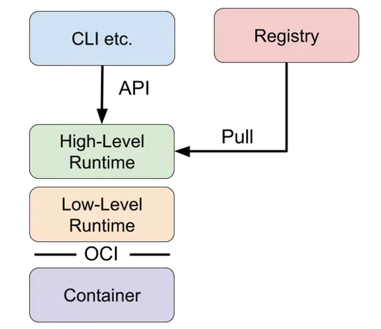

- `Container image sẽ lưu tất cả những thứ ta cần để ta chạy một container, ta chỉ cần tải container image và dùng nó để run container, thay vì phải tạo container từ đầu và cài nhiều thứ.`
- `Container registry là chỗ dùng chứa container image.`

## Low-level container runtime

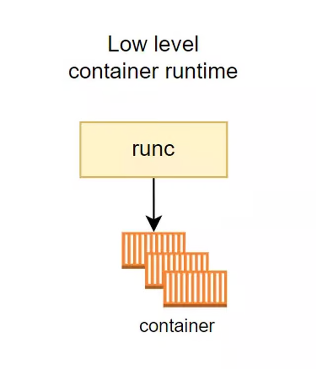

- Như ta đã nói ở trên thì nhiệm vụ chính của low-level container runtime là tạo và xóa container, những công việc mà low-level container runtime sẽ làm là:
    + Tạo cgroup.
    + Chạy CLI trong cgroup.
    + Chạy câu lệnh Unshare để tạo namespaces riêng.
    + Cấu hình root filesystem.
    + Clean up cgroup sau khi câu lệnh hoàn tất.

- Thực tế thì low level container runtime sẽ còn làm rất nhiều thứ nữa, nhưng ở trên là những công việc chính. Mô phỏng quá trình container runtime tạo container.

```bash
# Chuyển sang sử dụng cgroup1
vi /etc/default/grub
GRUB_CMDLINE_LINUX_DEFAULT="systemd.unified_cgroup_hierarchy=0"

sudo update-grub
sudo reboot

mount | grep cgroup

```

```bash
ROOTFS=$(mktemp -d) && UUID=9999

# Tạo cgroup.
sudo cgcreate -g cpu,memory:$UUID

# Cấu hình limit memory cho cgroup.
sudo cgset -r memory.limit_in_bytes=100000000 $UUID

# Cấu hình limit CPU cho cgroup.
sudo cgset -r cpu.shares=512 $UUID && sudo cgset -r cpu.cfs_period_us=1000000 $UUID && sudo cgset -r cpu.cfs_quota_us=2000000 $UUID

# Tạo container.
sudo cgexec -g cpu,memory:$UUID unshare -uinpUrf --mount-proc sh -c "/bin/hostname $UUID && chroot $ROOTFS /bin/sh"
sudo cgexec -g cpu,memory:$UUID unshare -uinpUrf --mount-proc sh -c "/bin/hostname $UUID && chroot $ROOTFS /bin/bash"

# Xóa cgroup.
sudo cgdelete -r -g cpu,memory:$UUID
```

```bash
mkdir -p $ROOTFS/bin/sh
rm -rf $ROOTFS/bin/sh
cp /bin/sh $ROOTFS/bin/
cp /bin/bash $ROOTFS/bin/

chmod +x $ROOTFS/bin/sh
mkdir -p "$ROOTFS/lib/x86_64-linux-gnu" "$ROOTFS/lib64"
cp /lib/x86_64-linux-gnu/libc.so.6 "$ROOTFS/lib/x86_64-linux-gnu/"
cp /lib64/ld-linux-x86-64.so.2 "$ROOTFS/lib64/"

```

- Ở trên là quá trình mô phỏng container runtime tạo container.
- Low level container runtime phổ biến nhất có lẽ là runc, với runc thì để tạo container ta chỉ cần chạy một câu lệnh như sau.

```bash
$ runc run runc-container
/# echo "Hello from in a container"
Hello from in a container
```

## High level container runtime

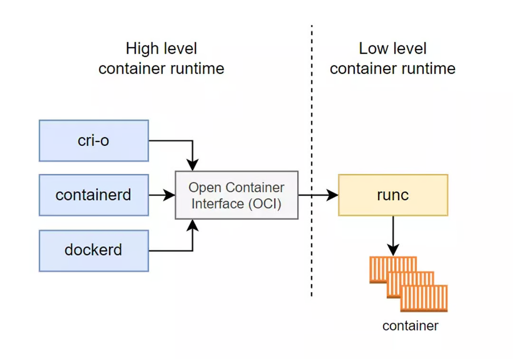

- Trong khi low level container runtime tập trung cho việc tạo và xóa container, thì high level container runtime sẽ tập trung cho việc quản lý nhiều container, vận chuyển và quản lý container images, tải và giải nén container image để chuyển xuống cho low level container runtime.

- Một thằng high level container runtime phổ biến chắc có lẽ là containerd, containerd cung cấp cho ta những tính năng sau:
    + Tải container image từ container registry.
    + Quản lý container image.
    + Chạy container từ container image đó.
    + Quản lý nhiều container.
- Ví dụ ta sẽ chạy những câu lệnh sau để tạo một redis container mà nó có sẵn image nằm trên container registry bằng containerd.

```bash
# Tải container image.
sudo ctr images pull docker.io/library/redis:latest

# Chạy container.
sudo ctr container create docker.io/library/redis:latest redis

# Ta có thể liệt lê toàn bộ images và container như sau.
sudo ctr images list

# Nếu ta muốn xóa container, ta chạy câu lệnh sau.
sudo ctr container delete redis
```

- Cũng khá giống khi ta chạy câu lệnh docker phải không 😁.

- Tuy ta có thể tải và chạy container từ container image có sẵn, nhưng containerd và khá nhiều high level container runtime khác không có hỗ trợ ta trong việc build container, và high level container runtime không có tập trung vào việc hỗ trợ UI để người dùng có thể dễ dàng tương tác hơn. Do đó để dễ dàng hơn cho người dùng trong việc giao tiếp với container, các công cụ gọi là Container Management mới được sinh ra, và Docker là một trong những thằng đó.

# Docker
- Docker là một trong những công cụ đầu tiên hỗ trợ toàn bộ các tính năng để tương tác container. Bao gồm:
    + Tính năng build image (Dockerfile/docker build).
    + Tính năng quản lý images (docker images).
    + Tính năng tạo, xóa và quản lý container (docker run, docker rm, docker ps).
    + Tính năng chia sẻ images (docker pull, docker push).
    + Cung cấp UI để người dùng có thể thao tác thay vì dùng CLI.
- Và docker sẽ thông qua các API để tương tác với container runtime ở dưới để tạo và chạy container cho ta. High level container runtime mà docker sử dụng tên là `dockerd`, `docker-containerd`, `dockerd-runc.` 

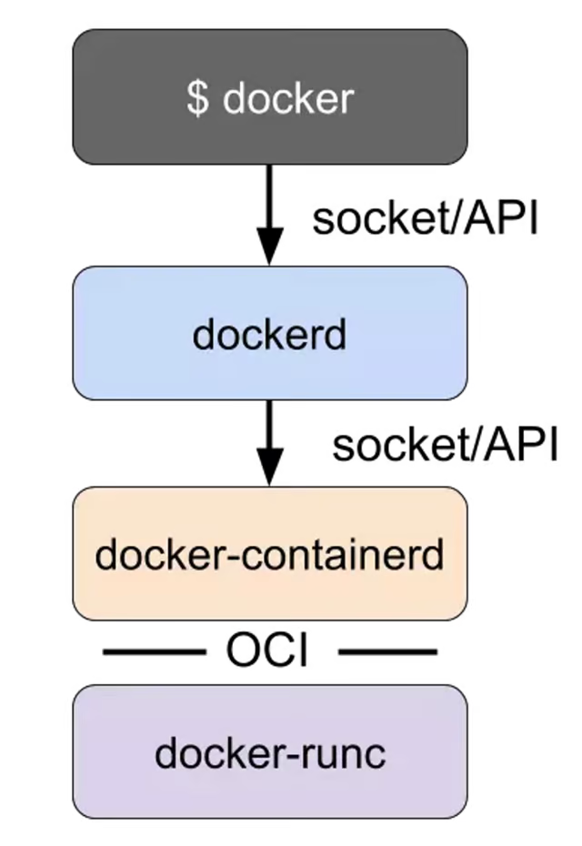

- Với `dockerd` sẽ cung cấp cho ta tính năng `build image`, `docker-containerd thì giống với containerd,` còn `dockerd-runc thì giống với runc`.

- `Kết luận`
- Vậy là ta đã tìm hiểu xong về container runtime. Với low-level container runtime sẽ có nhiệm vụ là tạo và xóa container, high level container runtime sẽ có nhiệm vụ quản lý `container images và container`. Và docker là một công cụ hoàn chỉnh để ta tương tác với container bên dưới thông qua container runtime, bao gồm cả việc build image.


#  Kubernetes làm việc với Container như thế nào?

## Giới thiệu
- Ở bài này thì chúng ta sẽ tìm hiểu về một chủ đề khá thú vị là cách Kubernetes làm việc với Container Runtime như thế nào, và các loại Container Runtime mà kubernetes sử dụng.

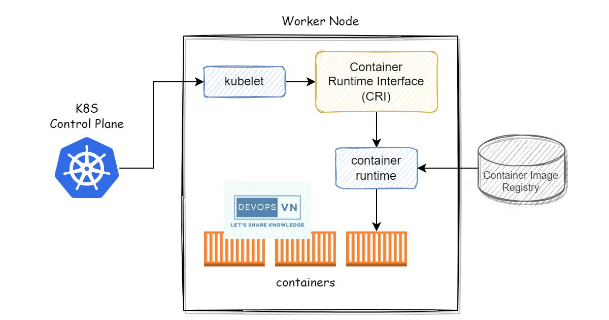

## Kubernetes Architecture

- Trước khi đi vào chi tiết về cách kubernetes sử dụng container runtime, mình sẽ nói sơ về tổng quan kiến trúc của kubernetes trước.

- Một kubernetes cluster bao gồm một master node và một hoặc nhiều worker node.

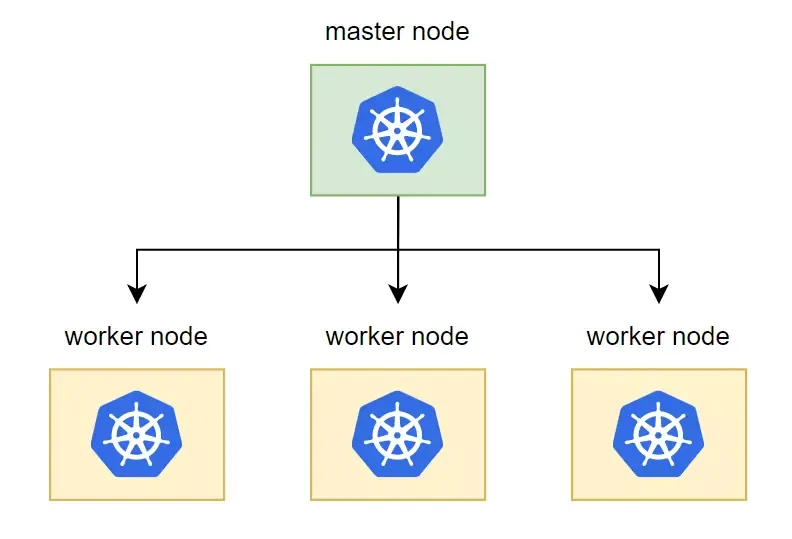

- Với master node có nhiệm vụ chính là quản lý cluster, phân phối và quản lý container tới từng worker node. Worker node có nhiệm vụ chính là nơi chứa các container để chạy ứng dụng. Trong từng master node và worker node nó sẽ có các thành phần sau đây.

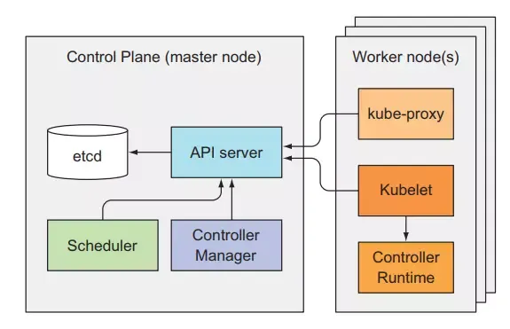

- Kubernetes master bao gồm 4 component:
    + etcd: dùng để lưu trữ trạng thái của cluster.
    + API server: thành phần chính mà client hoặc các thành khác sử dụng để giao tiếp với kubernetes cluster.
    + Controller Manager: quản lý và tạo các resource tương ứng trong cluster.
    + Scheduler: phân phối chọn worker node để chạy container.

- Kubernetes worker node bao gồm 3 thành phần:
    + kubelet: quản lý container trên từng worker node.
    + kube-proxy
    + container runtime

- Thì ở bài này chúng ta sẽ tìm hiểu về worker node, vì đây sẽ là nơi kubernetes giao tiếp với container. Nếu các bạn muốn hiểu rõ hơn về kiến trúc bên trong kubernetes thì các bạn xem bài này nhé Kubernetes Series - Bài 11 - Kubernetes internals architecture.

## How does Kubernetes manage containers in the cluster?

- Trong một cluster ta sẽ có nhiều worker node, và worker node sẽ là nơi mà các container của ta chạy.
- Và để làm việc với container trên từng worker node, kubernetes dùng một công cụ tên là kubelet.

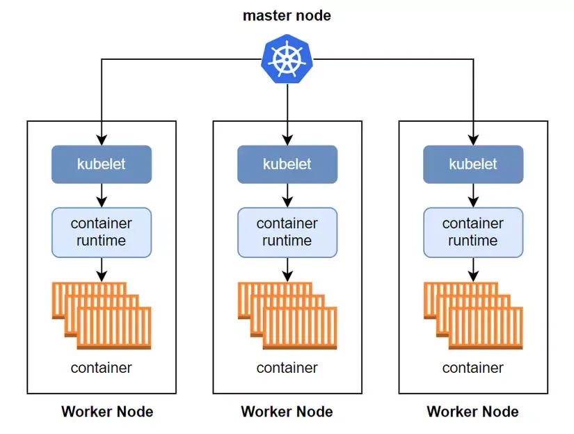

- Đây là thành phần chịu trách nhiệm tương tác với master node và quản lý container bên trong kubernetes cluster. Bên cạnh đó kubelet còn giám sát container ở trên worker node và gửi thông tin đó về master node.

- Nó sẽ lắng nghe thông báo từ master node về cấu hình của container mà được phân phối tới worker node, sau đó nó sẽ tạo container tương ứng với cấu hình đó lên trên worker node.

Vậy kubernetes làm việc với container thông qua kubelet, còn kubelet sẽ làm việc với container như thế nào? Ta sẽ tìm hiểu tầng sâu hơn nữa là cách kubelet sẽ làm việc với container.

## Container Runtime and Container Runtime Interface

- Như đã nói ở bài trước container runtime là một công cụ đóng vai trò quản lý, giúp ta tạo và xóa container một cách dễ dàng, thay vì ta phải tạo container bằng hàng loạt câu CLI phức tạp.

- Và kubelet sẽ tương tác với container runtime ở trên worker node thông qua một layer tên là Container Runtime Interface (CRI).

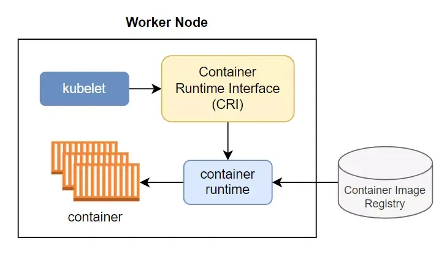

- Vậy tại sao ta lại phải cần CRI, sao kubelet không tương tác trực tiếp với container luôn đi, tách ra chi cho rảnh vậy?

- Thì lý do cho việc này là vì nhà phát triển kubernetes muốn giữ cho kubelet đơn giản nhất có thể. Vì container runtime thì có rất nhiều loại (docker, cri-o, containerd, …), thì thay vì ta phải implement việc tương tác với rất nhiều loại container runtime khác nhau bên trong kubelet, thì nhà phát triển kubernetes muốn để việc đó cho một thằng trung gian là CRI.

- Cho dù ở worker node có xài container runtime nào đi chăng nữa thì kubelet cũng chỉ giao tiếp với CRI thông qua một tập lệnh duy nhất, còn lại việc giao tiếp với các container runtime khác nhau như thế nào thì tự thằng CRI nó implement.

- Vậy thì kubelet sẽ thông qua CRI tương tác với container runtime, và container runtime sẽ thực hiện việc tạo container, hình minh họa nguyên một luồng kubernetes tạo container.

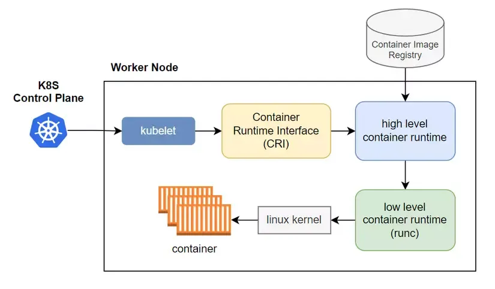

1. Đầu tiên kubernetes master node báo cho kubelet tạo container.
2. Tiếp theo kubelet giao tiếp với high level container runtime (cri-o, containerd, …) thông qua CRI và kêu nó tạo container đi.
3. Lúc này high level container runtime sẽ pull image từ container image registry xuống, extract nó ra và lưu xuống disk.
4. Sau đó low level container runtime được thông báo và nó nhảy vào disk để lấy container image để tạo container.
5. Sau khi lấy được container image thì low level container runtime thực hiện một loạt lệnh xuống dưới linux kernel để tạo container.

## Kubernetes works with Container Runtime

- Vậy là ta đã hiểu được cách kubernetes làm việc với container runtime như thế nào, tiếp theo ta sẽ xem một số container runtime phổ biến mà kubernetes có thể xài.

### Docker

- Docker là thằng container runtime đầu tiên mà kubernetes sử dụng, nhưng ở phiên bản 1.24 thì nó đã bị kubernetes remove đi, không sử dụng nữa.

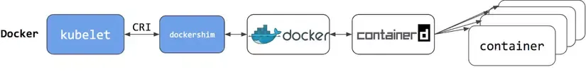

- `Kubernetes sử dụng docker thông qua CRI là dockershim, và vì nó quá rườm rà nên đã bị remove từ bản 1.24. Mình nhắc lại 2 lần là để cho mọi người nhớ kĩ :))).`

### Containerd
- Containerd là một thằng container runtime đơn giản và bớt rờm rà hơn so với thằng docker.

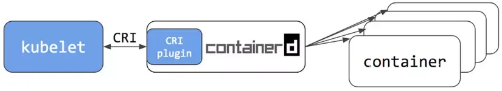

- Từ bản 1.1 thì containerd có nhúng sẵn một CRI plugin vào bên trong nó, kubelet chỉ cần tương tác trực tiếp với plugin này là được. Như ta thấy thì thay vì ở trên ta dùng docker cho container runtime ta phải đi qua rất nhiều lớp, còn với containerd thì ta đi thẳng tới nó luôn.

### CRI-O
- Đây là một thằng container runtime cũng phổ biến mà có thể dùng cho kubernetes như thằng containerd.

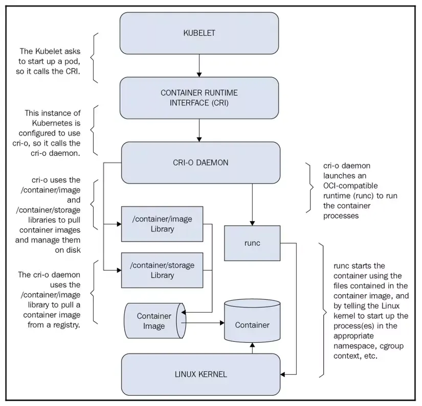


- CRI-O được phát triển bởi Redhat.

### Kết luận

Vậy là ta đã tìm hiểu xong về vấn đề kubernetes làm việc với container runtime như thế nào. Thì chỉ có một điểm quan trọng mà mình cần nhắc là từ bản 1.24 thì kubernetes sẽ bỏ việc sử dụng docker cho container runtime, nếu ta muốn nâng kubernetes lên bản 1.24 thì cần phải cài container runtime khác nhé.

# Tại  Kubernetes lại không sử dụng Docker (container runtime nữa) nữa

- Đầu tiên cùng xem qua cách triển khai Docker Engine trong các k8s worker node. Docker triển khai trên k8s worker node sẽ bảo gồm 3 component chính là:
    + Docker CLI: là giao diện command line, giúp bạn execute các command tới Docker Server
    + Docker API: phục cho việc giao tiếp với Docker Server
    + Docker Server: lại gồm thành phần là
    + Container Runtime: chịu trách nhiệm bật tắt các container, quản lý toàn bộ lifecycles của container
    + Volumes: đảm nhiệm phần dữ liệu cho container, quản lý các persistent data trong Docker
    + Network
    + Build images: đảm nhiệm công việc build image trong Docker
- Thực tế, k8s chỉ cần sử dụng tới 1 thành phần duy nhất là Container Runtime trong Docker bởi những thành phần còn lại chính đã được xây dụng trong k8s: k8s CLI, k8s Volumes, k8s Network, và bạn không cần thiết phải build images trong k8s cluster.

- Để k8s có thể tương tác với Container Runtime thì k8s phải tương tác với Docker thông qua Dockershim, là 1 phần của k8s xây dựng để tương tác với Docker. Vì thế các developer của k8s vẫn hằng ngày phải maintain, update nó. Và đây, có vẻ lượng code của Dockershim đang ngày càng khó maintain và tốn nhiêu effort dẫn tới việc k8s sẽ bỏ nó luôn:

