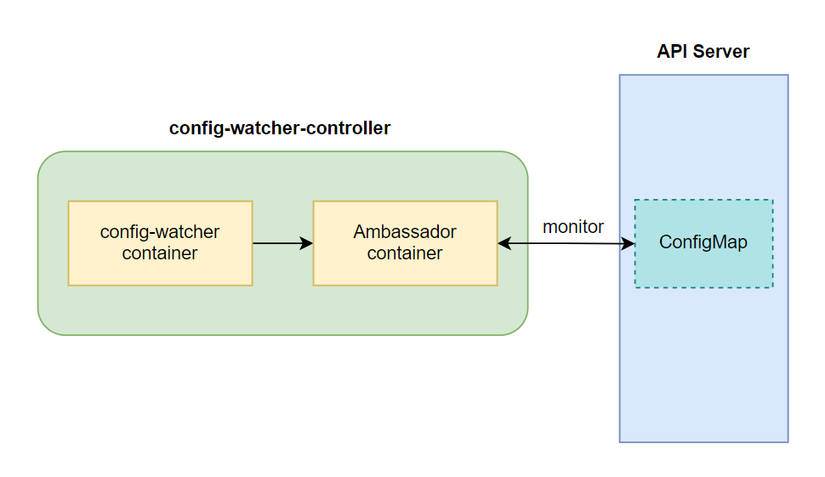
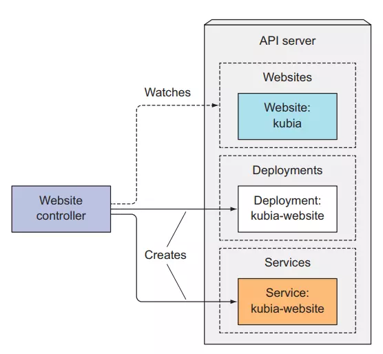
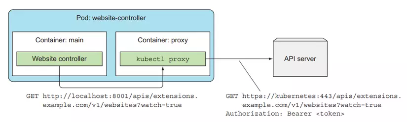

# Server lab
viettu-k8s-master-1: 172.16.10.7
viettu-k8s-master-2: 172.16.10.56
viettu-k8s-master-3:

# Renew certs

## Tại sao phải renew cert cho k8s
- K8s có 2 phương thức để xác thực người dùng là token và client certificate. Các thành phần trong k8s sử dụng certificate để xác thực và giao tiếp với nhau, client certificate chỉ hợp lệ trong thời gian nhất định thường 1 năm, chính vì vậy để renew cho certificate này trước khi chúng hết hạn để hệ thống hoạt động ổn định => nếu không các thành phần trong k8s không thể giao tiếp được với nhau dẫn đến ngừng hoạt động 

## renew certs cho Kubernetes Cluster with kubeadm

```bash
kubeadm certs check-expiration

root@k8s-master-2:~# kubeadm certs check-expiration
[check-expiration] Reading configuration from the cluster...
[check-expiration] FYI: You can look at this config file with 'kubectl -n kube-system get cm kubeadm-config -o yaml'

CERTIFICATE                EXPIRES                  RESIDUAL TIME   CERTIFICATE AUTHORITY   EXTERNALLY MANAGED
admin.conf                 Feb 25, 2026 08:11 UTC   364d            ca                      no      
apiserver                  Feb 25, 2026 08:23 UTC   364d            ca                      no      
apiserver-etcd-client      Feb 25, 2026 08:11 UTC   364d            etcd-ca                 no      
apiserver-kubelet-client   Feb 25, 2026 08:11 UTC   364d            ca                      no      
controller-manager.conf    Feb 25, 2026 08:11 UTC   364d            ca                      no      
etcd-healthcheck-client    Feb 25, 2026 08:11 UTC   364d            etcd-ca                 no      
etcd-peer                  Feb 25, 2026 08:11 UTC   364d            etcd-ca                 no      
etcd-server                Feb 25, 2026 08:11 UTC   364d            etcd-ca                 no      
front-proxy-client         Feb 25, 2026 08:11 UTC   364d            front-proxy-ca          no      
scheduler.conf             Feb 25, 2026 08:11 UTC   364d            ca                      no      
super-admin.conf           Feb 25, 2026 08:11 UTC   364d            ca                      no      

CERTIFICATE AUTHORITY   EXPIRES                  RESIDUAL TIME   EXTERNALLY MANAGED
ca                      Feb 23, 2035 08:11 UTC   9y              no      
etcd-ca                 Feb 23, 2035 08:11 UTC   9y              no      
front-proxy-ca          Feb 23, 2035 08:11 UTC   9y              no      
```

```bash
kubeadm certs renew --help

# Available Commands:
#   admin.conf               Renew the certificate embedded in the kubeconfig file for the admin to use and for kubeadm itself
#   all                      Renew all available certificates
#   apiserver                Renew the certificate for serving the Kubernetes API
#   apiserver-etcd-client    Renew the certificate the apiserver uses to access etcd
#   apiserver-kubelet-client Renew the certificate for the API server to connect to kubelet
#   controller-manager.conf  Renew the certificate embedded in the kubeconfig file for the controller manager to use
#   etcd-healthcheck-client  Renew the certificate for liveness probes to healthcheck etcd
#   etcd-peer                Renew the certificate for etcd nodes to communicate with each other
#   etcd-server              Renew the certificate for serving etcd
#   front-proxy-client       Renew the certificate for the front proxy client
#   scheduler.conf           Renew the certificate embedded in the kubeconfig file for the scheduler manager to use
#   super-admin.conf         Renew the certificate embedded in the kubeconfig file for the super-admin
```

- Ta có thể renew như apiserver, apiserver-etcd-client, ... 


```bash
# ở đây ta renew lại toàn bộ
kubeadm certs renew all
```

- Như vậy toàn bộ cert đã được làm mới lại ==> Restart lại toàn bộ thành phần của master

- Nếu các thành phần kube-apiserver, kube-controller-manager, kube-scheduler, và etcd đang chạy, có thể restart chúng bằng cách xóa tệp manifest tạm thời ==> Ta có thể di chuyển tệp manifests tạm thời ra khỏi thư mục /etc/kubernetes/manifests/, đợi vài giây rồi di chuyển lại để kubelet tạo lại pod: Cách này sẽ buộc kubelet phải đọc lại file manifest và tạo lại pod.

**Lưu ý:** Để renew cert được cần làm lần lượt trên từng master, vì trên từng master sẽ chứa cert và file config riêng ==> lên cần làm lần lượt trên từng master một và sau đó sẽ restart từng node master một

- Để Restart node master 

```bash
$ cd /etc/kubernetes/
$ ls
admin.conf  controller-manager.conf  kubelet.conf  manifests  pki  scheduler.conf  super-admin.conf

$ cd manifests/

$ ls
etcd.yaml  kube-apiserver.yaml  kube-controller-manager.yaml  kube-scheduler.yaml
```

- Tại đây k8s sẽ check những file trong manifest và nó sẽ khởi tạo lên pod ==> tạm thời ta chuyển thư mục này sang 1 thư mục khá thì k8s sẽ phát hiện ra là không có file manifest này và nó sẽ xóa đi các pod liên quan như kube-scheduler, kube-controller-manager, kube-apiserver, etcd
- Khi ta chuyển các file còn lại vào thư mục manifest thì nó sẽ khởi tạo cho lại các thành phần của master 

=> K8s sẽ check những manifest trong thư mục manifests và nó khởi tạo lên các pod


-  Di chuyển file kube-scheduler.yaml và kiểm tra xem pod kube-scheduler có bị xóa không

```bash
# ban đầu
root@viettu-k8s-master-1:/etc/kubernetes/manifests# k get pod -n kube-system
NAME                                          READY   STATUS    RESTARTS       AGE
kube-scheduler-viettu-k8s-master-1            1/1     Running   4 (77m ago)    2d4h
kube-scheduler-viettu-k8s-master-2            1/1     Running   7 (89m ago)    2d4h

# di chuyển file manifest 
root@viettu-k8s-master-1:/etc/kubernetes/manifests# mv kube-scheduler.yaml /tmp/

# kiểm tra và thấy kube-scheduler-viettu-k8s-master-1 đã bị xóa đi
root@viettu-k8s-master-1:/etc/kubernetes/manifests# k get pod -n kube-system | grep scheduler
kube-scheduler-viettu-k8s-master-2            1/1     Running   7 (92m ago)    2d4h

# di chuyển lại
root@viettu-k8s-master-1:/etc/kubernetes/manifests# mv /tmp/kube-scheduler.yaml .

root@viettu-k8s-master-1:/etc/kubernetes/manifests# k get pod -n kube-system | grep scheduler
kube-scheduler-viettu-k8s-master-1            1/1     Running   0              12s
kube-scheduler-viettu-k8s-master-2            1/1     Running   7 (93m ago)    2d4h
```

```bash
root@viettu-k8s-master-2:/etc/kubernetes/manifests# mv * /tmp/

root@viettu-k8s-master-2:/etc/kubernetes/manifests# k get pod
NAME                                          READY   STATUS    RESTARTS        AGE
calico-kube-controllers-5b9b456c66-j8628      1/1     Running   0               56s
calico-node-br6mr                             1/1     Running   2 (3h27m ago)   2d5h
calico-node-m2mkw                             1/1     Running   2 (3h27m ago)   2d5h
coredns-55cb58b774-6phhl                      1/1     Running   0               3h30m
coredns-55cb58b774-mndpn                      1/1     Running   0               3h30m
etcd-viettu-k8s-master-1                      1/1     Running   0               2d5h
kube-apiserver-viettu-k8s-master-1            1/1     Running   1 (97s ago)     2d5h
kube-controller-manager-viettu-k8s-master-1   1/1     Running   0               6m17s
kube-proxy-c9l6n                              1/1     Running   2 (3h27m ago)   2d5h
kube-proxy-hd6xm                              1/1     Running   2 (3h27m ago)   2d5h
kube-scheduler-viettu-k8s-master-1            1/1     Running   0               72m            

root@viettu-k8s-master-2:/etc/kubernetes/manifests# mv /tmp/* .

root@viettu-k8s-master-2:~# k get pod
NAME                                          READY   STATUS    RESTARTS        AGE
calico-kube-controllers-5b9b456c66-j8628      1/1     Running   0               56s
calico-node-br6mr                             1/1     Running   2 (3h30m ago)   2d5h
calico-node-m2mkw                             1/1     Running   2 (3h30m ago)   2d5h
coredns-55cb58b774-6phhl                      1/1     Running   0               3h33m
coredns-55cb58b774-mndpn                      1/1     Running   0               3h33m
etcd-viettu-k8s-master-1                      1/1     Running   0               2d5h
etcd-viettu-k8s-master-2                      1/1     Running   0               2d5h
kube-apiserver-viettu-k8s-master-1            1/1     Running   1 (4m46s ago)   2d5h
kube-apiserver-viettu-k8s-master-2            1/1     Running   0               86s
kube-controller-manager-viettu-k8s-master-1   1/1     Running   0               9m26s
kube-controller-manager-viettu-k8s-master-2   1/1     Running   0               86s
kube-proxy-c9l6n                              1/1     Running   2 (3h30m ago)   2d5h
kube-proxy-hd6xm                              1/1     Running   2 (3h30m ago)   2d5h
kube-scheduler-viettu-k8s-master-1            1/1     Running   0               75m
kube-scheduler-viettu-k8s-master-2            1/1     Running   0               86s
```

## renew certs manual cho Kubernetes Cluster 

### Renew cert cho api server

```bash
# Generate a apiserver.key with 2048bit:
openssl genrsa -out apiserver.key 2048
```

- Lấy thông tin của file san ban đầu 

```bash
$ openssl x509 -in /etc/kubernetes/pki/apiserver.crt -text -noout
# Subject: CN = kube-apiserver
# S:kubernetes, DNS:kubernetes.default, DNS:kubernetes.default.svc, DNS:kubernetes.default.svc.cluster.local, DNS:viettu-k8s-master-2, IP Address:10.96.0.1, IP Address:172.16.10.56, IP Address:172.16.10.7
```

```bash
cat <<EOF > /etc/kubernetes/pki/apiserver.cnf
[ req ]
default_bits = 2048
prompt = no
default_md = sha256
req_extensions = req_ext
distinguished_name = dn

[ dn ]
CN = kube-apiserver

[ req_ext ]
subjectAltName = @alt_names

[ alt_names ]
DNS.1 = kubernetes
DNS.2 = k8s-master-1
DNS.3 = k8s-master-2
DNS.4 = kubernetes.default
DNS.5 = kubernetes.default.svc
DNS.6 = kubernetes.default.svc.cluster
DNS.7 = kubernetes.default.svc.cluster.local
IP.1 = 172.16.10.7
IP.2 = 172.16.10.56

[ v3_ext ]
authorityKeyIdentifier=keyid,issuer:always
basicConstraints=CA:FALSE
keyUsage=keyEncipherment,dataEncipherment
extendedKeyUsage=serverAuth,clientAuth
subjectAltName=@alt_names
EOF
```

```bash
openssl req -new -key apiserver.key -out apiserver.csr -config apiserver.cnf

openssl x509 -req -in apiserver.csr -CA ca.crt -CAkey ca.key -CAserial ca.srl -out apiserver.crt -days 10000 

# -CA ca.crt	Chỉ định tệp CA root của k8s sẽ dùng để ký chứng chỉ.
# -CAkey ca.key: Chỉ định private key của CA để ký chứng chỉ (ca.key).
```

```bash
# check info cert
openssl x509 -in /etc/kubernetes/pki/apiserver.crt -text -noout
```

```bash
kubeadm certs check-expiration


root@viettu-k8s-master-1:/lab-k8s# kubeadm certs check-expiration | grep apiserver
CERTIFICATE                EXPIRES                  RESIDUAL TIME   CERTIFICATE AUTHORITY   EXTERNALLY MANAGED
apiserver                  Jul 22, 2052 03:39 UTC   27y             ca                      no
```

- Khởi động lại api server

```bash
mv /etc/kubernetes/manifests/kube-apiserver.yaml /tmp/
sleep 5
mv /tmp/kube-apiserver.yaml /etc/kubernetes/manifests/

# or
k delete pod kube-apiserver-viettu-k8s-master-1
...
```

- Phân tích kết quả kiểm tra chứng chỉ API Server
```bash
$ openssl s_client -connect 127.0.0.1:6443 -showcerts | openssl x509 -noout -dates

root@viettu-k8s-master-1:/etc/kubernetes/pki# openssl s_client -connect 127.0.0.1:6443 -showcerts | openssl x509 -noout -dates
# notBefore=Mar 6 2025
# notAfter=Jul 22 2052
# → Chứng chỉ mới đã được áp dụng thành công
```


### Renew cert cho apiserver-kubelet-client

```bash
openssl genrsa -out apiserver-kubelet-client.key 2048
```

- Dựa vào info của cert ban đầu để tạo file cnf

```bash
$ openssl x509 -in /etc/kubernetes/pki/apiserver-kubelet-client.crt -text -noout
# Subject: O = kubeadm:cluster-admins, CN = kube-apiserver-kubelet-client
# O (Organization) → Xác định group (nhóm quyền). Thành viên của group kubeadm:cluster-admins, có quyền admin trong cluster.
```

```bash
cat <<EOF > /etc/kubernetes/pki/apiserver-kubelet-client.cnf
[req]
distinguished_name = req_distinguished_name
x509_extensions = v3_req
prompt = no

[req_distinguished_name]
O = kubeadm:cluster-admins
CN = kube-apiserver-kubelet-client

[v3_req]
keyUsage = critical, digitalSignature, keyEncipherment
extendedKeyUsage = clientAuth
basicConstraints = critical, CA:FALSE
authorityKeyIdentifier = keyid,issuer
EOF
```

```bash
openssl req -new -key apiserver-kubelet-client.key -out apiserver-kubelet-client.csr -config apiserver-kubelet-client.cnf

openssl x509 -req -in apiserver-kubelet-client.csr -CA ca.crt -CAkey ca.key -CAcreateserial -out apiserver-kubelet-client.crt -days 10000 
```

```bash
root@viettu-k8s-master-1:/etc/kubernetes/pki# kubeadm certs check-expiration | grep apiserver-kubelet-client
apiserver-kubelet-client   Jul 22, 2052 04:11 UTC   27y             ca                      no
```

### Renewcert admin.conf

- backup
```bash
grep 'client-certificate-data' /etc/kubernetes/admin.conf | awk '{print $2}' | base64 -d > /tmp/admin.crt
grep 'client-key-data' /etc/kubernetes/admin.conf | awk '{print $2}' | base64 -d > /tmp/admin.key
```

- Xem thông tin từ chứng chỉ hiện tại

```bash
root@viettu-k8s-master-1:/etc/kubernetes/pki# openssl x509 -in admin.crt -text -noout | grep Subject:
        Subject: O = kubeadm:cluster-admins, CN = kubernetes-admin


# CN = kubernetes-admin: Common Name là "kubernetes-admin"
# O = system:masters: Organization là "system:masters", đây là nhóm có quyền cao nhất trong Kubernetes

# Subject này rất quan trọng vì nó xác định danh tính và quyền hạn của người dùng trong cụm Kubernetes. Nhóm "system:masters" có quyền truy cập đầy đủ vào tất cả tài nguyên trong cụm.

```

```bash
openssl genrsa -out /tmp/admin-new.key 2048
openssl req -new -key /tmp/admin-new.key -out /tmp/admin-new.csr -subj "/CN=kubernetes-admin/O=system:masters"
openssl x509 -req -in /tmp/admin-new.csr -CA /etc/kubernetes/pki/ca.crt -CAkey /etc/kubernetes/pki/ca.key -CAcreateserial -out /tmp/admin-new.crt -days 1000

# kiểm tra chứng chỉ mới
$ openssl x509 -in /tmp/admin-new.crt -text -noout
# Issuer: CN = kubernetes
#         Validity
#             Not Before: Mar  6 08:54:04 2025 GMT
#             Not After : Dec  1 08:54:04 2027 GMT
#         Subject: CN = kubernetes-admin, O = system:masters
```

- Sửa ~/.kube/config

```yaml
apiVersion: v1
clusters:
- cluster:
    certificate-authority: /etc/kubernetes/pki/ca.crt
    server: https://172.16.10.7:6443
  name: kubernetes
contexts:
- context:
    cluster: kubernetes
    namespace: kube-system
    user: kubernetes-admin
  name: kubernetes-admin@kubernetes
current-context: kubernetes-admin@kubernetes
kind: Config
preferences: {}
users:
- name: kubernetes-admin
  user:
    client-certificate: /tmp/admin-new.crt
    client-key: /tmp/admin-new.key
```

- kiểm tra -> Chứng chỉ hợp lệ

```bash
root@viettu-k8s-master-1:/etc/kubernetes/pki# k get pod -n kube-system
NAME                                          READY   STATUS    RESTARTS        AGE
calico-kube-controllers-5b9b456c66-j8628      1/1     Running   0               127m
calico-node-br6mr                             1/1     Running   2 (5h36m ago)   2d7h
calico-node-m2mkw                             1/1     Running   2 (5h37m ago)   2d7h
coredns-55cb58b774-6phhl                      1/1     Running   0               5h40m
...
```

- Sửa client key thành file ko tồn tại

```bash
root@viettu-k8s-master-1:/etc/kubernetes/pki# k get pod
error: unable to read client-key /tmp/admin-new2.key for kubernetes-admin due to open /tmp/admin-new2.key: no such file or directory
```


### Làm tương tự với
- apiserver-etcd-client
- controller-manager.conf
- etcd-healthcheck-client
- etcd-peer
- etcd-server
- front-proxy-client


# Kubeconfig 

## Giới thiệu về file Kubeconfig:

- File Kubeconfig là một thành phần quan trọng trong Kubernetes, chịu trách nhiệm quản lý cấu hình truy cập và kết nối tới các cluster Kubernetes. Mục đích chính của file này là lưu trữ thông tin cần thiết để `kubectl` và các công cụ khác có thể giao tiếp với các cluster. File Kubeconfig giúp quản lý thông tin về các cluster, người dùng, và các context, cho phép chuyển đổi linh hoạt giữa nhiều cluster và môi trường làm việc khác nhau.

## Cấu trúc cơ bản của file Kubeconfig:

- File Kubeconfig thường được đặt tại `~/.kube/config` và có cấu trúc dưới dạng YAML, bao gồm ba phần chính: clusters, contexts, và users. Mỗi phần này chứa các thông tin cần thiết để kết nối và xác thực tới các cluster khác nhau.

## Các thành phần của file Kubeconfig

### `clusters`:

- Phần này chứa thông tin về các cluster mà bạn có thể kết nối đến, bao gồm tên cluster, server API, và thông tin chứng chỉ để xác thực.

```yaml
clusters:
- name: cluster-1
  cluster:
    server: https://cluster-1.example.com
    certificate-authority: /path/to/ca.crt
```

### `contexts`:

- Contexts quản lý kết nối giữa clusters và users. Mỗi context xác định cluster nào sẽ được truy cập và user nào sẽ được sử dụng để xác thực.

```yaml
contexts:
- name: dev-context
  context:
    cluster: cluster-1
    user: dev-user
    namespace: development
```

### `users`:

- Phần này chứa thông tin xác thực của người dùng như tên người dùng, token hoặc chứng chỉ client.

```yaml
users:
- name: dev-user
  user:
    client-certificate: /path/to/client.crt
    client-key: /path/to/client.key
```

## Sử dụng nhiều Contexts

### Lý do tại sao cần quản lý nhiều contexts:
- Trong môi trường phát triển và sản xuất phức tạp, việc quản lý nhiều context giúp bạn dễ dàng chuyển đổi giữa các cluster và môi trường khác nhau. Điều này đặc biệt hữu ích khi bạn cần làm việc trên nhiều dự án hoặc với nhiều team.

### Thay đổi giữa các contexts bằng lệnh kubectl:

- Sử dụng lệnh `kubectl config use-context <tên-context>` để thay đổi context hiện tại. Điều này cho phép bạn chuyển đổi nhanh chóng giữa các cluster và người dùng khác nhau.

```bash
kubectl config use-context dev-context
```

### Ví dụ về cách sử dụng contexts để quản lý truy cập đến nhiều cluster:

- Giả sử bạn có hai cluster, một cho phát triển (dev-cluster) và một cho sản xuất (prod-cluster). Bạn có thể thiết lập file Kubeconfig như sau:

```yaml
apiVersion: v1
kind: Config
clusters:
- name: dev-cluster
  cluster:
    server: https://dev-cluster.example.com
    certificate-authority: /path/to/dev-ca.crt
- name: prod-cluster
  cluster:
    server: https://prod-cluster.example.com
    certificate-authority: /path/to/prod-ca.crt
contexts:
- name: dev-context
  context:
    cluster: dev-cluster
    user: dev-user
    namespace: development
- name: prod-context
  context:
    cluster: prod-cluster
    user: prod-user
    namespace: production
users:
- name: dev-user
  user:
    client-certificate: /path/to/dev-client.crt
    client-key: /path/to/dev-client.key
- name: prod-user
  user:
    client-certificate: /path/to/prod-client.crt
    client-key: /path/to/prod-client.key
current-context: dev-context
```

## Best Practices khi quản lý Kubeconfig

### Lưu ý an toàn khi quản lý file Kubeconfig:
- Bảo mật thông tin xác thực: Đảm bảo rằng các file chứa thông tin xác thực như chứng chỉ và khóa riêng tư được bảo vệ và chỉ có người dùng được phép mới có quyền truy cập.
- Không chia sẻ file Kubeconfig: Tránh chia sẻ file Kubeconfig một cách công khai. Nếu cần chia sẻ, hãy xóa hoặc ẩn các thông tin nhạy cảm.

### Cách tổ chức file Kubeconfig khi làm việc với nhiều team và môi trường:

- Sử dụng nhiều file Kubeconfig: Bạn có thể sử dụng biến môi trường KUBECONFIG để chỉ định nhiều file Kubeconfig, giúp quản lý cấu hình cho nhiều cluster và môi trường dễ dàng hơn.

```bash
export KUBECONFIG=~/.kube/config:~/.kube/dev-config:~/.kube/prod-config
```

- Sử dụng `kubectl config view --merge` để kết hợp nhiều file Kubeconfig thành một file duy nhất:

```bash
kubectl config view --merge --flatten > ~/.kube/combined-config
```

## Thực hành tạo một kubeconfig

```bash
openssl genrsa -out developer-be.key 2048

## O Ở đây là group nào tức namepsace nào 
openssl req -new -key developer-be.key -out developer-be.csr -subj "/CN=developer-be/O=staging"

# # CA là mình cần đi tìm một Certificate của người quản trị Kubernetes này (CSR Root), sử dụng CSR Root của user admin k8s để ký cho những account khác
# CAKey: key  của account quản trị viên, người tạo lên kubernetes
openssl x509 -req -in developer-be.csr -CA /etc/kubernetes/pki/ca.crt -CAkey /etc/kubernetes/pki/ca.key -CAcreateserial -out developer-be.crt -days 365
```

- Cách 1:

```bash
# add user
k config set-credentials developer-be --client-certificate=developer-be.crt --client-key=developer-be.key

## add context
k config set-context developer-be-context --cluster=kubernetes --user=developer-be

## set current context
k config use-context developer-be-context

## # Get pod để kiểm tra xem có quyền không
k get pods

# Xet lại user admin
k config use-context kubernetes-admin@kubernetes
```

- Cách 2:

```bash
vi ~/.kube/dev-config
```

```yaml
apiVersion: v1
clusters:
- cluster:                                                                                                                                                              
    certificate-authority: /etc/kubernetes/pki/ca.crt
    server: https://172.16.10.7:6443
  name: kubernetes
contexts:
- context:
    cluster: kubernetes
    user: developer-be
  name: developer-be-context
current-context: kubernetes-admin@kubernetes
kind: Config
preferences: {}
users:
- name: developer-be
  user:
    client-certificate: /lab-k8s/kubeconfig/developer-be.crt
    client-key: /lab-k8s/kubeconfig/developer-be.key
```


```bash
export KUBECONFIG=~/.kube/config:~/.kube/dev-config
```

```bash
# Tạo kube-config thành công, Forbidden là do chưa có role nào được gắn với user này, trình bày rõ hơn ở phần RBAC
root@viettu-k8s-master-1:/lab-k8s/kubeconfig# k get node
Error from server (Forbidden): nodes is forbidden: User "developer-be" cannot list resource "nodes" in API group "" at the cluster scope
root@viettu-k8s-master-1:/lab-k8s/kubeconfig#

```

# Role-based access control (RBAC)

## Lý thuyết

### RBAC là gì

- Role-based access control (RBAC) trong Kubernetes là một cơ chế để quản lý và kiểm soát quyền truy cập trong một Kubernetes Cluster. Nó cho phép quản trị viên định nghĩa các Rule và gán chúng cho User hoặc Group dùng để xác định quyền truy cập vào các tài nguyên trong Cluster.

- Trong Kubernetes, RBAC được triển khai thông qua các thành phần chính: Role, ClusterRole và RoleBindings ClusterRoleBinding. Role và ClusterRole định nghĩa các quyền truy cập cụ thể cho một tài nguyên như Pods, Services, Deployments và Namespaces. RoleBinding và ClusterRoleBindings được sử dụng để gán Role đã được định nghĩa, RoleBinding sẽ gán cho User còn ClusterRoleBinding gán cho Group.

### Mục đích sử dụng Role-based access control (RBAC)

- Với RBAC trong Kubernetes, quản trị viên có thể kiểm soát quyền truy cập của người dùng vào các tài nguyên khác nhau. Điều này giúp đảm bảo rằng mỗi người dùng chỉ có quyền truy cập vào các tài nguyên mà họ cần để thực hiện công việc của mình, đồng thời ngăn chặn truy cập trái phép hoặc không cần thiết đến các tài nguyên quan trọng.

- RBAC trong Kubernetes cung cấp một cơ chế linh hoạt và mạnh mẽ để quản lý quyền truy cập, giúp tăng cường bảo mật và kiểm soát trong môi trường Kubernetes.


### Cách thành phần để setup Role-based access control (RBAC)

- Để thiết lập Role-based access control (RBAC) trong Kubernetes, có các thành phần sau:
  + Role: là thành phần chính để định nghĩa các quyền truy cập cụ thể cho tài nguyên rong Kubernetes. Một Role định nghĩa tập hợp các quyền truy cập, được gắn liền với một namespace cụ thể.
  + ClusterRole: tương tự như Role, nhưng áp dụng trên toàn Cluster thay vì một namespace. Chúng được sử dụng để định nghĩa các quyền truy cập cho các tài nguyên không thuộc về namespace cụ thể.
  + RoleBinding: được sử dụng để liên kết Role với một đối tượng cụ thể và xác định quyền truy cập
  + ClusterRoleBinding: tương tự như RoleBinding, nhưng áp dụng cho ClusterRole thay vì Roles. Chúng liên kết các ClusterRole với đối tượng cụ thể trong toàn bộ Cluster.

### Trong Kubernetes RBAC (Role-Based Access Control), có 3 loại đối tượng cần xác thực:

- Người dùng (User): Đây là các tài khoản người dùng được tạo ra và quản lý bởi hệ thống xác thực của Kubernetes hoặc cơ sở dữ liệu xác thực ngoài. Có thể là người dùng hệ thống hoặc người dùng được tạo ra bởi người quản trị hệ thống.
- Nhóm (Group): Đây là tập hợp các người dùng được nhóm lại với nhau để chia sẻ các quyền truy cập với Role tương tự. Các nhóm có thể được tạo ra trong hệ thống xác thực của Kubernetes hoặc từ cơ sở dữ liệu xác thực ngoài.
- Service Account: Đây là các tài khoản được tạo ra tự động và quản lý bởi Kubernetes. Chúng được sử dụng bởi các ứng dụng và các thành phần trong môi trường Kubernetes để xác thực và truy cập vào các tài nguyên.


### Hiểu về cách kubernetes API server thực hiện authentication

- Như chúng ta đã nói ở bài 10, API server có thể được config với một hay nhiều authentication plugins, khi một request đi tới API server nó sẽ đi qua hết các authen plugins này. Những plugin này sẽ phân tách những thông tin cần thiết như username, user id, group mà client thực hiện request thuộc về.

#### `Client`
- Có 2 loại client được API server phân biệt rõ ràng:
  + Humans (users)
  + Pod (ứng dụng chạy bên trong container)

- Đối với user, thường sử dụng kubectl hoặc thực hiện một HTTP request với token để authentication tới API server. Còn đối với Pod, thì sẽ sử dụng ServiceAccount để authentication tới API server. Ở bài này chúng ta sẽ nói về cách Pod authentication tới API server.

#### `Groups`
- Cả users và ServiceAccounts đều thuộc một hoặc nhiều group, group được dùng để grant permissions của tất cả user và ServiceAccounts nằm trong nó một lúc, thay vì phải grant permissions của từng thằng riêng lẽ.

- Group này được phân tách ra bằng authentication plugin cùng với thông username và user id, có 4 group mặc định là:
  + system:unauthenticated - được gán cho user không authenticated thành công.
  + system:authenticated - được gán cho user authenticated thành công.
  + system:serviceaccounts - group cho toàn bộ ServiceAccounts.
  + system:serviceaccounts:<namespace> - group cho toàn bộ ServiceAccounts trong một namespace.

### `ServiceAccounts`

- Như chúng ta đã nói, ServiceAccount sẽ được tự động mount vào bên trong container của Pod ở folder `/var/run/secrets/kubernetes.io/serviceaccount`. Gồm 3 file là `ca.crt`, `namespace`, `token`.

```bash
/ # ls /var/run/secrets/kubernetes.io/serviceaccount
ca.crt     namespace  token
```

- File token này là file sẽ chứa thông tin của về Pod client, khi ta dùng nó để thực hiện request tới server, API server sẽ tách thông tin từ trong token này ra. Và ServiceAccount username của chúng ta sẽ có dạng dạng như sau `system:serviceaccount:<namespace>:<service account name>`, với `system:serviceaccount:<namespace>` là group và `<service account name>` là tên của ServiceAccount được sử dụng.

- Sau khi lấy được thông tin trên thì server sẽ truyền ServiceAccount username này tới authorization plugins, để xem ServiceAccount này có được quyền thực hiện action hiện tại lên trên API server hay không.

- Thì ServiceAccount thực chất chỉ là một resource để ứng dụng bên trong container sử dụng cho việc authenticated tới API server mà thôi. Ta có thể list ServiceAccount bằng câu lệnh:

```bash
root@viettu-k8s-master-1:/lab-k8s/kubeconfig# k get sa
NAME                 SECRETS   AGE
default              0         6h27m
```

- Và ServiceAccount `default` này là một namespace resouce, nghĩa là chỉ có scope bên trong một namespace, ta không thể dùng ServiceAccount của namespace này cho một namespace khác được. Và mỗi namespace sẽ có một ServiceAccount tên là default được tự động tạo ra khi một namespace được tạo. Một ServiceAccount có thể được sử dụng bởi nhiều Pod bên trong cùng một namespace.


#### Sử dụng ServiceAccount để pull image từ private container registry

- Trong serires này thì chúng ta chỉ mới xài public container image chứ chưa xài private container image. Khi làm dự án thực tế thì ta sẽ cần sử dụng private container image chứ không xài public container image không, tại ta không bao giờ muốn container của sản phẩm chúng ta public trên mạng ai cũng tải về để chạy được. Thì để tải được image từ private registry về, ở trong config của Pod, ta phải khai báo thêm trường `imagePullSecrets`, như sau:

```yaml
apiVersion: apps/v1
kind: Deployment
...
    spec:
      imagePullSecrets:
        - name: <secret-name> # secret use to pull image form private registry
      containers:
        - name: background-consume-queue
          image: registry.kala.ai/web-crm/background-consume-queue
...
```

- Trường imagePullSecrets name sẽ chứa Secret name mà ta sử dụng để pull image từ private registry về. Secret name này được tạo bằng cách sử dụng câu lệnh sau:

```bash
$ kubectl create secret docker-registry <secret-name> --docker-server=<your-registry-server> --docker-username=<your-name> --docker-password=<your-pword>
```

- Với `<secret-name>` là tên của secret, docker-server là server registry, nếu bạn dùng hub.docker.com thì server registry là `docker.io`, docker-username là username bạn dùng để login vào docker hub, docker-password là password của username tương ứng tên docker hub. Ví dụ ta muốn pull image từ private registry là registry.kala.ai, thì ta tạo secret như sau:

```bash
$ kubectl create secret docker-registry my-secret --docker-server=registry.kala.ai --docker-username=username --docker-password=12345678
```

```yaml
apiVersion: apps/v1
kind: Deployment
...
    spec:
      imagePullSecrets:
        - name: my-secret
      containers:
        - name: background-consume-queue
          image: registry.kala.ai/web-crm/background-consume-queue
...
```

- Vậy nếu muốn pull image từ private registry thì mỗi khi viết config ta phải thêm trường imagePullSecrets, ta có thể dùng ServiceAccount để tối giản bước này. Khi một Pod được tạo, ServiceAccount tên là default sẽ tự động được gán cho mỗi Pod.


```bash
$ kubectl get pod <pod-name> -o yaml
apiVersion: v1
kind: Pod
metadata:
  creationTimestamp: "2021-10-14T07:42:11Z"
  ...
spec:
  ...
  schedulerName: default-scheduler
  securityContext: {}
  serviceAccount: default # here
  serviceAccountName: default # here
  ...
```

- Ta sẽ thấy trường serviceAccount sẽ được tự động gán cho Pod với giá trị là ServiceAccount `default`. Ta thử xem config của một ServiceAccount.

```bash
root@viettu-k8s-master-1:/lab-k8s/kubeconfig# kubectl describe sa default
Name:                default
Namespace:           default
Labels:              <none>
Annotations:         <none>
Image pull secrets:  <none>
Mountable secrets:   <none>
Tokens:              <none>
Events:              <none>
```

- Bạn để ý là config của một ServiceAccount được hiển thị ở trên có một trường tên là `Image pull secrets`, thì đây chính là trường có tác dụng tương tự như `imagePullSecrets` bên trong config của Pod, vậy những gì ta cần làm lúc này là cập nhật lại trường imagePullSecrets của default ServiceAccount, và ServiceAccount này sẽ tự động được gán vào trong Pod, và ta không cần khai báo trường imagePullSecrets trong mỗi config của Pod nữa, ta cập nhật trường imagePullSecrets của ServiceAccount như sau:


```bash
$ kubectl patch sa default --type json -p '[{"op":"add","path":"/imagePullSecrets","value":[{"name": "my-secret"}]}]'
```

```bash
root@viettu-k8s-master-1:/lab-k8s/kubeconfig# kubectl describe sa default
Name:                default
Namespace:           default
Labels:              <none>
Annotations:         <none>
Image pull secrets:  my-secret
Mountable secrets:   <none>
Tokens:              <none>
Events:              <none>
```


- Vậy là tất cả Pod trong default namespace của chúng ta có thể pull được image từ private registry mà ta không cần khai báo imagePullSecrets khi viết config cho Pod.


#### Tạo ServiceAccount

- ServiceAccount là một resouce của kubernetes, vậy nên ta có thể tạo và xóa nó như các resouce khác một cách bình thường, kể cả nếu bạn xóa default ServiceAccount thì khi tạo Pod nó sẽ báo lỗi là không tìm thấy ServiceAccount để gán vào Pod thôi, thì khi ta xóa ServiceAccount default thì kubernetes sẽ tự động tạo lại một ServiceAccount mới cho ta, và Pod sẽ được tao ra lại bình thường.

- Hoặc bạn cũng có thể tạo một ServiceAccount khác và chỉ định Pod sử dụng ServiceAccount mới này thay vì dùng default ServiceAccount. Để tạo ServiceAccount thì cũng rất đơn giản, ta chỉ cần gõ câu lệnh:

```bash
$ kubectl create sa bar
serviceaccount/bar created
$ kubectl describe sa bar
Name:                bar
Namespace:           default
Labels:              <none>
Annotations:         <none>
Image pull secrets:  <none>
Mountable secrets:   <none>
Tokens:              <none>
Events:              <none>
```

- Create token cho serviceaccount bar: bar-token.yaml

```yaml 
apiVersion: v1
kind: Secret
metadata:
  name: bar-token
  annotations:
    kubernetes.io/service-account.name: bar 
type: kubernetes.io/service-account-token
```

```bash
k apply -f bar-token.yaml
```

- Khi ta describe secret được tạo ra bởi SA, ta sẽ thấy nó chứa 3 file, là 3 file mà sẽ được mount vào bên trong container của Pod ở folder `/var/run/secrets/kubernetes.io/serviceaccount`.

- Để sử dụng ServiceAccount khác default bên trong Pod thì ta chỉ định ở trường `spec.serviceAccountName`.

```yaml
apiVersion: apps/v1
kind: Deployment
...
    spec:
      serviceAccountName: bar
      containers:
        - name: background-consume-queue
          image: registry.kala.ai/web-crm/background-consume-queue
...
```

- Vậy ta có cần tạo một SA khác không hay dùng một thằng thôi cho nhanh? Thì để trả lời vấn để này thì mặc định một thằng SA `nếu ta không bật Role Based Access Control authorization plugin` thì nó sẽ có quyền thực hiện mọi hành động lên API server, nghĩa là một thằng ứng dụng trong container có thể sử dụng SA để authentication tới API server và thực hiện list Pod, xóa Pod, tạo Pod mới một cách bình thường, vì nó có đủ quyền. Thì để ngăn chặn việc đó, ta cần enable Role Based Access Control authorization plugin.


### Role Based Access Control

- Thì kể từ version 1.8.0, RBAC sẽ được enable mặc định, và ta có thể tạo Role và gán với từng SA nhất định. Chỉ cho phép một SA thực hiện những hành động mà ta cho phép, theo Principle of Least Privilege.

#### Action
Các action ta có thể thực hiện tới API server là HEAD, GET, POST, PUT, PATCH, DELETE. Và những action này sẽ tương ứng với một verb mà ta sẽ dùng khi định nghĩa role.

| Action  | Verb   |
|---------|--------|
| HEAD, GET  | get    |
| POST   | create |
| PUT    | update |
| PATCH  | patch  |
| DELETE | delete |

#### RBAC resources

- RBAC sẽ có các resouce như sau:
    + Roles: định nghĩa verb nào có thể được thực hiện lên trên namespace resouce
    + ClusterRoles: định nghĩa verb nào có thể được thực hiện lên trên cluster resouce
    + RoleBindings: gán Roles tới một SA
    + ClusterRoleBindings: gán ClusterRoles tới SA

- Điểm khác nhau của Roles và ClusterRoles là Roles là namespace resouce, nghĩa là nó sẽ thuộc về một namespace nào đó, và chỉ định nghĩa role cho SA trong một namespace. Còn ClusterRoles thì sẽ không thuộc namespace nào cả.


#### Tạo Role và RoleBinding

- Bây giờ ta sẽ thực hành tạo Role và Clusterrole để hiểu rõ hơn về lý thuyết. Trước tiên ta sẽ tạo 2 namespace:

```bash
$ kubectl create ns foo
namespace/foo created
$ kubectl create ns bar
namespace/bar created
$ kubectl run test --image=luksa/kubectl-proxy -n foo
pod/test created
$ kubectl run test --image=luksa/kubectl-proxy -n bar
pod/test created
```

- Truy cập vào Pod và thực hiện request.

```bash
$ kubectl exec -it test -n foo sh
 # curl localhost:8001/api/v1/namespaces/foo/services
{
  "kind": "Status",
  "apiVersion": "v1",
  "metadata": {},
  "status": "Failure",
  "message": "services is forbidden: User \"system:serviceaccount:foo:default\" cannot list resource \"services\" in API group \"\" in the namespace \"foo\"",
  "reason": "Forbidden",
  "details": {
    "kind": "services"
  },
  "code": 403
}/ #
```

- Ta sẽ thấy là với RBAC được enable thì SA bây sẽ không có quyền gì cả. Để cho phép thằng default SA ở namespace foo có thể list được service trong namespace foo, thì ta cần phải tạo một Role và dùng RoleBinding để gán quyền cho default SA này. Tạo một file tên là `service-reader.yaml` với config như sau:

```yaml
apiVersion: rbac.authorization.k8s.io/v1
kind: Role
metadata:
  namespace: foo
  name: service-reader
rules:
  - apiGroups: [""]
    verbs: ["get", "list"]
    resources: ["services"]
```

```bash
$ kubectl apply -f service-reader.yaml -n foo
```

- Ở file config trên, thuộc tính apiGroups ta sẽ chỉ định nhóm của api ta muốn thực hiện hành động lên nó, ở trên ta chỉ định "" có nghĩa là core api group /v1 path, nếu ta muốn thực hiện hành động lên deployment thì ta sẽ chỉ định apiGroups là apps/v1. Trường verb chỉ định action ta có thể thực hiện lên api group group trên, trường resources ta chỉ định là Service resources. Khi ta tạo Role xong, ta cần binding nó tới SA bằng cách dùng câu lệnh như sau:


```bash
$ kubectl create rolebinding test --role=service-reader --serviceaccount=foo:default -n foo
```

- Hoặc viết file config như sau:

```yaml
apiVersion: rbac.authorization.k8s.io/v1
kind: RoleBinding
metadata:
  name: test
  namespace: foo
roleRef:
  apiGroup: rbac.authorization.k8s.io
  kind: Role # this must be Role or ClusterRole
  name: service-reader # this must match the name of the Role or ClusterRole you wish to bind to
subjects:
  - kind: ServiceAccount # Kind is User or ServiceAccount
    name: default # name of the SA
    namespace: foo
```


- Bây giờ thì khi ta có thể gọi API list service bên trong Pod được rồi.

```bash
root@viettu-k8s-master-1:/lab-k8s/rbac# kubectl exec -it test -n foo sh
/ # curl localhost:8001/api/v1/namespaces/foo/services
{
  "kind": "ServiceList",
  "apiVersion": "v1",
  "metadata": {
    "resourceVersion": "43420"
  },
  "items": []
}/ #
```

- Ta cũng có thể sử dụng Rolebinding ở namespace này cho SA ở một namespace khác. Bằng cách thêm SA vào trường subjects của Rolebinding.

```bash
$ kubectl edit rolebinding test -n foo
...
subjects:
...
- kind: ServiceAccount
  name: default
  namespace: bar
```
- Khi ta thêm subject trên thì bây giờ SA ở namespace `bar` có thể đọc được services ở namespace `foo`.


```bash
root@viettu-k8s-master-1:/lab-k8s/rbac# kubectl exec -it test -n bar sh
/ # curl localhost:8001/api/v1/namespaces/foo/services
{
  "kind": "ServiceList",
  "apiVersion": "v1",
  "metadata": {
    "resourceVersion": "43659"
  },
  "items": []
}/ #
```

#### Tạo ClusterRole và ClusterRoleBinding

- Giờ thì ta sẽ qua phần tạo ClusterRole, ClusterRole cho phép một SA có thể truy cập được resouce của Cluster như Node, PersistentVolume, v...v... Ở trong Pod hiện tại, khi ta thực hiện API request để list persistentvolumes thì ta sẽ gặp lỗi.

```bash
root@viettu-k8s-master-1:/lab-k8s/rbac# kubectl exec -it test -n foo sh
/ # curl localhost:8001/api/v1/persistentvolumes
{
  "kind": "Status",
  "apiVersion": "v1",
  "metadata": {},
  "status": "Failure",
  "message": "persistentvolumes is forbidden: User \"system:serviceaccount:foo:default\" cannot list resource \"persistentvolumes\" in API group \"\" at the cluster scope",
  "reason": "Forbidden",
  "details": {
    "kind": "persistentvolumes"
  },
  "code": 403
}/ #
```

- Để thực hiện được action này, ta phải tạo ClusterRole, tạo file tên là `pv-reader` với config như sau:

```yaml
apiVersion: rbac.authorization.k8s.io/v1
kind: ClusterRole
metadata:
  name: pv-reader
rules:
  - apiGroups: [""]
    verbs: ["get", "list"]
    resources: ["persistentvolumes"]
```

- Config của ClusterRole cũng giống như Role, ta chỉ cần thay kind từ Role sang ClusterRole và không cần phải chỉ định namespace.

```bash
$ kubectl apply -f pv-reader.yaml
```

- Sau đó ta tạo ClusterRoleBinding:

```bash
$ kubectl create clusterrolebinding pv-test --clusterrole=pv-reader --serviceaccount=foo:default
```

- Bây giờ thì ta đã có thể gọi tới API server để list PV.

```bash
root@viettu-k8s-master-1:/lab-k8s/rbac# kubectl exec -it test -n foo sh
/ # curl localhost:8001/api/v1/persistentvolumes
{
  "kind": "PersistentVolumeList",
  "apiVersion": "v1",
  "metadata": {
    "resourceVersion": "44405"
  },
  "items": []
}/ #
```


### ClusterRole và ClusterRoleBinding mặc định

- Kubernetes có một có ClusterRole và ClusterRoleBinding mặc định, ta có thể list nó ra bằng câu lệnh:

```bash
$ kubectl get clusterroles
NAME
admin
cluster-admin
edit
...
system:discovery
...
view
...
$ kubectl get clusterrolebindings
admin
cluster-admin
edit
...
system:discovery
...
view
...
```

#### Truy cập non-resource URLs với system:discovery

- Kubernetes API server sẽ được chia làm 2 loại chính là: các url liên quan tới resource và những url không liên quan tới resouce (được gọi là non-resource URLs). Resource URLs là các url sẽ liệt kê resource và thực hiện các thao tác lên resource, còn các non-resource URLs thì sẽ không có tương tác nào liên quan trực tiếp tới các resource hết, ví dụ như là url dùng để list hết tất cả các url mà API server hỗ trợ.

- Đối với non-resource URLs thì kể cả client authenticated hoặc unauthenticated với API server đều truy cập được những non-resource URLs này, role này được định nghĩa trong `system:discovery` ClusterRole và ClusterRoleBinding.

- Ta xem thử config của system:discovery:

```bash
root@viettu-k8s-master-1:/lab-k8s/rbac# kubectl get clusterrole system:discovery -o yaml
apiVersion: rbac.authorization.k8s.io/v1
kind: ClusterRole
metadata:
  annotations:
    rbac.authorization.kubernetes.io/autoupdate: "true"
  creationTimestamp: "2025-03-04T01:38:43Z"
  labels:
    kubernetes.io/bootstrapping: rbac-defaults
  name: system:discovery
  resourceVersion: "74"
  uid: 7e6b383e-2146-48d1-9a27-393828852113
rules:
- nonResourceURLs:
  - /api
  - /api/*
  - /apis
  - /apis/*
  - /healthz
  - /livez
  - /openapi
  - /openapi/*
  - /readyz
  - /version
  - /version/
  verbs:
  - get
```

- Ta sẽ thấy role này sẽ định nghĩa ta có quyền get những thông tin của các non-resource URLs được định nghĩa ở trường nonResourceURLs. Ở trên ta có nói về group, là cách để ta grant permission cho một nhóm user hay vì từng thằng riêng lẻ. Thì thằng `system:discovery` ClusterRoleBinding sẽ bind role tới toàn bộ user thuộc group authenticated, unauthenticated.

```bash
$ kubectl get clusterrolebinding system:discovery -o yaml

apiVersion: rbac.authorization.k8s.io/v1
kind: ClusterRoleBinding
metadata:
    name: system:discovery
...
roleRef:
    apiGroup: rbac.authorization.k8s.io
    kind: ClusterRole
    name: system:discovery # bind to ClusterRole
subjects:
    - apiGroup: rbac.authorization.k8s.io
      kind: Group
      name: system:authenticated # group authenticated
    - apiGroup: rbac.authorization.k8s.io
      kind: Group
      name: system:unauthenticated # group unauthenticated
```

#### Liệt kê toàn bộ resouce trong một namspace với view ClusterRole

- `view` ClusterRole sẽ định nghĩa toàn bộ role cho phép chúng ta có thể list toàn bộ resouce bên trong một namespace. Ta coi thử config của `view`:

```bash
$ kubectl get clusterrole view -o yaml
apiVersion: rbac.authorization.k8s.io/v1
kind: ClusterRole
metadata:
    name: view
...
rules:
    - apiGroups:
    - ""
resources:
    - configmaps
    - endpoints
    - persistentvolumeclaims
    - pods
    - replicationcontrollers
    - replicationcontrollers/scale
    - serviceaccounts
    - services
verbs:
    - get
    - list
    - watch
...
```

- Để sử dụng `view` ClusterRole thì chỉ cần tạo ClusterRoleBinding cho nó:

```bash
$ kubectl create clusterrolebinding view --clusterrole=view --serviceaccount=foo:default
```

- Và vì nó là ClusterRole, nên thằng SA trong foo namespace cũng có thể list được các resouce khác namespace của nó. Nhưng ta không thể dùng nó để đọc cluster resouce được, vì nó chỉ có scope đối với namespace resouce. Bên trong pod của foo namespace

```bash
root@viettu-k8s-master-1:/lab-k8s/rbac# kubectl exec -it test -n foo sh
/# curl localhost:8001/api/v1/namespaces/foo/pods
{
  "kind": "PodList",
  "apiVersion": "v1",
  ...

/# curl localhost:8001/api/v1/namespaces/bar/pods
{
  "kind": "PodList",
  "apiVersion": "v1",
  ...
```


#### Update resouce với edit ClusterRole

- `eidt` ClusterRole sẽ kế thừa toàn bộ role của `view` và bên cạnh đó nó còn định nghĩa thêm role cho phép chúng ta thực hiện các verb create, update, patch, delete tất cả các resouce bên trong một namespace, ngoài trừ Secret, Role, RoleBinding


#### Toàn quyền trên namespace với admin ClusterRole

- admin ClusterRole này cho phép chúng ta có toàn quyền trên một namespace, kể cả edit Secret, Role, RoleBinding. Ngoài trừ ResourceQuotas (sẽ nói ở bài khác). Điểm khác nhau giữa `edit` và `admin` là thằng admin có thể sửa Secret, Role, RoleBinding. Còn thằng edit thì không.

#### Toàn quyền trên cluster với cluster-admin ClusterRole
- Thì thằng này là thằng sẽ cung cấp cho chúng ta có mọi quyền trên API server, cross namepspace, có thể truy cập cluster resource.

#### system:* ClusterRole
- Khi ta liệt kê ClusterRole ra ta sẽ thấy có rất nhiều ClusterRole mặc định, trong đó có một vào thằng prefix với system:, thì đây là những ClusterRole được các kubernetes component sử dụng. Ví dụ system:kube-scheduler được sử dụng bởi Scheduler.


## Triển khai phân quyền cho User
- Ví dụ là 1 quản trị viên k8s, ta sẽ set quyền cho developer đó có quyền truy cập vào trong resouce k8s
- - Lệnh kubectl config view  được sử dụng để hiển thị cấu hình của kubectl. Cấu hình này bao gồm thông tin về các cluster, người dùng (users), và các context mà kubectl đang quản lý.

```bash
root@viettu-k8s-master-1:/lab-k8s/rbac# k config use-context developer-be-context
Switched to context "developer-be-context".

# Get pod để kiểm tra xem có quyền không
root@viettu-k8s-master-1:/lab-k8s/rbac# k get pod
Error from server (Forbidden): pods is forbidden: User "developer-be" cannot list resource "pods" in API group "" in the namespace "default"
```


```bash
vi developer-be-role-rolebinding.yaml
```

```yaml
apiVersion: rbac.authorization.k8s.io/v1
kind: Role
metadata:
  name: developer-role
  namespace: default
rules:
  - apiGroups: [""]
    resources: ["pods", "services"]
    verbs: ["get", "list", "watch", "create", "update", "patch", "delete"]
  - apiGroups: ["apps"]
    resources: ["deployments"]
    verbs: ["get", "list", "watch", "create", "update", "patch", "delete"]
---
apiVersion: rbac.authorization.k8s.io/v1
kind: RoleBinding
metadata:
  name: developer-rolebinding
  namespace: default
subjects:
  - kind: User
    name: developer-be
    namespace: default
roleRef:
  kind: Role
  name: developer-role
  apiGroup: rbac.authorization.k8s.io
```

```bash
k apply -f developer-be-role-rolebinding.yaml
```

```bash
root@viettu-k8s-master-1:/lab-k8s/rbac#  k config use-context developer-be-context
Switched to context "developer-be-context".
root@viettu-k8s-master-1:/lab-k8s/rbac# k get pod
NAME                             READY   STATUS    RESTARTS   AGE
kubia-website-6d9d5558b5-zrx9n   2/2     Running   0          4h42m
root@viettu-k8s-master-1:/lab-k8s/rbac# k get svc
NAME            TYPE        CLUSTER-IP      EXTERNAL-IP   PORT(S)        AGE
kubernetes      ClusterIP   10.96.0.1       <none>        443/TCP        8h
kubia-website   NodePort    10.107.60.175   <none>        80:30545/TCP   4h43m
root@viettu-k8s-master-1:/lab-k8s/rbac# k get deploy
NAME            READY   UP-TO-DATE   AVAILABLE   AGE
kubia-website   1/1     1            1           4h43m
```

- Vậy có quyền get pod, **Chú ý:** chỉ có quyền trên namespace default

- Set lại context admin và xóa resouce pods đi và get pods lại xem được không

```bash
k config use-context kubernetes-admin@kubernetes
```

```yaml
apiVersion: rbac.authorization.k8s.io/v1
kind: Role
metadata:
  name: developer-role
  namespace: default
rules:
  - apiGroups: [""]
    resources: ["services"]
...
```

```bash
k apply -f developer-be-role-rolebinding.yaml
```

```bash
k config use-context developer-be-context

root@viettu-k8s-master-1:/lab-k8s/rbac# k get pod
Error from server (Forbidden): pods is forbidden: User "developer-be" cannot list resource "pods" in API group "" in the namespace "default"
root@viettu-k8s-master-1:/lab-k8s/rbac# k get svc
NAME            TYPE        CLUSTER-IP      EXTERNAL-IP   PORT(S)        AGE
kubernetes      ClusterIP   10.96.0.1       <none>        443/TCP        8h
kubia-website   NodePort    10.107.60.175   <none>        80:30545/TCP   4h46m
root@viettu-k8s-master-1:/lab-k8s/rbac#
```

## Cluster Role cho user

- Cluster role không phân biệt namespace, nghĩa là user có được toàn quyền, truy cập vào một cluster bất kỳ với namespace nào thì nó cũng truy cập được hết chỉ quan tâm đến resource thôi (ví dụ: pod, service)
- Ngoài ra còn phân chia theo group được, group ở đây khi mọi người muốn assign cùng một permision cho nhiều User khách nhau nếu không có cluster role thì phải đi xét tạo nhữn rolebilding xét cho từng user => Mất thời gian, có thể sử dụng cluster role binding có thể assign vào một group ==> Group ở đây khi vừa này tạo CSR , ở phần Subject có tạo một Group là Staging => nghĩa là developer-be thuộc group staging

```bash
openssl req -new -key developer-be.key -out developer-be.csr -subj "/CN=developer-be/O=staging"
```

- ClusterRoleBinding => subjects có kind là Group, và name: staging (Tương ứng với group của user mà ta đã xét trong Certificate)

```yaml
apiVersion: rbac.authorization.k8s.io/v1
kind: ClusterRole
metadata:
  name: developer-cluster-role
  namespace: default
rules:
  - apiGroups: [""]
    resources: ["*"] ## tất cả các resource
    verbs: ["get", "list", "watch", "create", "update", "patch", "delete"]
---
apiVersion: rbac.authorization.k8s.io/v1
kind: ClusterRoleBinding
metadata:
  name: developer-cluster-role-binding
  namespace: default
roleRef:
  kind: ClusterRole
  name: developer-cluster-role
  apiGroup: rbac.authorization.k8s.io
subjects:
  - kind: Group
    name: staging
    apiGroup: rbac.authorization.k8s.io
```

```bash
k config use-context kubernetes-admin@kubernetes

k apply -f developer-cluster-role-binding.yaml

k config use-context developer-be-context
```

```bash
# Get pod ở namespace kubesystem -> Gọi được thành công
root@viettu-k8s-master-1:/lab-k8s/rbac# k get pod -n kube-system
NAME                                          READY   STATUS    RESTARTS   AGE
calico-kube-controllers-5b9b456c66-zfh72      1/1     Running   0          47h
calico-node-br6mr                             1/1     Running   0          47h
calico-node-m2mkw                             1/1     Running   0          47h
coredns-55cb58b774-x6zgk                      1/1     Running   0          47h
coredns-55cb58b774-x76jp                      1/1     Running   0          47h
etcd-viettu-k8s-master-1                      1/1     Running   0          47h
etcd-viettu-k8s-master-2                      1/1     Running   0          47h
kube-apiserver-viettu-k8s-master-1            1/1     Running   0          47h
kube-apiserver-viettu-k8s-master-2 

root@viettu-k8s-master-1:/lab-k8s/rbac# k get pod -n default
NAME                             READY   STATUS    RESTARTS         AGE
kubia-website-6d9d5558b5-zrx9n   2/2     Running   214 (127m ago)   44h
```

==> Toàn quyền trên tất cả namespace

- Quay về user admin và sửa Group thành development

```bash
k config use-context kubernetes-admin@kubernetes

vi developer-cluster-role-binding.yaml
```

```yaml
apiVersion: rbac.authorization.k8s.io/v1
kind: ClusterRoleBinding
metadata:
  name: developer-cluster-role-binding
  namespace: default
roleRef:
  kind: ClusterRole
  name: developer-cluster-role
  apiGroup: rbac.authorization.k8s.io
subjects:
  - kind: Group
    name: development # Sửa group
    apiGroup: rbac.authorization.k8s.io
```

```bash
k apply -f developer-cluster-role-binding.yaml

k config use-context developer-be-context
```

```bash
# Sẽ bị lỗi forbidden trên toàn bộ namespace
root@viettu-k8s-master-1:/lab-k8s/rbac# k get pod
Error from server (Forbidden): pods is forbidden: User "developer-be" cannot list resource "pods" in API group "" in the namespace "default"

```


# CRD trong k8s

- Bên cạnh những resource mặc định như Pod, ReplicaSet, Deployment, StatefulSet, ... Thì kubernetes cho phép chúng ta tạo thêm những custom resource để đáp ứng đúng nhu cầu của chúng ta trong dự án, từng custom resource sẽ phục vụ cho một mục đích cụ thể nào đó trong dự án của chúng ta. Ví dụ, để tạo postgres database trong kubernetes, thì đầu tiên ta sẽ định nghĩa một StatefulSet, sau đó tạo một Service cho StatefulSet này để client có thể kết nối được tới nó. Ta có thể giảm công đoạn phải tạo nhiều thứ liên quan như vậy bằng cách định nghĩa một custom resource tên là Postgres, mỗi lần ta cần postgres database thì ta chỉ cần tạo một Postgres custom resource là được, ví dụ như sau:

```yaml
...
kind: Postgres
metadata:
  name: test-db
storage: 50GB
```

## Custom Controller

- Trước khi nói về phần custom resource, ta sẽ nói qua về cách tạo custome controller trước. Ở bài Kubernetes internals architecture, ta tìm hiểu về cấu trúc bên trong kubernetes, nó gồm có 4 thành phần chính là etcd, API server, Controller Manager, Scheduler. Controller Manager có nhiệm vụ theo dõi API server và tạo ra các resource liên quan tới nó, ví dụ như Deployment Controller sẽ có nhiệm vụ theo dõi Deployment resource ở trên API server và tạo ra những resource liên quan. Thì bên cạnh những Controller Manager có sẵn bên trong kubernetes, ta có thể tạo thêm custom controller để phục vụ cho một mục đích khác nào đó.

- Trong kubernetes, bạn sẽ để ý một điều là khi ta tạo một ConfigMap và gán nó cho Pod, lúc ta cập nhật lại ConfigMap đó với giá trị mới, thì Pod sử dụng ConfigMap của chúng ta vẫn giữ giá trị cũ, nếu ta muốn Pod nó sử dụng giá trị ConfigMap mới thì ta phải xóa Pod đó đi cho nó tạo lại thì nó mới cập nhật được giá trị mới. Công việc này hơi mất công, ta có thể tạo một custom controller để thực hiện công việc này tự động, customer controller của ta sẽ theo dõi resource ConfigMap ở trên API server, và nếu nó phát hiện ConfigMap thay đổi, nó sẽ tự động xóa thằng Pod đó và nếu Pod được tạo bằng các resource như ReplicaSet, Deployment thì nó sẽ được tự động tạo lại, lúc này Pod mới của ta sẽ sử dụng giá trị mới của ConfigMap.

- Để tạo một custom controller, đầu tiên ta sẽ viết code mà sẽ theo dõi API server với resource ta muốn, sau đó ta build thành image, sau đó ta sẽ tạo một Deployment mà sử dụng image ta vừa tạo và deploy nó lên kubernetes. Thực chất thì một thằng customer controller chỉ là một thằng Deployment bình thường mà thôi, khác ở chỗ là ta sẽ tự viết code để tương tác với API server.

### Tạo một customer controller

- Bây giờ ta sẽ tạo một customer controller có tên là config-watcher-controller, nó sẽ theo dõi ConfigMap và nếu Pod nào có xài ConfigMap liên quan, khi ConfigMap thay đổi thì giá trị ConfigMap mới này cũng sẽ được cập nhật lại cho Pod một cách tự động. Nó sẽ làm việc này bằng cách xóa Pod cũ đi để Pod tự được tạo lại. Minh họa của config-watcher-controller như sau:



- Giờ ta sẽ tiến hành viết code và build image cho config-watcher container, tạo một file config-watcher-controller.sh với code như sau:

```bash
#!/bin/bash

# Controller script which watches configmaps and evaluates annotation
# on the ConfigMap for pods to restart

# Namespace to watch (or 'default' if not given)
namespace=${WATCH_NAMESPACE:-default}

# API URL setup. Requires an ambassador API proxy running side-by-side on localhost
base=http://localhost:8001
ns=namespaces/$namespace

# Main event loop
start_event_loop() {
  # Watch the K8s API on events on service objects
  echo "::: Starting to wait for events"

  # Event loop listening for changes in config maps
  curl -N -s $base/api/v1/${ns}/configmaps?watch=true | while read -r event
  do
    # Sanitize new lines
    event=$(echo "$event" | tr '\r\n' ' ')

    # Event type & name
    local type=$(echo "$event" | jq -r .type)
    local config_map=$(echo "$event" | jq -r .object.metadata.name)

    # Fetch annotations of ConfigMap and extract our trigger annotation if any
    # The extracted pod selector is expected to have
    # the format "label1=value1,label2=value2,.."
    local annotations=$(echo "$event" | jq -r '.object.metadata.annotations')
    if [ "$annotations" != "null" ]; then
      local pod_selector=$(echo $annotations | jq -r 'to_entries | .[] | select(.key == "k8spatterns.io/podDeleteSelector") | .value | @uri')
    fi
    echo "::: $type -- $config_map -- $pod_selector"

    # Act only when configmap is modified and an annotation has been given
    if [ $type = "MODIFIED" ] && [ -n "$pod_selector" ]; then
      delete_pods_with_selector "$pod_selector"
    fi
  done
}

# Delete all pods that match a selector
delete_pods_with_selector() {
  local selector=${1}

  echo "::::: Deleting pods with $selector"

  # Pick up all pod names which match the given selector
  local pods=$(curl -s $base/api/v1/${ns}/pods?labelSelector=$selector | \
               jq -r .items[].metadata.name)

  # Delete all pods that matched
  for pod in $pods; do
    # Delete but also check exit code
    exit_code=$(curl -s -X DELETE -o /dev/null -w "%{http_code}" $base/api/v1/${ns}/pods/$pod)
    if [ $exit_code -eq 200 ]; then
      echo "::::: Deleted pod $pod"
    else
      echo "::::: Error deleting pod $pod: $exit_code"
    fi
  done
}

# ==============================================
# Fire up
start_event_loop

```

- Ta không cần phải hiểu code chi tiết làm gì, đoạn code trên sẽ có nhiệm vụ là theo dõi ConfigMap trên API server bằng bằng câu lệnh curl -N -s $base/api/v1/${ns}/configmaps?watch=true | while read -r event, nếu ConfigMap có thay đổi gì thì nó sẽ chạy xuống đoạn code phía dưới, và phát hiện nếu có ConfigMap nào thay đổi mà có Pod sử dụng nó thì nó sẽ xóa Pod đó bằng đoạn code:

```bash
if [ $type = "MODIFIED" ] && [ -n "$pod_selector" ]; then
  delete_pods_with_selector "$pod_selector"
fi
```

- Ta chỉ cần hiểu hành động của đoạn code trên như vậy là được. Tiếp theo, ta tạo Dockerfile:

```Dockerfile
FROM alpine
WORKDIR /watcher
RUN apk add --update curl jq && rm -rf /var/cache/apk/*
COPY config-watcher-controller.sh .
ENTRYPOINT ["curl"]
```

- Tiếp theo là build và push image lên docker hub của bạn nếu bạn không muốn sử dụng image viettu123/configmap-watcher:

```bash
$ docker login 
$ docker build . -t viettu123/configmap-watcher
$ docker push viettu123/configmap-watcher
```

- Sau khi xong thì ta tạo một file tên là config-watcher-controller.yaml với config như sau:

```yaml
# Service account required for watching to resources
apiVersion: v1
kind: ServiceAccount
metadata:
  name: config-watcher-controller
---

# Bind to 'edit' role to allow for watching resources and restarting pods
apiVersion: rbac.authorization.k8s.io/v1
kind: RoleBinding
metadata:
  name: config-watcher-controller
subjects:
- kind: ServiceAccount
  name: config-watcher-controller
roleRef:
  name: edit
  kind: ClusterRole
  apiGroup: rbac.authorization.k8s.io
---

# Controller with kubeapi-proxy sidecar for easy access to the API server
apiVersion: apps/v1
kind: Deployment
metadata:
  name: config-watcher-controller
spec:
  replicas: 1
  selector:
    matchLabels:
      app: config-watcher-controller
  template:
    metadata:
      labels:
        app: config-watcher-controller
    spec:
      # A serviceaccount is needed to watch events
      # and to allow for restarting pods. For now its
      # associated with the 'edit' role
      serviceAccountName: config-watcher-controller
      containers:
      - name: proxy
        image: 080196/kubeapi-proxy
      - name: config-watcher
        image: viettu123/configmap-watcher
        env:
         # The operator watches the namespace in which the controller
         # itself is installed (by using the Downward API)
         - name: WATCH_NAMESPACE
           valueFrom:
             fieldRef:
               fieldPath: metadata.namespace
        command:
        - "sh"
        - "/watcher/config-watcher-controller.sh"
```

- Ở file trên, ta sẽ tạo một ServiceAccount riêng để sử dụng cho config-watcher-controller của ta thay vì sử dụng ServiceAccount mặc định, sau đó ta sẽ dùng RoleBinding để bind edit role tới ServiceAccount này để cho phép nó có quyền edit các resource trong một namespace. Trong Deployment config, ta sẽ khai báo ServiceAccount trên tới Pod template, để ứng dụng container trong Pod có thể edit các resource của kubernetes được, các bạn có thể xem lại bài 13 để hiểu hơn về ServiceAccount. Để controller này biết nó đang theo dõi namespace nào, ta dùng Downward API đã nói ở bài 11.

- Ta tạo controller trên:

```bash
$ kubectl apply -f config-watcher-controller.yaml
serviceaccount/config-watcher-controller created
rolebinding.rbac.authorization.k8s.io/config-watcher-controller created
deployment.apps/config-watcher-controller created
```

### Sử dụng custom controller

- Ok, vậy là ta đã tạo được custom controller, tiếp theo ta sẽ tạo một resource nào đó và test thử, để sử dụng config-watcher-controller, thì khi ta khai báo ConfigMap, ta sẽ thêm vào trường annotations với giá trị k8spatterns.io/podDeleteSelector: "<key>=<value>" , với key value là label của Pod mà ta muốn cập nhật lại giá trị ConfigMap cho nó khi ConfigMap của ta thay đổi. Tạo một file tên là confimap-watch.yaml:

```yaml
apiVersion: v1
kind: ConfigMap
metadata:
  name: webapp-config
  annotations:
    k8spatterns.io/podDeleteSelector: "app=webapp"
data:
  message: "Hello configmap watch one"
```

```bash
$ kubectl apply -f confimap-watch.yaml
configmap/webapp-config created
```

- Tạo một file tên là deploy-use-configmap-watcher.yaml:

```yaml
apiVersion: apps/v1
kind: Deployment
metadata:
  name: webapp
spec:
  replicas: 1
  selector:
    matchLabels:
      app: webapp
  template:
    metadata:
      labels:
        app: webapp
    spec:
      containers:
        - name: webapp
          image: alpine
          command: ["/bin/sleep", "999999"]
          envFrom:
            - configMapRef:
                name: webapp-config
```

- Giá trị label của Pod là giá trị mà ta khai báo ở thằng ConfiMap ở trên. Ta tạo Deployment và truy cập vào nó để xem giá trị ConfigMap trước đó, sau đó ta sẽ cập nhật lại giá trị ConfigMap và xem thử Pod của ta có được tự động cập nhật giá trị hay không:

```bash
root@viettu-k8s-master-1:/lab-k8s/crd# kubectl apply -f deploy-use-configmap-watcher.yaml
deployment.apps/webapp created

root@viettu-k8s-master-1:/lab-k8s/crd# kubectl get pod
NAME                                        READY   STATUS    RESTARTS   AGE
config-watcher-controller-c46d84c89-n8sl9   2/2     Running   0          8m25s
webapp-59bcbc7955-sph9b                     1/1     Running   0          9s

root@viettu-k8s-master-1:/lab-k8s/crd# k exec -it webapp-59bcbc7955-sph9b sh
kubectl exec [POD] [COMMAND] is DEPRECATED and will be removed in a future version. Use kubectl exec [POD] -- [COMMAND] instead.
/ # env
message=Hello configmap watch one
/ #
```

- Cập nhật lại file confimap-watch.yaml:

```yaml
apiVersion: v1
kind: ConfigMap
metadata:
  name: webapp-config
  annotations:
    k8spatterns.io/podDeleteSelector: "app=webapp"
data:
  message: "Hello configmap watch two"
```

```bash
$ kubectl apply -f confimap-watch.yaml
configmap/webapp-config configured
```

- Lúc này nếu ta get pod, ta sẽ thấy có một thằng đang bị xóa đi và một thằng khác được tạo ra:

```bash
root@viettu-k8s-master-1:/lab-k8s/crd# k get pod
NAME                                        READY   STATUS        RESTARTS   AGE
config-watcher-controller-c46d84c89-n8sl9   2/2     Running       0          11m
webapp-59bcbc7955-m88tm                     1/1     Running       0          29s
webapp-59bcbc7955-sph9b 
```

- Khi ta truy cập vào pod mới và kiểm tra lại, ta sẽ thấy env của ta đã được cập nhật:

```bash
root@viettu-k8s-master-1:/lab-k8s/crd# k exec -it webapp-59bcbc7955-m88tm sh
kubectl exec [POD] [COMMAND] is DEPRECATED and will be removed in a future version. Use kubectl exec [POD] -- [COMMAND] instead.
/ # env
message=Hello configmap watch two
```

- Oke, vậy là custom controller của ta đã chạy đúng 😄. Tới đây thì ta đã biết cách viết và tạo một customer controller phục vụ cho một mục đích cụ thể của ta, nhưng mà trước khi ta làm gì đó thì ta xem có người nào đã làm trước chưa, nếu có rồi thì ta cứ sử dụng thôi, vì viết một controller mà chạy được trong môi trường production ta cần với test nhiều lần nữa, code ở trên chỉ dành cho môi trường dev thôi.

## Custom Resource

- Sau khi ta nói về custom controller thì bây giờ ta sẽ nói về custom resource. Để tạo một custom resource trong thì ta sẽ dùng `CustomResourceDefinition`, ta sẽ viết `CustomResourceDefinition` và định nghĩa những giá trị custom resource của ta trong đó. Sau đó ta sẽ tạo `CustomResourceDefinition` này, rồi ta sẽ viết một controller để theo dõi custom resource của ta mới tạo và thực hiện hành động liên quan tới nó. Ví dụ ta có một file website-crd.yaml với config của `CustomResourceDefinition` như sau:

```yaml
apiVersion: apiextensions.k8s.io/v1
kind: CustomResourceDefinition
metadata:
  name: websites.extensions.example.com # The full name of your custom object
spec:
  scope: Namespaced # You want Website resources to be namespaced.
  group: extensions.example.com # Define an API group and version of the Website resource.
  versions:
    - name: v1
      served: true
      storage: true
      schema:
        openAPIV3Schema:
          type: object
          properties:
            spec:
              type: object
              properties:
                gitRepo:
                  type: string
  names: # You need to specify the various forms of the custom object’s name.
    kind: Website
    singular: website
    plural: websites
```

```
# Dưới đây là giải thích chi tiết cho định nghĩa CRD trên:

- apiVersion: apiextensions.k8s.io/v1
    + Đây là version của API dùng để định nghĩa CRD. Phiên bản này được sử dụng trong Kubernetes hiện đại.
- kind: CustomResourceDefinition
    + Xác định rằng tài nguyên được tạo là một CRD cho phép bạn mở rộng các tính năng của Kubernetes bằng cách thêm resource tùy chỉnh.
- metadata.name: websites.extensions.example.com
    + Đây là tên đầy đủ của CRD. Cấu trúc tên thường gồm: [plural].[group].
    + Ví dụ: "websites" là dạng số nhiều của resource, "extensions.example.com" là API group.
- spec.scope: Namespaced
    + Chỉ định rằng resource tùy chỉnh này sẽ được triển khai bên trong một namespace cụ thể thay vì ở phạm vi cluster-wide. Điều này có nghĩa là các instance của Website sẽ tồn tại trong từng namespace riêng biệt.
- spec.group: extensions.example.com
    + Xác định API group mà resource này thuộc về. Các resource sau này sẽ được truy cập thông qua đường dẫn API bao gồm group này (ví dụ: extensions.example.com/v1).
- spec.versions # Danh sách phiên bản của CRD.
    + name: v1: Định nghĩa version của resource.
    + served: true: Cho biết API server sẽ phục vụ (serve) phiên bản này, tức là khách hàng có thể thực hiện các thao tác CRUD với resource này.
    + storage: true: Đánh dấu phiên bản này là phiên bản lưu trữ trong etcd (nơi lưu trạng thái của cluster).
    + schema (openAPIV3Schema):
        + Xác định cấu trúc dữ liệu của resource dựa trên định dạng OpenAPI v3.
        + type: object: Resource sẽ có kiểu dữ liệu là object.
        + properties:
            + spec: Một thuộc tính bắt buộc có kiểu object, bên trong có các thuộc tính định nghĩa chi tiết cho resource.
            + properties.spec.gitRepo: Định nghĩa một thuộc tính tên "gitRepo" có kiểu string. Điều này có thể đại diện cho URL hoặc tên của repository liên quan đến Website.
- spec.names #Định nghĩa các biểu diễn tên của resource tùy chỉnh:
    + kind: Website: Tên dạng PascalCase được sử dụng trong mã code (ví dụ như khi viết controller).
    + singular: website: Dạng số ít của resource, dùng trong cú pháp ví dụ: kubectl get website <name>.
    + plural: websites: Dạng số nhiều của resource, dùng trong cú pháp ví dụ: kubectl get websites.

===> Như vậy, CRD này cho phép bạn tạo các resource thuộc loại "Website", với định nghĩa rằng mỗi Website sẽ có một trường spec chứa thông tin như địa chỉ Git repository (gitRepo). Các resource này sẽ được cấu hình theo namespace, giúp quản lý chúng dễ dàng hơn trong môi trường đa người dùng hoặc đa dự án.
```

- Ở file trên trường group và version sẽ định nghĩa API group và version của resource này trên API server, giá trị của hai trường đó của ta ở trên là `extensions.example.com` và `v1`, vậy nên khi ta khai báo resource, chỗ apiVersion ta sẽ chỉ định là `extensions.example.com/v1`, trường `names` ta sẽ định nghĩa kind và hai động từ dạng số ít và số nhiều của custom resource, với giá trị trên thì ta sẽ thực hiện câu lệnh kubectl get website để list tất cả các Website resource. Ta tạo CustomResourceDefinition trên:

```bash
$ kubectl apply -f website-crd.yaml
customresourcedefinition.apiextensions.k8s.io/websites.extensions.example.com created

$ k get crd
websites.extensions.example.com                       2025-03-04T03:20:24Z

$ k describe crd websites.extensions.example.com
```

- Bây giờ thì ta đã định nghĩa được custom resource của ta trên API server, để tạo resource này, ta tạo một file tên là website.yaml với config như sau:

```yaml
apiVersion: extensions.example.com/v1
kind: Website
metadata:
  name: kubia
spec:
  gitRepo: https://github.com/luksa/kubia-website-example.git
```

```bash
$ kubectl apply -f website.yaml
website.extensions.example.com/kubia created
```

- Oke, vậy là ta đã được custom resource, để tương tác với nó thì ta cũng dùng những câu lệnh tương tác như các resource bình thường khác:

```bash
root@viettu-k8s-master-1:/lab-k8s/crd# kubectl get website
NAME    AGE
kubia   6s

$ kubectl delete website kubia
website.extensions.example.com "kubia" deleted
```

- Vậy là custom resource của ta đã chạy thành công, nhưng mà nó sẽ không có hành động gì cả, để resource này có thể sử dụng thực tế được, ta cần tạo một controller cho nó. Ta sẽ muốn Website resource của ta hành động như sau, ta sẽ định nghĩa Website resource với đường dẫn tới gitlab của static website ta cần deploy, sau đó ta sẽ tạo Website resource, controller của ta sẽ theo dõi và phát hiện có Website resource mới được tạo, nó sẽ tạo ra một resource Deployment để deploy Pod mà chạy static website, sau đó nó sẽ tạo một service mà expose traffic của website cho client.



- Ta tạo một controller website-controller.yaml với config như sau:

```yaml
apiVersion: apps/v1
kind: Deployment
metadata:
  name: website-controller
spec:
  replicas: 1
  selector:
    matchLabels:
      app: website-controller
  template:
    metadata:
      name: website-controller
      labels:
        app: website-controller
    spec:
      serviceAccountName: website-controller
      containers:
        - name: main
          image: viettu123/website-controller:v1
        - name: proxy
          image: luksa/kubectl-proxy:1.6.2
```

[luksa/website-controller][https://github.com/luksa/k8s-website-controller/tree/master]

```bash
root@viettu-k8s-master-1:/lab-k8s/crd# kubectl create serviceaccount website-controller
serviceaccount/website-controller created

root@viettu-k8s-master-1:/lab-k8s/crd# kubectl create clusterrolebinding website-controller --clusterrole=cluster-admin
clusterrolebinding.rbac.authorization.k8s.io/website-controller created

root@viettu-k8s-master-1:/lab-k8s/crd# kubectl apply -f website-controller.yaml
deployment.apps/website-controller created
```

- Hoạt động của container website-controller cũng giống với configmap watch controller ta đã viết ở trên.



- Nếu các bạn muốn xem code thì xem ở github repo này `https://github.com/luksa/k8s-website-controller`. Giờ ta sẽ tạo Website resource lại để xem nó hoạt động:

```bash
$ kubectl apply -f website.yaml
website.extensions.example.com/kubia created

$ kubectl get website
NAME    AGE
kubia   15s

root@viettu-k8s-master-1:/lab-k8s/crd# k get all
NAME                                     READY   STATUS    RESTARTS      AGE
pod/kubia-website-6d9d5558b5-zrx9n       2/2     Running   0             28s
pod/website-controller-8d9df9b44-vq5sk   2/2     Running   1 (48s ago)   54s

NAME                    TYPE        CLUSTER-IP      EXTERNAL-IP   PORT(S)        AGE
service/kubernetes      ClusterIP   10.96.0.1       <none>        443/TCP        3h51m
service/kubia-website   NodePort    10.107.60.175   <none>        80:30545/TCP   28s

NAME                                 READY   UP-TO-DATE   AVAILABLE   AGE
deployment.apps/kubia-website        1/1     1            1           28s
deployment.apps/website-controller   1/1     1            1           54s

NAME                                           DESIRED   CURRENT   READY   AGE
replicaset.apps/kubia-website-6d9d5558b5       1         1         1       28s
replicaset.apps/website-controller-8d9df9b44   1         1         1       54s

root@viettu-k8s-master-1:/lab-k8s/crd# curl 10.107.60.175
<html>
<body>
Hello there.
</body>
</html>
```

- Ok, vậy là custom resource và controller của ta đã hoạt động chính xác. Thay vì phải tạo Deployment và Service riêng từng cái, thì ta chỉ cần định nghĩa một CRD, tuy lúc đầu làm cái này thì khó nhưng về sau thì công việc của ta sẽ dễ dàng hơn nhiều 😁.